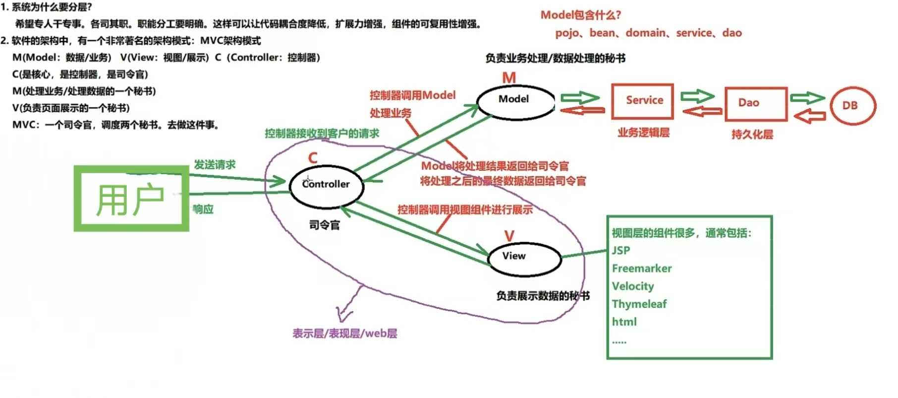

# 1.项目亮点和难点

- 抢购，限流，防刷
- 分布式事务
- CompletableFutrue异步编排技术

# 2.抢购/订单业务

## 1.接口调用链与实现

###订单服务

:warning:注意接口参数传递

```Java
// 两个拦截器，userId已经写入ThreadLocal

// VoucherOrderController
@PostMapping("/seckill/{id}")
@RestrictRequest(interval = 3, count = 3000) // 限制接口访问（限流）
public Result seckillVoucher(@PathVariable("id") Long voucherId) {} // 参数：优惠券id；返回订单信息

// VoucherOrderServiceImpl
@Override
public Result seckillVoucherRabbitMQ(Long voucherId) {} // 参数：优惠券id
```

```java
@Override
public Result seckillVoucherRabbitMQ(Long voucherId) {
    Long userId = UserHolder.getUser().getId();
    long orderId = redisIDCreator.nextId("order"); // 随机生成订单id

    // 1.执行lua脚本，从Redis中实现（库存判断，是否重复下单）
    int result = stringRedisTemplate.execute(
        SECKILL_SCRIPT,
        Collections.emptyList(),
        voucherId.toString(),
        userId.toString(),
        String.valueOf(orderId)
    ).intValue();

    // 判断结果是否为0
    if (result != 0) {
        return Result.fail(result == 1 ? "库存不足" : "不允许重复购买");
    }

    // 2.为0，有购买资格，创建订单
    VoucherOrder voucherOrder = new VoucherOrder();
    voucherOrder.setId(orderId);
    voucherOrder.setUserId(userId);
    voucherOrder.setVoucherId(voucherId);

    // 3.发送到消息队列【同时削峰】
    mqSender.sendSeckillMessage(voucherOrder, false);

    // 返回订单id（代表成功）
    return Result.ok(orderId);
}
```

**【发送方】**

```java
public void sendSeckillMessage(VoucherOrder voucherOrder, boolean reliable) {
    log.info("发送消息：" + voucherOrder);
    // 1.若要保证可靠传递
    if (reliable) {
        // 设置交换机处理消息的模式，交换器无法根据自身类型和路由键找到一个符合条件的队列时的处理方式。true：RabbitMQ会调用Basic.Return命令将消息返回给生产者
        rabbitTemplate.setMandatory(true);
        //（1）定义确认回调，当 publisher 将消息发送到 broker(exchange) 失败，则重新发送一次【broker包括exchange和queue】
        rabbitTemplate.setConfirmCallback(((correlationData, ack, cause) -> {
            // 如果发送失败就重新发送
            if (!ack) {
                log.error("消息发送失败，错误原因：{}，再次发送。", cause);
                rabbitTemplate.convertAndSend(MQConstants.SECKILL_EXCHANGE, MQConstants.SECKILL_ROUTING_KEY, voucherOrder);
            }
        }));
        //（2）设置退回函数，当 exchange 将消息发送到 queue 失败时，自动将消息退回给 publisher
        rabbitTemplate.setReturnsCallback((returnedMessage -> {
            // 如果消息未从 路由exchange 成功发送到队列，会走这个回调
            log.error("交换机发送消息到队列失败，错误原因：{}，执行将消息退回到 publisher 操作。", returnedMessage.getReplyText());
        }));
    }
    // 2.发送消息，默认消息持久化
    rabbitTemplate.convertAndSend(MQConstants.SECKILL_EXCHANGE, MQConstants.SECKILL_ROUTING_KEY, voucherOrder);
}
```

**【接收方】**

```Java
/**
 * 推模式？接收到消息 <a href="https://blog.csdn.net/liqinglonguo/article/details/134029011">channel.basicAck</a>
 * <p>
 * 注解 @Payload吗，队列中的json字符串变成对象的注解
 * </P>
 *
 * @param voucherOrder
 * @param channel
 * @param message
 */
@RabbitListener(queues = MQConstants.SECKILL_QUEUE, ackMode = "MANUAL") // queues 指定监听的队列名称；手动 ack
public void receiveSeckillOrder(@Payload VoucherOrder voucherOrder, Channel channel, Message message) {

    log.info("接收到的订单消息：" + voucherOrder);
    // 线程池执行
    threadPool.submit(() -> {
        try {
            // 生成订单，库存……
            voucherOrderService.createVoucherOrderRabbitMQ(voucherOrder);

        } catch (Exception e1) {
            // 先本地catch异常，再抛出
            log.warn("订单处理异常，重新尝试。");
            try {
                voucherOrderService.createVoucherOrderRabbitMQ(voucherOrder);
            } catch (Exception e2) {
                log.error("订单处理失败：", e2);
                throw new RuntimeException();
                // TODO 第二次处理失败，则更改 Redis 中的数据（也可以将消息放入 异常订单数据库 或 队列 中特殊处理）-如回滚库存等操作
            }
        }
        // 手动确认消费完成
        try {
            channel.basicAck(message.getMessageProperties().getDeliveryTag(), true);

        } catch (IOException e) {
            throw new RuntimeException(e);
        }
    });
}
```

```java
@Transactional
@Override
public void createVoucherOrderRabbitMQ(VoucherOrder voucherOrder) {
Long userId = voucherOrder.getUserId();
    Long voucherId = voucherOrder.getVoucherId();

    // 查询订单
    int count = query().eq("user_id", userId).eq("voucher_id", voucherId).count();
    if (count > 0) {
        log.error("该用户已经购买过一次！");
        return;
    }

    //（1）本地保存订单
    save(voucherOrder);
    //（2）保存消息表（等待任务调度，发送给mq）
    TimeTaskMessage message = timeTaskMessageService.addMessage("voucherRepertory", String.valueOf(voucherOrder.getVoucherId()), null, null);
    if (message == null) {
        throw new BusinessException("添加消息记录失败");
    }

    // 同时发送延时消息给MQ，死信交换机（异步）
    mqSender.sendDelayOrderMessage(
        MultiDelayMessage.builder()
        .data(voucherOrder.getId())
        .delayMillis(CollUtil.newArrayList(10000L, 10000L, 10000L))
        .build()
    );
}
```

### 库存服务

```java
// queues 指定监听的队列名称；手动 ack
@RabbitListener(queues = "repertory.queue", ackMode = "MANUAL") 
// 接收到来自订单服务调用
public void receiveRepertory(@Payload SeckillVoucher seckillVoucher, Channel channel, Message message) {

    log.info("接收到的订单消息：" + seckillVoucher);
    // 线程池执行
    threadPool.submit(() -> {
        try {
            // 扣减库存
            seckillVoucherRepService.reduceSeckillVoucherRep(seckillVoucher.getVoucherId());

        } catch (Exception e1) {
            // 先本地catch异常，再抛出
            log.warn("订单处理异常，重新尝试。");
            try {
                seckillVoucherRepService.reduceSeckillVoucherRep(seckillVoucher.getVoucherId());
            } catch (Exception e2) {
                log.error("订单处理失败：", e2);
                throw new RuntimeException();
                // TODO 第二次处理失败，则更改 Redis 中的数据（也可以将消息放入 异常订单数据库 或 队列 中特殊处理）-如回滚库存等操作
            }
        }
        // 手动确认消费完成
        try {
            channel.basicAck(message.getMessageProperties().getDeliveryTag(), true);

        } catch (IOException e) {
            throw new RuntimeException(e);
        }
    });
}
```

```java
// SeckillVoucherRepServiceImpl
@Override
@Transactional
public boolean reduceSeckillVoucherRep(Long voucherId) {
    // 修改
    boolean update = update()
        .setSql("stock = stock - 1")
        .eq("voucher_id", voucherId)
        .gt("stock", 0) //【乐观锁】只要库存大于0就可以秒杀成功（超卖问题），优化需要比较version
        .update();

    // TODO 使用MQ发送消息，给订单服务，删除消息（需要消息id）

    return update;
}
```


## 2.秒杀核心瓶颈

- 高并发压力
  - 秒杀活动通常会吸引大量用户在短时间内发起购买请求，这会导致服务器面临巨大的并发压力。传统的Web应用服务器可能无法有效处理如此大规模的请求，导致性能下降和请求超时。
- 数据库压力
  - 秒杀活动中，商品的库存信息需要频繁被查询和更新。如果采用传统的关系型数据库来处理这些请求，数据库会成为瓶颈，因为它们往往无法承受如此高的读写负载。
- 重复购买问题
  - 在秒杀活动中，用户可能会尝试多次购买同一商品，这可能导致超卖问题。在传统系统中，没有有效的机制来防止这种情况，需要额外的处理来保证商品不会被重复售卖。

## 3.项目相关问题 

### - 订单的id号是根据什么生成的 

> 为什么不采用数据库自增：
>
> - id规律太明显
> - 单表数据数据受限（如果要用到分表），没有全局自增
>
> 为什么不采用雪花算法：
>
> - [雪花算法详解(原理优缺点及代码实现) - mikechen的互联网架构 - 博客园 (cnblogs.com)](https://www.cnblogs.com/mikechenshare/p/16787023.html) 
> - 依赖服务器时间，服务器时钟回拨时可能会生成重复 id。 

```java
@Component
public class RedisIDCreator {

    /**
     * 2023年1月1日0时0分0秒 的 toEpochSecond（开始时间戳）
     */
    private static final long BEGIN_TIMESTAMP = 1672531200L;

    @Autowired
    private StringRedisTemplate stringRedisTemplate;

    /**
     * 生成id
     *
     * @param keyPrefix
     * @return
     */
    public long nextId(String keyPrefix) {
        // 1.符号位0【首位】

        // 2.当前时间戳 - BEGIN_TIMESTAMP【1~32位】
        LocalDateTime now = LocalDateTime.now();
        long nowSecond = now.toEpochSecond(ZoneOffset.UTC);
        long timestamp = nowSecond - BEGIN_TIMESTAMP;

        // 3.序列号（32位），获取当前日期，每一天都有新的起点【33~64位】
        String date = now.format(DateTimeFormatter.ofPattern("yyyy:MM:dd"));
        long increment = stringRedisTemplate.opsForValue().increment("icr:" + keyPrefix + ":" + date);

        return timestamp << 32 | increment;
    }
    
    public static void main(String[] args) {
        LocalDateTime begin = LocalDateTime.of(2023, 1, 1, 0, 0, 0);
        long second = begin.toEpochSecond(ZoneOffset.UTC);
        // 1672531200
        System.out.println(second);
    }
}
```


### - Redis库存和DB库存一样吗

- 是一样的，那怎么保证数据一致性
  - 首先Redis是Lua脚本判断（已抢购用户的id + 库存量）；只有redis成功才发送到MySQL，再进行扣除；目标保证MySQL一定会执行即可
  - 回答方向：把重试请求写到「消息队列」中，然后由专门的消费者来重试，直到成功；MQ消息不丢失，手动应答……


### - 如何防止http请求中数据被篡改

**（1）设置客户端IP黑/白名单**

1.1.客户端所有请求，请求到代理服务器(nginx)，代理服务器维护黑/白名单的ip，决定是否转发请求。

1.2.项目创建一个filter，拦截所有请求，在filter的方法中，通过request信息匹配ip黑/白名单，和url的拦截规则，决定是否合法。

优点：简单粗暴。

缺点：需要客户端的IP固定。

应用场景：并发量小的场景。比如系统的后台管理服务，客服需要人工审批和通过涉及到钱财的业务，就可以使用这种简单粗暴的方式，防止账号泄露，接口泄露等等。

**（2）请求参数Sign签名**

2.1前端发起http请求，对参数排序，然后使用 参数与私钥拼接，在进行md5加密 等方式，生成一个签名出来，一起发给服务端，服务端这边获取到参数，签名，再使用自己的私钥进行同样方式的加密生成签名，比对签名是否一致。一致则认为合法，不一致则不合法。**但是无法防止重复请求攻击！**

2.2针对上面方法升级，可以缓存每次请求的md5值，或者给每个请求添加uuid+随机数这样一个代表请求序号的标识。然后请求到服务端时，服务端想办法缓存起来起来这个标识，每次请求过来时，判断是否已经请求过。**但是缓存怎么实现，如何维护？而且并发量高的话，每个请求过来都先查缓存，是否影响性能。**

2.3在请求的参数中和签名结果里，加入[时间戳](https://so.csdn.net/so/search?q=%E6%97%B6%E9%97%B4%E6%88%B3&spm=1001.2101.3001.7020)这个参数，业务服务器一方面比较签名结果，一方面根据时间戳，来认证请求的合法性，比如允许请求的时间戳与服务器当前时间，存在20秒的误差等自定义规则。超过20秒的合法请求，服务器也不处理，防止恶意的重复请求。

2.4时间戳+md51 时间差120s以上代表重复请求，md5写缓存，缓存时长120s（大于等于上面的值就行），判断如果有md5代表重复请求。

（3）请求方式换成Https


## 4.超时处理

```java
// 【1】VoucherOrderServiceImpl # createVoucherOrderRabbitMQ()

// 同时发送延时消息给MQ，死信交换机（异步）
mqSender.sendDelayOrderMessage(
        MultiDelayMessage.builder()
                .data(voucherOrder.getId())
                .delayMillis(CollUtil.newArrayList(10000L, 10000L, 10000L))
                .build()
);

// 【2】MqSender
public <T> void sendDelayOrderMessage(MultiDelayMessage<T> delayMessage) {
    log.info("发送延迟消息：" + delayMessage);
    Long delay = delayMessage.removeNextDelay();
    rabbitTemplate.convertAndSend(MQConstants.DELAY_ORDER_EXCHANGE, MQConstants.DELAY_ORDER_ROUTING_KEY, delayMessage, message -> {
        message.getMessageProperties().setDelay(delay.intValue());
        return message;
    });
}

// 【3】MqReceiver
@RabbitListener(queues = MQConstants.DELAY_ORDER_DL_QUEUE) // queues 指定监听的队列名称；手动 ack
public void receiveDelayOrder(@Payload MultiDelayMessage<Long> delayMessage, Channel channel, Message message) {
    log.info("接收到的延迟消息：" + delayMessage);
    try {
        // 1.查询订单状态
        Long orderId = delayMessage.getData();
        VoucherOrder voucherOrder = voucherOrderService.getById(orderId);
        if (voucherOrder == null || voucherOrder.getStatus() != 1) {
            // TODO 2.实现支付服务，查询是否真的已支付
            return;
        }
        // 3.判断是否还有有延迟时间
        if (delayMessage.hasNextDelay()) {
            mqSender.sendDelayOrderMessage(delayMessage); // 有，重发延迟
            return;
        }
        // 4.没有，取消订单（可以删除）；保证事务一致性
        voucherOrderService.lambdaUpdate()
            .set(VoucherOrder::getStatus, 4)
            .eq(VoucherOrder::getId, orderId)
            .update();

        // TODO 5.恢复 MySQL库存 和 redis库存；保证事务一致性【重点】

    } catch (Exception e) {
        throw new RuntimeException(e);
    }
}
```

# 3.限流、防刷、削峰

##1.如何实现限流防刷

- **:warning:（1）错峰：图片验证码**

  ```java
  /**
   * 图片数字验证码
   *
   * @return
   */
  @GetMapping("/captcha")
  public CaptchaDTO getCaptcha() {
      // 创建一个图像验证码宽度为130，高度为48，包含6个字符，干扰线6个
      CircleCaptcha circleCaptcha = CaptchaUtil.createCircleCaptcha(130, 48, 6, 6);
      // 获取验证码的文本
      String captchaText = circleCaptcha.getCode();
      // 获取验证码图片的Base64编码
      String captchaImageBase64Data = circleCaptcha.getImageBase64Data();
      // 拦截器写入的userId，作为验证码id
      Long captchaId = UserHolder.getUser().getId();
      captchaId = Optional.ofNullable(captchaId).orElseGet(() -> Long.valueOf(UUID.randomUUID().toString()));
      // 保存验证码文本到Redis中，有效期30秒【下次从Redis取进行校验】
      stringRedisTemplate.opsForValue().set("captcha:" + captchaId, captchaText, 60, TimeUnit.SECONDS);
  
      return CaptchaDTO.builder()
          .captchaId(captchaId.toString())
          .captchaImage(captchaImageBase64Data)
          .build();
  }
  
  /**
   * 校验图片验证码；采用重定向？
   * <a href="https://blog.csdn.net/m0_45899013/article/details/106928429">重定向和转发</a>
   * 
   * @param voucherId
   * @param captchaText
   * @param captchaId
   * @param response
   * @return
   */
  @PostMapping("/captchaCheck/{voucherId}")
  public String login(@PathVariable("id") Long voucherId, @RequestBody String captchaText, @RequestBody String captchaId, HttpServletResponse response) {
      // 校验
      String origin = stringRedisTemplate.opsForValue().get("captcha:" + captchaId);
      if(origin.equals(captchaText)) {
          try {
              response.sendRedirect("/seckill/" + voucherId);
          } catch (IOException e) {
              throw new RuntimeException(e);
          }
          return null;
      }
      return "验证失败";
  }
  ```

- **:warning:（2）使用 Redis + Lua 进行 ip锁和user锁的次数判断；刷取次数是否到达次数限制**

  ```java
  /**
   * 目标方法执行前（防刷切入点）；
   * 限制 同一个ip和user 在规定时间内的最大访问次数【防刷】
   *
   * @param joinPoint
   * @throws NoSuchMethodException
   */
  @Before("restrictRequestPointcut()")
  public void joinPoint(JoinPoint joinPoint) throws NoSuchMethodException {
      // 使用redisson声明 ip锁 和 user锁
      RLock ipLock = null, userLock = null;
      boolean isIp = false, isUser = false;
      try {
          // 根据 方法签名 获得 被注解标注的具体实现方法
          MethodSignature signature = (MethodSignature) joinPoint.getSignature();
          Method method = joinPoint.getTarget().getClass().getMethod(signature.getName(), signature.getParameterTypes());
  
          // 获取 RestrictRequest 注解，获取注解信息
          RestrictRequest restrictRequest = method.getAnnotation(RestrictRequest.class);
          long interval = restrictRequest.interval();
          int count = restrictRequest.count();
          String message = restrictRequest.message();
  
          // 获得访问 被注解标注的接口 的http请求
          ServletRequestAttributes requestAttributes = (ServletRequestAttributes) RequestContextHolder.getRequestAttributes();
          assert requestAttributes != null;
  
          HttpServletRequest request = requestAttributes.getRequest();
          HttpServletResponse response = requestAttributes.getResponse();
  
          assert response != null;
          response.setContentType("application/json;charset=UTF-8");
  
          // TODO 以下操作可以使用 lua脚本 进行实现，从而保证 操作的原子性 以及降低 网络开销
          // 得到 限制ip的key 和 限制user的key
          String ipKey = RedisConstants.ACCESS_LIMIT_IP_KEY + IPUtil.getIpAddr(request) + "-" + request.getRequestURI();
          String userKey = RedisConstants.ACCESS_LIMIT_USER_KEY + UserHolder.getUser().getId() + "-" + request.getRequestURI();
  
          // 1.获取 ip锁
          ipLock = redissonClient.getLock("lock:" + ipKey);
          isIp = ipLock.tryLock();
          if (!isIp) {
              throw new BusinessException("相同IP不能在同一时刻下单！");
          }
  
          // 2.获取 user锁
          userLock = redissonClient.getLock("lock" + userKey);
          isUser = userLock.tryLock();
          if (!isUser) {
              throw new BusinessException("相同用户不能在同一时刻下单！");
          }
  
          // 3.取得在限定时间内的访问次数
          String ipValue = stringRedisTemplate.opsForValue().get(ipKey);
          int ipCount = (ipValue == null ? 0 : Integer.parseInt(ipValue));
  
          String userValue = stringRedisTemplate.opsForValue().get(userKey);
          int userCount = (userValue == null ? 0 : Integer.parseInt(userValue));
  
          // 4.如果 还没有达到最大访问次数，则将redis中的次数加1
          if (ipCount < count && userCount < count) {
              // ip
              if (ipCount == 0) {
                  stringRedisTemplate.opsForValue().set(ipKey, Integer.toString(1), interval, TimeUnit.SECONDS);
              } else {
                  stringRedisTemplate.opsForValue().increment(ipKey, 1);
              }
              // user
              if (userCount == 0) {
                  stringRedisTemplate.opsForValue().set(userKey, Integer.toString(1), interval, TimeUnit.SECONDS);
              } else {
                  stringRedisTemplate.opsForValue().increment(userKey, 1);
              }
          } else {
              message = "".equals(message) ? "相同IP或用户在" + interval + "秒内达到了最大访问次数：" + count : message;
              throw new BusinessException(message);
          }
      } finally {
          // 释放已经拿到的锁
          if (isIp) {
              ipLock.unlock();
          }
          if (isUser) {
              userLock.unlock();
          }
      }
  }
  ```

- **:warning:（3）Redis库存，预扣操作，充当令牌**


## 2.为什么要用AOP实现防刷限流

- 减少代码的重复，各个模块的**重用性加强**。
- **降低 模块间的耦合度**，提高代码的可操作性和可维护性。
- **根据注解设置，同时可以由用户自定义设置参数**


## 3.访问流量超出Redis承受范围

- 限流
- 熔断降级


## 4.拦截器和过滤器对比

[Java中的拦截器和过滤器有什么区别 - 知乎 (zhihu.com)](https://zhuanlan.zhihu.com/p/408809649) 

**（一）什么是过滤器**

过滤器Filter基于Servlet实现，过滤器的主要应用场景是对字符编码、跨域等问题进行过滤。Servlet的工作原理是拦截配置好的客户端请求，然后对Request和Response进行处理。Filter过滤器随着web应用的启动而启动，只初始化一次。

Filter的使用比较简单，继承Filter 接口，实现对应的init、doFilter以及destroy方法即可。

**（二）什么是拦截器**

拦截器是SpringMVC中实现的一种基于**Java反射（动态代理）**机制的方法增强工具，拦截器的实现是**继承HandlerInterceptor 接口**，并实现接口的preHandle、postHandle和afterCompletion方法。

1、**preHandle**：请求方法前置拦截，该方法会在Controller处理之前进行调用，Spring中可以有多个Interceptor，这些拦截器会按照设定的Order顺序调用，当有一个拦截器在preHandle中返回false的时候，请求就会终止。

2、**postHandle**：preHandle返回结果为true时，在Controller方法执行之后，视图渲染之前被调用

3、**afterCompletion**：在preHandle返回ture，并且整个请求结束之后，执行该方法。

**（三）拦截器与过滤器的区别**

**相同点**：

1、拦截器与过滤器都是体现了AOP的思想，对方法实现增强，都可以拦截请求方法。

2、拦截器和过滤器都可以通过Order注解设定执行顺序

**不同点**：

1、**过滤器属于Servlet级别，拦截器属于Spring级别** Filter是在javax.servlet包中定义的，要依赖于网络容器，因此只能在web项目中使用。

Interceptor是SpringMVC中实现的，归根揭底拦截器是一个Spring组件，由Spring容器进行管理。

2、**过滤器和拦截器的执行顺序不同**：

下面通过一张图展示Filter和Interceprtor的执行顺序


首先当一个请求进入Servlet之前，过滤器的doFilter方法进行过滤，

进入Servlet容器之后，执行Controller方法之前，拦截器的preHandle方法进行拦截，

执行Controller方法之后，视图渲染之前，拦截器的postHandle方法进行拦截，

请求结束之后，执行拦截器的postHandle方法。

3、过滤器基于**函数回调**方式实现，拦截器基于**Java反射机制**实现

**（四）总结**

实际开发中，拦截器的应用场景会比过滤器要更多，下面是拦截器和过滤器的主要应用场景

**拦截器的应用场景**：权限控制，日志打印，参数校验

**过滤器的应用场景**：跨域问题解决，编码转换

我翻了一下历史项目的代码，拦截器在用户权限校验场景下使用会比较多，由于一般是前后端分离项目，过滤器的使用场景就会少很多。


拦截器和过滤器算是比较常用的了，但是还是得注意两者的差距，我是鱼仔，我们下期再见！

# 4.分布式事务

## 1.解决方案

- :warning:JavaGuide：[服务治理：分布式事务解决方案有哪些？](https://www.yuque.com/snailclimb/mf2z3k/ng9vmg)
- JavaGuide：[面试官：RocketMQ 分布式事务消息的缺点？ (qq.com)](https://mp.weixin.qq.com/s/cBx1l1zaThN6_808fMl27g) 
- :warning:二哥：[7.分布式事务有哪些常见的实现方案？](https://javabetter.cn/#_7-%E5%88%86%E5%B8%83%E5%BC%8F%E4%BA%8B%E5%8A%A1%E6%9C%89%E5%93%AA%E4%BA%9B%E5%B8%B8%E8%A7%81%E7%9A%84%E5%AE%9E%E7%8E%B0%E6%96%B9%E6%A1%88)
- :warning:[分布式事务（四）本地消息表和消息事务（RocketMQ详细实现） - 掘金 (juejin.cn)](https://juejin.cn/post/7030787692984008741#heading-1) 


## 2.项目相关问题

### 为什么选择本地消息表+任务调度

- 实现AP，不强求一致性
- 分析消息表的优点！


### 本地消息表+任务调度有什么缺点

- 与业务场景绑定**，高耦合，不可公用** 
- 本地消息表与业务数据表在同一个库，占用业务系统资源，**量大可能会影响数据库性能，**扫表效率慢；订单表与本地消息表为同一个数据库，更新订单和存储消息为同一个本地事务，数据库事务处理，要么都成功，要么都失败。 
- **定时扫表存在延迟问题**


### 为什么不使用MQ事务

- 分析MQ缺点
- [面试官：RocketMQ 分布式事务消息的缺点？ (qq.com)](https://mp.weixin.qq.com/s/cBx1l1zaThN6_808fMl27g) 
- 如果消息发送失败，也就是比如 mq 集群挂了，并不会影响事务的执行，业务的执行和事务消息的插入都已经成功了，那此时待消息已经安安静静的在消息库里等着，后台能会有一个补偿任务，会将这些消息捞出来重新发送，直到发送成功。 


##3.项目分布式事务实现的过程

（1）**抢购业务**


1. 订单服务，添加**一条订单和一条消息，在一个事务里提交**
2. 订单服务，使用**定时任务轮询查询状态为未同步的消息表**，**发送到MQ**，如果发送失败，就重试发送
3. **库存服务，接收MQ消息，修改库存表**，需要保证幂等操作
4. 如果修改成功，调用rpc接口修改订单系统消息表的状态为已完成或者直接删除这条消息
5. 如果修改失败，可以不做处理，等待重试

订单服务中的消息有可能由于**业务问题会一直重复发送，所以为了避免这种情况可以记录一下发送次数，当达到次数限制之后报警，人工接入处理**；库存服务需要保证幂等，避免同一条消息被多次消费造成数据不一致。

本地消息表这种方案**实现了最终一致性，需要在业务系统里增加消息表**，业务逻辑中多一次插入的DB操作，所以性能会有损耗，而且最终一致性的间隔主要有定时任务的间隔时间决定

（2）**es和MySQL**

- 先写入MySQL的blog表
- 再写入消息表（业务key为blogId）
- 任务调度，拿到blogId，判断消息状态是否重复执行
- 再写入es
- 删除消息表（或修改状态1）

> 1. 本项目的本地消息表和任务调度省略了MQ，一般为：本地消息表+任务调度+MQ
> 2. 如果引入MQ后，抢购业务流程
>    1. ……
>    2. 订单服务接收到MQ消息后，进行订单表校验，是否重复下单
>    3. 写入订单表，消息表（业务key为voucherId）
>    4. 任务调度，拿到消息，发送给MQ
>    5. 库存服务接收到MQ后，判断消息状态是否重复执行
>    6. 乐观锁，进行判断，stock>0进行扣减库存
>    7. 调用RPC接口修改订单系统消息表的状态或者直接删除这条消息
> 3. 这种方法相对于只使用 MQ，如果消息发送失败，也就是比如 mq 集群挂了，并不会影响事务的执行，业务的执行和事务消息的插入都已经成功了，那此时待消息已经安安静静的在消息库里等着，后台能会有一个补偿任务，会将这些消息捞出来重新发送，直到发送成功。 

# 5.项目相关设计

## 1.整个项目的架构怎么设计的，怎么考量的 

（1）考量标准

1. **分析需求和限制**：分析项目的需求和限制，包括**业务复杂度、用户数量、数据量、访问频率**、可用性要求、安全性要求、成本预算等方面的考虑。
2. **架构设计原则**：介绍在设计项目架构时遵循的一些原则和指导方针，例如**高内聚低耦合**、模块化设计、**可扩展性**、性能优化、安全性、易维护性等。
3. **技术选型**：介绍项目中使用的主要技术和框架，包括**后端开发框架、数据库选择、消息队列选择、缓存选择**、前端技术栈等，以及选择这些技术的考虑因素。
4. **性能优化和扩展性考虑**：说明项目中采取的一些**性能优化措施和扩展性考虑，例如分布式部署、负载均衡**、缓存优化、**数据库水平分片等**。
5. **安全性设计**：介绍项目中采取的安全性设计措施，包括**身份认证、权限控制**、数据加密、防止攻击等，以确保系统的安全性。
6. **监控和运维**：说明项目中采取的监控和运维措施，包括**日志记录**、异常监控、性能监控、自动化部署、容灾备份等，以保证系统的稳定运行。

（2）本项目

- **完善微服务架构**

  - 库存服务
  - 订单服务
  - 博客推文服务（保存博客推文，查询博客详情）
  - 上传文件服务
  - 店铺服务（查询店铺详情）
  - 用户登录服务
  - 关注取关服务

- MVC模式：Model（业务逻辑层，持久化层）；View + Controller（表示层）

  

- 店铺服务（查询频繁）：选用Redis作为缓存，Hash

- 订单+库存

  - 选用Redis对接口进行 ip和userId 进行防刷判断
  - 选用Redis进行库存预减，String类型
  - 选用Redis进行一人一单分析，Set类型
  - 选用RabbitMQ解耦合+异步+响应快，Redis预扣成功后，发送给mq，后序再处理库存
  - 选用 任务调度+本地消息表 解决分布式事务

- 博客服务

  - 上传大文件，分块+断点续传
  - 查询，使用es，加速搜索和关键字搜索
  - Feed流，推模式（滚动分页查询）
  - 选用异步编排技术查询


## 2.分库分表问题


## 3.后端怎么和前端传输数据

- RestFul API，使用HTTP请求，进行数据传输
- 前端通过Get，Post，Put进行数据传递


## 4.数据库表设计和关键字段

- 如果在时间上要超过Linux时间的，或者 [服务器] 时区不一样的就建议选择 datetime。
- 如果是想要使用**自动插入时间**或者**自动更新时间**功能的，可以使用**timestamp**。

### 1.博客推文表 tb_blog

| 列名        | 数据类型   | 长度  | 主键/自增 | 注释                               |
| ----------- | ---------- | ----- | --------- | ---------------------------------- |
| **id**      | **bigint** | **8** | **√**     | **主键**                           |
| **shop_id** | **bigint** |       |           | **店铺id**                         |
| **user_id** | **bigint** |       |           | **用户id**                         |
| title       | varchar    | 255   |           | 标题                               |
| images      | varchar    | 2048  |           | 探店的照片，最多9张，多张以","隔开 |
| content     | varchar    | 2048  |           | 探店的文字描述                     |
| liked       | int        |       |           | 点赞数量                           |
| comments    | int        |       |           | 评论数量                           |
| create_time | timestamp  | 4     |           | 创建时间                           |
| update_time | timestamp  |       |           | 更新时间                           |

### 2.关注表tb_follow

| 列名           | 数据类型  | 长度 | 主键/自增 | 注释         |
| -------------- | --------- | ---- | --------- | ------------ |
| id             | bigint    | 8    | √         | 主键         |
| user_id        | bigint    |      |           | 用户id       |
| follow_user_id | bigint    |      |           | 关联的用户id |
| create_time    | timestamp |      |           | 创建时间     |

- 创建**唯一索引**

  ```MySQL
  ALTER TABLE `tb_follow` ADD UNIQUE (`user_id`)
  ```

- 创建**联合索引（user_id, follow_user_id）**，可以在粉丝群体中，搜索某个粉丝是否存在

  ```mysql
  ALTER TABLE `tb_follow` ADD INDEX follow_index ( `user_id`, `follow_user_id`)
  ```

  

### 3.本地消息表 tb_message

| 列名                | 数据类型    | 长度   | 主键/自增 | 注释                                      |
| ------------------- | ----------- | ------ | --------- | ----------------------------------------- |
| **id**              | **bigint**  | **8**  | **√**     | **消息id**                                |
| **message_type**    | **varchar** | **32** |           | **消息类型代码：blog / voucherRepertory** |
| **business_key1**   | **varchar** | **64** |           | **关联业务信息1：blogId / voucherId**     |
| business_key2       | varchar     | 255    |           | 关联业务信息2                             |
| business_key3       | varchar     | 512    |           | 关联业务信息3                             |
| execute_num         | int         | 4      |           | 通知次数                                  |
| **state**           | **char**    | **1**  |           | **处理状态：0：初始，1：成功**            |
| return_failure_date | datetime    |        |           | 回复失败时间                              |
| return_success_date | datetime    |        |           | 回复成功内容                              |
| return_failure_msg  | varchar     | 2048   |           | 回复失败内容                              |
| execute_date        | datetime    |        |           | 最近通知时间                              |
| **stage_state1**    | **char**    | **1**  |           | **阶段1处理状态，0：初始，1：成功**       |
| stage_state2        | char        | 1      |           | 阶段2处理状态，θ：初始，1：成功           |
| stage_state3        | char        | 1      |           | 阶段3处理状态，θ：初始，1：成功           |
| stage_state4        | char        | 1      |           | 阶段4处理状态，θ：初始，1：成功           |

### 4.优惠券库存表 tb_seckill_voucher

| 列名           | 数据类型   | 长度  | 主键/自增 | 注释                   |
| -------------- | ---------- | ----- | --------- | ---------------------- |
| **voucher_id** | **bigint** | **8** | **√**     | **主键（优惠券的id）** |
| **stock**      | **int**    | **4** |           | **库存**               |
| create_time    | timestamp  |       |           | 创建时间               |
| begin_time     | timestamp  |       |           | 生效时间               |
| end_time       | timestamp  |       |           | 失效时间               |
| update_time    | timestamp  |       |           | 更新时间               |


### 5.店铺信息表 tb_shop

| 列名        | 数据类型   | 长度  | 主键/自增 | 注释                            |
| ----------- | ---------- | ----- | --------- | ------------------------------- |
| **id**      | **bigint** | **8** | **√**     | **主键（店铺id）**              |
| name        | varchar    | 128   |           | 商铺名称                        |
| type_id     | bigint     |       |           | 商铺类型的id                    |
| images      | varchar    | 1024  |           | 商铺图片，多个图片以','隔开     |
| area        | varchar    | 128   |           | 商圈，例如陆家嘴                |
| address     | varchar    | 255   |           | 地址                            |
| x           | double     |       |           | 经度                            |
| y           | double     |       |           | 维度                            |
| avg_price   | bigint     |       |           | 均价，取整数                    |
| sold        | int        | 10    |           | 销量                            |
| comments    | int        | 10    |           | 评论数量                        |
| score       | int        | 2     |           | 评分，1~5分，乘10保存，避免小数 |
| open_hours  | varchar    | 32    |           | 营业时间，例如 10:00-22:00      |
| create_time | timestamp  |       |           | 创建时间                        |
| update_time | timestamp  |       |           | 更新时间                        |


### 6.用户表 tb_user

| 列名        | 数据类型  | 长度 | 主键/自增 | 注释                           |
| ----------- | --------- | ---- | --------- | ------------------------------ |
| id          | bigint    |      | √         | **主键**（用户id）             |
| phone       | varchar   | 11   |           | **手机号码**                   |
| password    | varchar   | 128  |           | **密码**，加密存储（暂时明文） |
| nick_name   | varchar   | 32   |           | 昵称，默认是用户id             |
| icon        | varchar   | 255  |           | 人物头像                       |
| create_time | timestamp |      |           | 创建时间                       |
| update_time | timestamp |      |           | 更新时间                       |


### 7.订单表 tb_voucher_order

| 列名            | 数据类型      | 长度  | 主键/自增 | 注释                                                         |
| --------------- | ------------- | ----- | --------- | ------------------------------------------------------------ |
| **id**          | **bigint**    | **8** | **√**     | **主键（订单id，非自增）**                                   |
| **user_id**     | **bigint**    |       |           | **下单的用户id**                                             |
| **voucher_id**  | **bigint**    |       |           | **购买的代金券id**                                           |
| pay_type        | tinyint       | 1     |           | 支付方式 1：余额支付；2：支付宝；3：微信                     |
| **status**      | tinyint       |       |           | **订单状态**，1：未支付；2：已支付；3：已核销；4：已取消；5：退款中；6：已退款 |
| **create_time** | **timestamp** | **4** |           | **下单时间**                                                 |
| pay_time        | timestamp     |       |           | 支付时间                                                     |
| use_time        | timestamp     |       |           | 核销时间                                                     |
| refund_time     | timestamp     |       |           | 退款时间                                                     |
| update_time     | timestamp     |       |           | 更新时间                                                     |


# 6.登录功能

##0.项目简述

【参考】[搞懂单点登录SSO，基于SpringBoot+JWT实现单点登录解决方案-阿里云开发者社区 (aliyun.com)](https://developer.aliyun.com/article/985710#slide-0)

​	       [Java-ThreadLocal三种使用场景-腾讯云开发者社区-腾讯云 (tencent.com)](https://cloud.tencent.com/developer/article/1636025) 

【本项目】

- 密码登录，明文
- RefreshTokenInterceptor拦截器
  - **拿到请求头中"authorization"的信息**
  - **查询Redis是否存在（Hash结构存储用户关键信息：userId，昵称）**
  - **:warning:存在就将用户信息写入ThreadLocal**
  - **刷新Redis中的token信息（不然过期要重新登录）**
- LoginInterceptor拦截器
  - **判断ThreadLocal是否有用户信息**
  - **没有就拦截，登录**
- ……


## 1.Token和JWT

- - **Token是一种身份验证机制，它是服务器颁发给客户端的一种凭证，用于验证客户端的身份**。在Web应用程序中，Token通常作为HTTP请求的头部或参数进行传递。
  - **JWT（JSON Web Token）是一种基于Token的身份验证机制**，它是一种开放标准（RFC 7519），用于在各个系统之间安全地传输声明。JWT由三部分组成：头部（Header）、载荷（Payload）和签名（Signature）。头部通常包含算法信息和令牌类型，载荷通常包含一些声明信息，例如用户ID、过期时间等，签名是用于验证令牌是否被篡改的一段数据。
- Token和JWT的区别：
  - 相同点：
    - 都是访问资源的令牌
    - 都可以记录用户的信息
    - 都是使服务端无状态化
    - 都是只有验证成功后，客户端才能访问服务端上受保护的资源
  - 不同点：
    - Token：服务端验证客户端发送过来的 Token 时，还**需要查询数据库获取用户信息**，然后验证 Token 是否有效。
    - JWT：将 Token 和 Payload 加密后存储于客户端，**服务端只需要使用密钥解密进行校验**（校验也是 JWT 自己实现的）即可，**不需要查询或者减少查询数据库**，**因为 JWT 自包含了用户信息和加密的数据**。
- 组成
  - 简单 token 的组成
    -  **uid**(用户唯一的身份标识)
    - **time**(当前时间的时间戳)
    - **sign**(签名，token 的前几位以哈希算法压缩成的一定长度的十六进制字符串)
  - JWT组成
    - 一个json字符串,包含当前令牌名称,以及加密算法
    - 一个json字符创,包含一些自定义的信息（用户信息）
    - 由头部信息使用base64加密之后,拼接上载荷使用base64加密之后的部分,在加上当前的密钥,进行头部中的加密算法进行加密 


## 2.token的流程

基于Token进行身份验证的流程通常如下：

1. 用户通过 **【用户名】和【密码】登录**，并发送登录请求到服务器。
2. 服务器**验证用户名和密码是否正确，如果正确，则颁发一个Token**，并将Token返回给客户端。
3. 客户端**将Token保存在本地（通常是浏览器的Cookie或LocalStorage中）**。
4. 客户端在以后的**每个请求中都要在请求头或参数中带上Token。**
5. 服务器在收到请求时，**验证Token的有效性和签名是否正确，如果验证通过，则认为用户已经登录，否则拒绝请求。**

使用JWT进行身份验证的流程类似，只是Token的格式和验证方式不同。在**使用JWT进行身份验证时，服务器会根据【密钥生成】签名，客户端在发送请求时需要带上签名以验证Token的有效性**。

使用Token进行身份验证的优点是可以有效地**避免跨站点脚本（XSS）**和**跨站点请求伪造（CSRF）**等攻击，同时也可以使系统更加灵活和可扩展。但是，使用Token进行身份验证也存在一些缺点，例如需要在客户端保存Token，如果Token泄露或被劫持，可能会导致安全问题。因此，在实际应用中，需要根据具体情况选择合适的身份验证机制。

------

假设有一个在线商城系统，用户需要在登录后才能购买商品。该系统可以使用基于Token的身份验证机制进行用户身份验证。

1. **用户登录**：用户在登录页面输入用户名和密码，并向服务器发送登录请求。服务器验证用户名和密码是否正确，如果验证通过，则**生成一个Token，并将Token返回给客户端**。
2. **保存Token**：客户端收到服务器返回的Token后，将Token保存在本地。通常情况下，可以将Token保存在浏览器的Cookie或LocalStorage中。
3. **发送请求**：用户在购买商品时，客户端会向服务器发送请求。在**请求头或参数中需要带上保存的Token**，以验证用户的身份。
4. **验证Token**：服务器在收到请求后，会**验证Token的有效性和签名是否正确。如果验证通过，则认为用户已经登录**，允许用户购买商品。如果Token无效或签名错误，则拒绝请求，提示用户需要重新登录。


## 3.token和cookie+session

- [每日一题165：Cookie 和 Session 有什么区别？如何使用Session进行身份验证？_哔哩哔哩_bilibili](https://www.bilibili.com/video/BV1D44y1U7Hq/?spm_id_from=333.788&vd_source=133a9b44f0ebb54b7863b9875a354607) 
- [每日一题168：分布式架构下，Session 共享有什么方案？【[马士兵\]】_哔哩哔哩_bilibili](https://www.bilibili.com/video/BV1a44y1U7J9/?spm_id_from=333.788&vd_source=133a9b44f0ebb54b7863b9875a354607) 
  - JWT的token，头部+负载+签名；服务端没有记录消息
  - Redis的session共享（但redis是集群也会有问题）


## 4.单点登录和退出

- 系统退出：
  - **点击退出时，可以发送 HTTP请求/发送给MQ 进行通知其他服务进行删除**

- [分布式系统中的SSO(单点登录)的理解，以及解决方案_sso对象存储详解-CSDN博客](https://blog.csdn.net/weixin_43878332/article/details/113406902#:~:text=%E5%88%86%E5%B8%83%E5%BC%8F%E7%B3%BB%E7%BB%9F%E4%B8%AD%E7%9A%84%E7%99%BB%E5%BD%95%E5%A6%82%E5%9B%BE%E6%89%80%E7%A4%BA%EF%BC%8C%E7%94%A8%E6%88%B7%E5%9C%A8Service%201%E4%B8%AD%E7%99%BB%E5%BD%95%E5%90%8E%EF%BC%8C%E7%A1%AE%E4%BF%9D%E8%BF%90%E8%A1%8C%E5%9C%A8%E4%B8%8D%E5%90%8C%E6%9C%8D%E5%8A%A1%E5%99%A8%E4%B8%AD%E7%9A%84Service,2%20%E3%80%813%EF%BC%8C%E4%B8%80%E6%A0%B7%E5%8F%AF%E4%BB%A5%E5%BE%97%E5%88%B0%E7%94%A8%E6%88%B7%E7%9A%84%E7%99%BB%E5%BD%95%E4%BF%A1%E6%81%AF%EF%BC%8C%E8%BF%99%E5%B0%B1%E6%98%AF%E6%89%80%E8%B0%93%E7%9A%84%E5%8D%95%E7%82%B9%E7%99%BB%E5%BD%95%E3%80%82%20%E4%BA%8C%E3%80%81%E5%8D%95%E7%82%B9%E7%99%BB%E5%BD%95%E7%9A%84%E8%A7%A3%E5%86%B3%E6%96%B9%E6%A1%881.Session%E5%B9%BF%E6%92%AD%E6%9C%BA%E5%88%B6%E5%AE%9E%E7%8E%B0%E4%B9%9F%E5%B0%B1%E6%98%AF%E5%9C%A8%E7%94%A8%E6%88%B7%E7%99%BB%E5%BD%95%E5%90%8E%EF%BC%8C%E5%B0%86%E5%8D%95%E4%B8%AA%E6%9C%8D%E5%8A%A1%E5%99%A8%E7%94%9F%E6%88%90%E7%9A%84Session%E4%BF%A1%E6%81%AF%EF%BC%8C%E5%A4%8D%E5%88%B6%E5%88%B0%E6%89%80%E6%9C%89%E6%9C%8D%E5%8A%A1%E5%99%A8%E4%B8%8A%EF%BC%8C%E6%B5%AA_%E5%AD%98%E5%88%B0sso) 
  - session广播
  - Redis+session
  - token，客户端发送
- 如何退出
  - [如何使用jwt 完成注销(退出登录)功能 - 个人文章 - SegmentFault 思否](https://segmentfault.com/a/1190000041216780) 
  - JWT黑名单，自动过期，注销时从客户端删除存储的Token


## 5.相关问题

### 分布式下jwt方案，为什么要用基于session? 

【看适用场景】

- `JWT`：有效期短；只希望被使用一次

  - Web 应用：这是一个可以被用户登录并维持状态的应用，用户在应用中挑选想要下载的文件。
  - 文件下载服务：无状态下载服务，只允许通过密钥下载。

- `Session`：`Session`比较适用于Web应用的会话管理，其特点一般是：

  - **权限多，如果用`JWT`则其长度会很长，很有可能突破Cookie的存储限制。**
  - **基本信息容易变动。如果是一般的后台管理系统，肯定会涉及到人员的变化，那么其权限也会相应变化**，如果使用`JWT`，那就需要服务器端进行主动失效，这样就将原本无状态的`JWT`变成有状态，改变了其本意。

- **jwt可以大大节约服务器资源，但缺点在于不方便注销。**

- 而session则正好弥补了jwt的缺点，可以**随时在后台注销，注销后用户发过来的session将无法通过**。但缺点也显而易见，那就是需要再服务器保留状态，用户一多的话会加大开销。

- 所以综合来看，如果你的网站**涉及到交易支付，建议session，方便管理**。其余的可以考虑jwt，简单快捷。

  

### 服务端的控制和客户端的控制有什么区别?


### SSO这种方案下的退出怎么实现？


### 为什么Cookie 无法防止CSRF攻击，token可以？

- [为什么token能够防止CSRF（修正版）_token防止csrf-CSDN博客](https://blog.csdn.net/qq_45888932/article/details/124002586) 


# 7.博客功能

##1.发布博客

### 1.接口调用链

```java
// BlogController
@PostMapping
public Result saveBlog(@RequestBody Blog blog) {} // 参数：前端封装的Blog类

// BlogServiceImpl
@Override
@Transactional
public Result saveBlog(Blog blog){} // 参数：Blog
```

### 2.实现

```java
@Override
@Transactional
public Result saveBlog(Blog blog) {
    // 1.从ThreadLocal获取登录用户（拦截器写入）
    UserDTO user = UserHolder.getUser();
    blog.setUserId(user.getId());
    // 2.【本地事务】保存探店博文到数据库
    boolean isSuccess = save(blog);
    if (!isSuccess) {
        return Result.ok("发布动态失败");
    }
    // 3.【本地事务】写入本地消息表，以后由任务调度，写入Elasticsearch（最终一致性）
    TimeTaskMessage message = timeTaskMessageService.addMessage("blog", String.valueOf(blog.getId()), null, null);
    if (message == null) {
        throw new BusinessException("添加消息记录失败");
    }

    // 4.查询当前用户粉丝，推送笔记id（调用FollowService服务查询数据库）
    List<Follow> follows = followService.query().eq("follow_user_id", user.getId()).list();
    for (Follow follow : follows) {
        Long userId = follow.getUserId();
        // 推送到redis的【SortedSet】，时间戳 作为score，blog_id 作为值
        String key = "feed:" + userId;
        stringRedisTemplate.opsForZSet().add(key, blog.getId().toString(), System.currentTimeMillis());
    }

    // 返回JSON数据（id）
    return Result.ok(blog.getId());
}
```


## 2.Feed滚动分页

用户博客动态功能（关注的UP更新博客时，进行推送）

### 1.接口调用链

```java
// BlogController
@GetMapping("/of/follow")
public Result queryBlogFollow(@RequestParam("lastId") Long max, @RequestParam(value = "offset", defaultValue = "0") Integer offset) {} // 参数：上次查询的最后一个时间戳（上次的最小值，这次的最大值），偏移量

// BlogServiceImpl
@Override
public Result queryBlogOfFollow(Long max, Integer offset) {} // 参数：上次查询的最后一个id，偏移量
```

### 2.实现

```java
@Override
public Result queryBlogOfFollow(Long max, Integer offset) {
    // 1.从ThreadLocal获取当前用户（拦截器写入）
    Long userId = UserHolder.getUser().getId();

    // 2.查询Redis收件箱【滚动分页查询】
    String key = "feed:" + userId;
    Set<ZSetOperations.TypedTuple<String>> tuples = stringRedisTemplate
        .opsForZSet()
        // K key：集合key
        // double min：最小值（当前最小值不关心，直接设置0）
        // double max：最大值（上次的最小值，当前的最大值）
        // offset：偏移量（ZSet中，score等于max的个数）
        // count：数量（每次查个数）
        .reverseRangeByScoreWithScores(key, 0, max, offset, 2); // 4个关键参数

    if (tuples == null || tuples.isEmpty()) {
        return Result.ok();
    }

    // 解析数据
    List<Long> ids = new ArrayList<>(tuples.size()); // 指定大小，避免扩容影响性能
    long minTime = 0;
    int minCount = 1; // 最小元素个数，也就是offset

    for (ZSetOperations.TypedTuple<String> tuple : tuples) {
        // blogId
        String blogId = tuple.getValue();
        ids.add(Long.valueOf(blogId));
        // minTime时间戳，最后一个元素最小（已排序）
        long time = tuple.getScore().longValue();
        if (time == minTime) {
            // offset最小元素的个数
            minCount++;
        } else {
            minTime = time;
            minCount = 0;
        }
    }

    // 3.根据解析到的id从 MySQL 查询blog
    String idStr = StrUtil.join(",", ids);
    List<Blog> blogList = query().in("id", ids).last("ORDER BY FIELD(id," + idStr + ")").list();
    // 查询blog点赞信息
    blogList.forEach(blog -> {
        Long id = blog.getUserId();
        User user = userService.getById(id);
        blog.setName(user.getNickName());
        blog.setIcon(user.getIcon());
        // 查询blog是否点赞
        isBlogLiked(blog);
    });

    // 4.返回
    ScrollResult scrollResult = new ScrollResult();
    scrollResult.setList(blogList); // 博客List
    scrollResult.setOffset(minCount); // 偏移量
    scrollResult.setMinTime(minTime); // 当前的最小时间戳

    return Result.ok(scrollResult);
}
```


## 3.CF异步编排

参考：[CompletableFuture原理与实践-外卖商家端API的异步化 - 美团技术团队 (meituan.com)](https://tech.meituan.com/2022/05/12/principles-and-practices-of-completablefuture.html) 

###1.接口实现

```java
/**
 * 异步编排，查询博客，返回blog涉及的信息（用户信息、博客信息，店铺信息，优惠券信息）；
 * 优化串行；
 * 根据blogId查询blog，得到userId和shopId -> 再查用户信息、商铺信息、优惠券信息 ->返回
 *
 * @param blogId
 * @return
 */
@GetMapping("/async/{blogId}")
public Result getDetailByCF(@PathVariable("blogId") Long blogId) { // 参数：博客id
    // 自定义线程池
    ExecutorService threadPool = new ThreadPoolExecutor(10, 10, 0L, TimeUnit.MILLISECONDS, new ArrayBlockingQueue<>(100));
    // TODO 完善返回方式
    Object[] ret = new Object[4];

    // 1.查询blog
    CompletableFuture<long[]> cf1 = CompletableFuture.supplyAsync(() -> {
        Blog blog = blogService.getById(blogId);
        ret[0] = blog;
        // {用户id，店铺id}
        return new long[]{blog.getUserId(), blog.getShopId()};
    }, threadPool);

    // 1.1.并行查用户详细信息
    CompletableFuture<Void> cf2 = cf1.thenAcceptAsync((arr) -> {
        long userId = arr[0];
        UserInfo userInfo = userInfoService.getById(userId);
        ret[1] = userInfo;
    }, threadPool);

    // 1.2.并行查优惠券
    CompletableFuture<Void> cf3 = cf1.thenAcceptAsync((arr) -> {
        long shopId = arr[1];
        List<Voucher> vouchers = voucherService.query().eq("shop_id", shopId).list();
        ret[2] = vouchers;
    }, threadPool);

    // 1.3.并行查店铺
    CompletableFuture<Void> cf4 = cf1.thenAcceptAsync((arr) -> {
        long shopId = arr[1];
        Shop shop = shopService.getById(shopId);
        ret[3] = shop;
    }, threadPool);

    // 2.等待执行完
    CompletableFuture<Void> tmp = CompletableFuture.allOf(cf2, cf3, cf4);
    tmp.join();

    return Result.ok(ret);
}
```


### 2.为什么采用CF，优缺点

- 在JDK1.8以前，通过调用**线程池的submit方法可以让任务以异步的方式运行，该方法会返回一个Future对象**，通过**调用get方法获取异步执行的结果**（阻塞等待）：
- 为什么仍需要引入CompletableFuture？**将多个异步任务的计算结果组合起来，后一个异步任务的计算结果需要前一个异步任务的值**等等，使用Future提供的那点API就囊中羞涩，处理起来不够优雅，这时候还是让CompletableFuture以**声明式**的方式优雅的处理这些需求。

**（1）Futrue接口**

- 启动多线程任务
- 处理其他事
- 收集多线程任务结果，Future虽然可以实现获取异步执行结果的需求，但是它没有提供通知的机制
  - **要么使用阻塞，在future.get()的地方等待future返回的结果，这时又变成同步操作**
  - **要么使用isDone()轮询地判断Future是否完成，这样会耗费CPU的资源，轮询？？？**

就是说 我们**提交的这些多线程任务 因为没有通知机制 所以我们只能不断的询问**；而且这也是一个变向的宏观的同步

- 必须要等到返回结果才能下一步—如果我门需要一次性做多个多层级的多线程任务 那么每一层要等上一层全部搞完 才能接着走[所以 这就相当于被“阻塞”了] 这样也是一种同步

**（2）CompletableFuture**

**优点：**

1. **异步编程支持：** `CompletableFuture` 提供了方便的异步编程方式，可以轻松地创建异步任务、组合多个任务以及处理任务完成后的结果。
2. **链式调用：** `CompletableFuture` 支持方法链式调用，可以通过一系列的方法调用，串联起异步任务，使代码更加清晰、简洁。
3. **组合与聚合：** 可以通过 `CompletableFuture` 提供的一系列组合方法，如 `thenCompose()`、`thenCombine()` 等，方便地组合多个异步任务的结果，实现复杂的异步流程控制。
4. **异常处理：** `CompletableFuture` 提供了丰富的异常处理机制，可以通过 `exceptionally()`、`handle()` 等方法处理任务执行过程中可能发生的异常情况。
5. **超时处理：** 可以通过 `CompletableFuture` 提供的 `orTimeout()`、`completeOnTimeout()` 等方法设置任务的超时时间，以及在任务超时时执行相应的操作。

**缺点：**

1. **性能开销：** 使用 `CompletableFuture` 时，可能会因为创建、管理多个线程以及任务的调度等原因，而导致一定的性能开销。


###3.CF和Futrue的区别

Future在Java5就引入了。

优点：一定程度上让一个线程池内的任务异步执行了
缺点：**传统回调最大的问题就是不能将控制流分离到不同的事件处理器中**。例如**主线程等待各个异步执行的线程返回的结果来做下一步操作**，则必须**阻塞在future.get()的地方**等待结果返回。这时候又变成同步了。

CompletableFuture在Java8引入。

实现了Future和CompletionStage接口，保留了Future的优点，并且弥补了其不足。即**异步的任务完成后，需要用其结果继续操作时，无需等待。可以直接通过thenAccept、thenApply、thenCompose等方式将前面异步处理的结果交给另外一个异步事件处理线程来处理**。
可见，这种方式才是我们需要的异步处理。一个控制流的多个异步事件处理能无缝的连接在一起。

# 8.店铺功能

## 1.查询店铺

###1.接口调用链

```java
// ShopController
@GetMapping("/{id}")
public Result queryShopById(@PathVariable("id") Long id) {} // 参数：店铺id

// ShopServiceImpl
@Override
public Result queryById(Long id) {} // 参数：店铺id

// RedisUtil
public <T, Tid> T queryWithLogicExpire(String keyPrefix, Tid id, Class<T> clazz, Function<Tid, T> queryDB, Long time, TimeUnit timeUnit) {} 
	// 参数：key的前缀，查询的id，class对象，要执行的函数体，过期时间，时间单位
```

### 2.实现

```java
// ShopServiceImpl
@Override
public Result queryById(Long id) {
    // 逻辑过期时间，要预热
    Shop shop = redisUtil.queryWithLogicExpire(
        RedisConstants.CACHE_SHOP_KEY,
        id,
        Shop.class,
        id2 -> getById(id2),
        20L, // 10s为了测试
        TimeUnit.SECONDS // 10s为了测试
    );

    if (shop == null) {
        return Result.fail("店铺不存在");
    }

    return Result.ok(shop);
}

// RedisUtil
public <T, Tid> T queryWithLogicExpire(String keyPrefix, Tid id, Class<T> clazz, Function<Tid, T> queryDB, Long time, TimeUnit timeUnit) {
    // 1.从redis查店铺缓存，是否存在（已经缓存预热，而且是逻辑过期，一般来说数据是存在的）
    String key = keyPrefix + id;
    String json = stringRedisTemplate.opsForValue().get(key);
    // 2.不存在（null/空值）
    if (StrUtil.isBlank(json)) {
        if (json != null) { // 命中空值（不存在该数据）
            return null;
        } else { // 没有命中空值，查询DB
            T t2 = queryDB.apply(id);
            if (t2 == null) {
                // 【缓存穿透】设置空值
                stringRedisTemplate.opsForValue().set(key, "", 10L, TimeUnit.MINUTES);
                return null;
            } else {
                this.setWithLogicExpire(key, t2, time, timeUnit);
            }
        }
    }

    // 3.存在，判断是否过期，没过期直接返回
    RedisData redisData = JSONUtil.toBean(json, RedisData.class);
    JSONObject jsonObject = (JSONObject) redisData.getData();
    T t = JSONUtil.toBean(jsonObject, clazz);

    LocalDateTime expireTime = redisData.getExpireTime();
    if (expireTime.isAfter(LocalDateTime.now())) { // 如果过期时间在now之后，说明还没过期
        return t;
    }

    // 4.过期，需要【缓存重建】，获取锁
    String lockKey = RedisConstants.LOCK_SHOP_KEY + id;
    boolean lock = tryLock(lockKey);
    if (!lock) {
        return t;
    }

    // 5.获取锁成功，再次查询redis，进行Double Check
    //【线程A和B同时判断是过期】 A重建缓存后释放锁，但是B由于网络原因，在A释放锁后才开始获取锁
    json = stringRedisTemplate.opsForValue().get(key);
    redisData = JSONUtil.toBean(json, RedisData.class);
    jsonObject = (JSONObject) redisData.getData();
    t = JSONUtil.toBean(jsonObject, clazz);

    expireTime = redisData.getExpireTime();
    if (expireTime.isAfter(LocalDateTime.now())) { // 如果过期时间在now之后，说明还没过期
        return t;
    }

    // 6.Double Check后，开启线程缓存重建
    CACHE_REBUILD_EXECUTOR.submit(() -> {
        try {
            // 查询数据库
            T t1 = queryDB.apply(id);
            // 写入redis，逻辑过期
            this.setWithLogicExpire(key, t1, time, timeUnit);

        } catch (Exception e) {
            throw new RuntimeException(e);
        } finally {
            // 释放锁
            unlock(lockKey);
        }
    });

    return t;
}
```

```java
private boolean tryLock(String key) {
    // setnx key value；可使用分布式锁Redission
    Boolean flag = stringRedisTemplate.opsForValue().setIfAbsent(key, "1", 10, TimeUnit.SECONDS);
    // 不要直接return flag，会有自动拆箱，出现空指针异常
    return BooleanUtil.isTrue(flag);
}

private void unlock(String key) {
    // 注意：分布式下，使用Lua脚本进行线程id判断，避免误差锁
    Boolean delete = stringRedisTemplate.delete(key);
    System.out.println(delete);
}
```


##2.更新店铺

```java
/**
 * 更新商铺信息
 *
 * @param shop 商铺数据
 * @return 无
 */
@PutMapping
public Result updateShop(@RequestBody Shop shop) {
    // 更新数据库
    Result result = shopService.updateData(shop);
    // 删除Redis
    stringRedisTemplate.opsForValue().getAndDelete(RedisConstants.CACHE_SHOP_KEY + shop.getId());
    log.info(result.toString());
    return result;
}
```


# 9.文件分块上传功能

参考：[一文吃透👉大文件分片上传、断点续传、秒传⏫ - 掘金 (juejin.cn)](https://juejin.cn/post/7324140839780433932#heading-0) 

## 1.流程

- 第一步：将文件进行分片，并计算其MD5值（文件的唯一标识）
- 第二步：发送请求，询问服务端文件的上传状态
- 第三步：根据文件上传状态进行后续上传
  - 文件已经上传过了，结束 --- 秒传功能
  - 文件存在，但分片不完整，将未上传的分片进行上传 --- 断点续传功能
  - 文件不存在，将所有分片上传
- 第四步：文件分片全部上传后，发送请求通知服务端合并文件分片

###第一步

**（1）:warning:接口参数【文件MD5值】，检测文件是否存在**

- 文件表
  - **主键id**
  - **用户id**
  - **文件md5值**
  - **文件路径**
  - **文件所在桶**

```java
/**
 * 检测文件是否完整
 *
 * @param fileMd5
 * @return
 */
@Override
public Result checkFile(String fileMd5) {
    // 1.在【文件表中存在，并且在文件系统中存在，此文件才存在
    //List<UploadFile> files = query().eq("id", fileMd5).list();
    //if (files == null || files.size() == 0) {
    //    return Result.ok("文件不存在，可以上传");
    //}
    
    // 2.查询文件系统中是否存在
    UploadFile uploadFile = files.get(0);
    GetObjectArgs args = GetObjectArgs.builder()
            .bucket(uploadFile.getBucket()) // 桶
            .object(uploadFile.getFilePath()) // 文件路径
            .build();
    try {
        InputStream inputStream = minioClient.getObject(args);
        if (inputStream == null) {
            // 文件不存在
            return Result.ok("文件不存在，可以上传");
        }
    } catch (Exception e) {
        // 文件不存在
        return Result.ok("文件不存在，可以上传");
    }
    // 文件已存在
    return Result.ok("文件已经存在，不需要重复上传");
}
```

### 第二步

**（2）接口参数【某块文件MD5值，块序号】，检测分块是否存在**

```java
/**
 * 检测分块
 *
 * @param fileMd5
 * @param chunkIdx
 * @return
 */
@Override
public Result checkChunks(String fileMd5, int chunkIdx) {
    // 1.分块文件所在目录
    String chunksFolderPath = MinioUtil.getChunksFolderPath(fileMd5);
    // 2.分块文件的路径【文件md5 + 块序号】
    String chunksPath = chunksFolderPath + chunkIdx;
    // 3.查询文件系统是否存在
    GetObjectArgs args = GetObjectArgs.builder()
        .bucket(videoFilesBucket)
        .object(chunksPath)
        .build();
    try {
        InputStream inputStream = minioClient.getObject(args);
        if (inputStream == null) {
            // 文件不存在
            return Result.ok("文件不存在，可以上传");
        }
    } catch (Exception e) {
        // 文件不存在
        return Result.ok("文件不存在，可以上传");
    }
    // 文件已存在
    return Result.ok("文件已经存在，不需要重复上传");
}

/**
 * 根据文件md5值得到分块文件的目录
 *
 * @param fileMd5 文件md5值
 * @return 分块路径
 */
public static String getChunksFolderPath(String fileMd5) {
    return fileMd5.charAt(0) + "/" + fileMd5.charAt(1) + "/" + fileMd5 + "/" + "chunk" + "/";
}
```

### 第三步

**（3）接口参数【某块文件MD5值，块序号，分块文件】，上传分块**

```java
@PostMapping("/uploadchunks")
public Result uploadChunks(@RequestParam("file") MultipartFile file, // 【MultipartFile】
                           @RequestParam("fileMd5") String fileMd5,
                           @RequestParam("chunk") int chunk) throws Exception {
}


/**
 * 上传分块
 *
 * @param fileMd5
 * @param chunk
 * @param bytes 【文件的字节流】
 * @return
 */
@Override
public Result uploadChunks(String fileMd5, int chunk, byte[] bytes) {
    // 得到分块文件的目录路径
    String chunksFolderPath = MinioUtil.getChunksFolderPath(fileMd5);
    // 得到分块文件的路径
    String chunksPath = chunksFolderPath + chunk;
    // 存储到Minio
    try {
        MinioUtil.addFile2Minio(minioClient, bytes, mediaFilesBucket, chunksPath);
        log.info("上传分块成功：{}", chunksPath);
        return Result.ok("上传分块成功");
    } catch (Exception e) {
        log.error("上传分块文件：{}，失败。", chunksPath, e);
    }
    return Result.fail("上传分块失败");
}


public static String getChunksFolderPath(String fileMd5) {
    return fileMd5.charAt(0) + "/" + fileMd5.charAt(1) + "/" + fileMd5 + "/" + "chunk" + "/";
}
```

```java
/**
 * 上传文件到MinIO
 *
 * @param fileBytes
 * @param bucket
 * @param objectName
 * @return
 */
public static void addFile2Minio(MinioClient minioClient, byte[] fileBytes, String bucket, String objectName) {
    try {
        // 获取 contentType
        String contentType = MediaType.APPLICATION_OCTET_STREAM_VALUE; // 未知的二进制流
        if (objectName.contains(".")) {
            // 如果文件名有扩展名，取 objectName 中的扩展名
            String extension = objectName.substring(objectName.lastIndexOf("."));
            ContentInfo extensionMatch = ContentInfoUtil.findExtensionMatch(extension);
            if (extensionMatch != null) {
                contentType = extensionMatch.getMimeType();
            }
        }
        // 创建 输入流
        ByteArrayInputStream inputStream = new ByteArrayInputStream(fileBytes);
        // 参数信息
        PutObjectArgs args = PutObjectArgs.builder()
            .bucket(bucket)
            .object(objectName) // 子目录
            .stream(inputStream, inputStream.available(), -1) // -1 表示文件分片按 5M(不小于5M,不大于5T)，分片数量最大 10000
            .contentType(contentType)
            .build();
        // 上传
        minioClient.putObject(args);
    } catch (Exception e) {
        log.error("上传文件出错", e);
    }
}
```

### 第四步

**（4）接口参数【某块文件MD5值，文件名，分块总数】，合并分块**

```java
@PostMapping("/mergechunks")
public Result mergeChunks(@RequestParam("fileMd5") String fileMd5,
                          @RequestParam("fileName") String fileName,
                          @RequestParam("chunkTotal") int chunkTotal) {
    UploadFileParam uploadFileParam = new UploadFileParam();
    uploadFileParam.setFileType("video");
    uploadFileParam.setFilename(fileName);

    Result result = uploadService.mergeChunks(fileMd5, chunkTotal, uploadFileParam);
    System.out.println(result);
    return result;
}
```

```java
/**
 * 合并分块
 *
 * @param fileMd5
 * @param chunkTotal
 * @param uploadFileParam
 * @return
 */
@Override
public Result mergeChunks(String fileMd5, int chunkTotal, UploadFileParam uploadFileParam) {
    // 1.从 [文件系统] 拿到所有分块【下载分块文件到本地，写入本地临时文件，再上传到文件系统】
    File[] chunkFiles = MinioUtil.mergeCheckChunks(minioClient, fileMd5, chunkTotal, videoFilesBucket);
    // 文件扩展名
    String filename = uploadFileParam.getFilename();
    String extension = filename.substring(filename.lastIndexOf("."));
    // 2.创建临时合并文件
    File mergeFile;
    try {
        mergeFile = File.createTempFile(fileMd5, extension);
    } catch (Exception e) {
        throw new BusinessException("合并文件过程中创建临时文件出错");
    }
    // 3.合并流程
    try {
        //（1）开始合并
        byte[] buffer = new byte[1024];
        try (RandomAccessFile rw = new RandomAccessFile(mergeFile, "rw")) {
            //（1.1）遍历分块
            for (File chunkFile : chunkFiles) {
                FileInputStream inputStream = new FileInputStream(chunkFile);
                int len;
                while ((len = inputStream.read(buffer)) != -1) {
                    //（1.2）写入临时文件
                    rw.write(buffer, 0, len);
                }
                inputStream.close();
            }
        } catch (Exception e) {
            e.printStackTrace();
            throw new BusinessException("合并文件过程中出错");
        }
        log.debug("合并文件完成{}", mergeFile.getAbsolutePath());
        uploadFileParam.setFileSize(mergeFile.length());
        //（2）校验文件内容，通过 md5 对比
        try (FileInputStream inputStream = new FileInputStream(mergeFile)) {
            String md5Hex = DigestUtil.md5Hex(inputStream);
            if (!fileMd5.equalsIgnoreCase(md5Hex)) {
                throw new BusinessException("合并文件校验失败");
            }
            log.debug("合并文件校验通过 {}", mergeFile.getAbsolutePath());
        } catch (Exception e) {
            e.printStackTrace();
            throw new BusinessException("合并文件校验异常");
        }
        //（3）合并临时文件重新上传到MinIO
        String mergeFilePath = MinioUtil.getFilePathByMd5(fileMd5, extension);
        try {
            MinioUtil.addFile2MinioByPath(minioClient, mergeFile.getAbsolutePath(), videoFilesBucket, mergeFilePath);
            log.debug("合并文件上传 MinIO 完成：{}", mergeFile.getAbsolutePath());
        } catch (Exception e) {
            throw new BusinessException("合并文件时上传文件出错");
        }
        //（4）上传到数据库
        IUploadService uploadService = (IUploadService) AopContext.currentProxy();
        UploadFile uploadFile = uploadService.addFile2Db(fileMd5, uploadFileParam, videoFilesBucket, mergeFilePath);
        if (uploadFile == null) {
            throw new BusinessException("文件入库出错");
        }
        return Result.ok();
    } finally {
        //（5）删除临时文件
        for (File chunkFile : chunkFiles) {
            chunkFile.delete();
        }
        mergeFile.delete();
        log.debug("临时文件清理完毕");
    }
}
```

## 2.MD5和Hash

MD5（Message-Digest Algorithm 5）是一种广泛使用的加密哈希函数，它可以为任何给定的数据生成一个独特的128位（16字节）哈希值。尽管MD5由于其脆弱性而不再推荐用于密码学安全，但它在文件校验和其他非安全性要求的应用中仍然非常有用。

本文将围绕如何使用MD5来确保数据的一致性展开，同时也会讨论其安全性局限性以及如何采取措施来弥补这些不足。

**MD5的基本使用**

MD5最基本的用途是生成数据的哈希值。例如，当你下载文件时，网站可能会提供该文件的MD5哈希值。下载完成后，你可以使用MD5工具对文件进行哈希处理，并将结果与网站提供的哈希值进行比较。如果两者相同，说明文件在传输过程中未被篡改，保持了完整性。

**提高MD5使用安全性的策略**

MD5的一个主要问题是它容易受到碰撞攻击，即两个不同的输入产生相同的输出哈希值。这意味着它不适合加密敏感数据，比如用户密码。但我们仍然可以采取一些措施来增强其在特定场景中的安全性：

- **添加盐值（Salting）**：在哈希之前，向数据添加一些随机数据，可以使得MD5哈希值更加独特，减少碰撞的可能性。
- **使用哈希链（Hash Chaining）**：对数据进行多次MD5哈希，每次都基于前一次的结果，这样可以增加破解哈希值的难度。
- **采用更强的哈希算法**：在可能的情况下，使用SHA-256或其他更安全的哈希函数替代MD5。


## 3.HTTP分块

参考：[HTTP断点续传（分块传输）（HTTP头格式非常清楚） - findumars - 博客园 (cnblogs.com)](https://www.cnblogs.com/findumars/p/5745345.html) 


**（1） :sunny:Range & Content-Range**

HTTP1.1 协议（RFC2616）开始支持获取文件的部分内容，这为并行下载以及断点续传提供了技术支持。它通过在 Header 中的两个参数实现，客户端发请求时对应的是 `Range` ，服务器端响应时对应的是 `Content-Range`。

**1）请求头：**
**`Range：`浏览器（比如 Flashget 多线程下载时）告诉 WEB 服务器自己想取对象的哪部分**。例如：Range: bytes=1173546

2）响应头
**`Content-Range`：用于指定整个实体中的一部分的插入位置，他也指示了整个实体的长度**。在服务器向客户返回一个部分响应，它必须描述响应覆盖的范围和整个实体长度。例如，传送头500个字节次字段的形式：`Content-Range:bytes0- 499/1234`。

**（2）:sunny:大体流程概述：**

1）客户端下载一个1024K的文件，已经下载了其中512K。

2）网络中断，客户端请求续传，因此需要在HTTP头中申明本次需要续传的片段：

```http
Range:bytes=512*1024-
```

3）服务端收到断点续传请求，从文件的512K位置开始传输，并且在HTTP头中增加：

```http
Content-Range:bytes 512*1024-/1024*1024
```

并且此时服务端返回的HTTP状态码应该是206，而不是200。

**`206 Partial Content:` 客户端发起了范围请求，服务器处理成功，返回了由Content-Range指定范围的实体内容。**

# 10.Redis

## 0.面试题

- [Redis (yuque.com)](https://www.yuque.com/snailclimb/mf2z3k/es0afc) 


## 1.Redis应用设计

### 1.如何实现一个扫码登录功能

#### 网页端与服务器

1. 打开的登录页面的时候，向浏览器的**网页端服务器发送获取登录二维码的请求**。
2. 网页端服务器收到请求后，
   1. **随机生成一个uuid，将这个id作为key值存入redis服务器**，同时设置一个过期时间，过期后，用户登录二维码需要进行刷新重新获取（二维码的过期时间设置）
   2. 将这个**key值和 验证字符串 合在一起，通过二维码生成接口，生成一个二维码的图片**。然后，将二维码图片和uuid一起返回给用户浏览器。
3. **浏览器拿到二维码和uuid后，会每隔x秒向 网页端服务器 发送一次，登录是否成功的请求**。**请求中携带有uuid**作为当前页面的标识符。
   1. 这里有的同学就会奇怪了，服务器只存了个uuid在redis中作为key值，怎么会有用户的id信息呢？
   2. 这里确实会有用户的id信息，**这个id信息是由手机服务器存入redis中的**。具体请继续阅读“手机端与服务器的配合逻辑”。

#### 手机端与服务器

1. 用户拿出手机扫描二维码，就可以得到一个验证信息和一个uuid
   1. 由于手机端已经进行过了登录（手机在应用中扫描，网页登录），在**访问手机端的服务器的时候，手机发送的参数中都会携带一个用户的token**，**手机端服务器可以从中解析到用户的userId**（这里从token中取值而不是手机端直接传userid是为了安全，直接传userid可能会被截获和修改，token是加密的，被修改的风险会小很多）
   2. **手机端将解析到的数据和用户token一起作为参数，向手机端服务器发送验证登录请求**（手机端的服务器跟网页端服务器不是同一台服务器）。
2. **手机端服务器收到请求后，首先对比参数中的验证信息，确定是否为用户登录请求接口**。如果是，返回一个确认信息给手机端。
3. **手机端收到返回后，将登录确认框显示给用户**（防止用户误操作，同时使登录更加人性化）。用户确认是进行的登录操作后，**手机再次发送请求。手机端服务器拿到uuId和userId后，将用户的userid作为value值存入redis中以uuid作为key的键值对中。**

#### 登录成功时

1. **浏览器再次发送请求（携带uuid）**
2. 浏览器端的服务器，
   1. **（从redis中查询以uuid为key值的value）就可以得到一个用户Id**，
   2. **并调用登录的方法**，**生成一个浏览器端的token**
3. 浏览器再次发送请求
4. **浏览器端服务器将用户信息返回给浏览器，登录成功**（这里**存储用户id**而不是直接存储用户信息是因为，手机端的用户信息，不一定是和浏览器端的用户信息完全一致）

## 2.数据结构

- [Redis 数据结构](https://xiaolincoding.com/redis/data_struct/data_struct.html)
- 8个
  - SDS
  - 链表
  - 压缩列表（元素数量较少时）
  - 哈希表
  - 整数集合（Set只包含整数值元素，并且元素数量不大时）
  - 跳表
  - quicklist（一个 quicklist 就是一个链表，而链表中的每个元素又是一个压缩列表 ）
  - listpack

## 3.数据类型

- [Redis 常见数据类型和应用场景](https://xiaolincoding.com/redis/data_struct/command.html)
- 5个常用
  - string（主要实现：int + sds）
  - list（主要实现：双向链表 + 压缩列表【quicklist】）
  - hash（主要实现：压缩列表【listpack】 + 哈希表）
  - set（主要实现：整数集合 + 哈希表）
  - zset（主要实现：压缩列表【listpack】+ 跳表）
- 4个新增
  - bitmap（主要实现：bit数组）
  - hyperloglog
  - geo（主要实现：sorted set）
  - stream
- 应用场景
  - String：缓存对象、常规计数、分布式锁、共享session信息等。
  - List：消息队列（有两个问题：1. 生产者需要自行实现全局唯一 ID；2. 不能以消费组形式消费数据）等。
  - Hash：缓存对象、购物车等。
  - Set：点赞、共同关注等。
  - Zset：点赞排行榜等。
  - BitMap：签到、用户登陆状态等；
  - HyperLogLog：百万级网页 UV 计数等；
  - GEO：存储地理位置信息的场景，比如滴滴叫车；
  - Stream：消息队列，相比于基于 List 类型实现的消息队列，有这两个特有的特性：自动生成全局唯一消息ID，支持以消费组形式消费数据。

## 4.基本理论

### 1.Redis是什么，优缺点

Redis本质上是一个Key-Value类型的内存数据库，在内存当中操作，定期通过异步操作把数据库中的数据flush到硬盘上进行保存。

**优点**：

- 读写**性能极高**， Redis能读的速度是110000次/s，写的速度是81000次/s。
- 支持**数据持久化**，支持AOF和RDB两种持久化方式。
- 支持事务， Redis的所有操作都是原子性的，意思就是要么成功执行要么失败完全不执行。单个操作是原子性的。多个操作也支持事务，即原子性，通过MULTI和EXEC指令包起来。
- **数据结构丰富**，除了支持string类型的value外，还支持hash、set、zset、list等数据结构。
- 支持**主从复制**，主机会自动将数据同步到从机，可以进行读写分离。
- 丰富的特性 – Redis还支持 publish/subscribe， 通知， key 过期等特性。

**缺点**：

- 数据库容量受到物理内存的限制，不能用作海量数据的高性能读写，因此Redis适合的场景主要局限在较小数据量的高性能操作和运算上。
- 主机宕机，宕机前有部分数据未能及时同步到从机，切换IP后还会引入数据不一致的问题，降低了系统的可用性。


### 2.Redis为什么快

- **内存存储**：Redis是使用内存(in-memeroy)存储，没有磁盘IO上的开销。数据存在内存中，**key-value存储**；类似于 HashMap，HashMap 的优势就是查找和操作的时间复杂度都是O(1)。

- 单线程实现（ Redis 6.0以前）：Redis使用单个线程处理请求，**避免了多个线程之间线程切换和锁资源争用的开销**。注意：**单线程是指的是在核心网络模型中，网络请求模块使用一个线程来处理，即一个线程处理所有网络请求**。

- **非阻塞IO：Redis使用多路复用IO技术**，将epoll作为I/O多路复用技术的实现，再加上Redis自身的事件处理模型**将epoll中的连接、读写、关闭都转换为事件**，不在网络I/O上浪费过多的时间。

- **优化的数据结构**：Redis有诸多可以直接应用的优化数据结构的实现，应用层可以直接使用原生的数据结构提升性能。

- 使用底层模型不同：Redis直接自己构建了 VM (虚拟内存)机制 ，因为一般的系统调用系统函数的话，会浪费一定的时间去移动和请求。

  > Redis的VM(虚拟内存)机制就是**暂时把不经常访问的数据(冷数据)从内存交换到磁盘中**，从而腾出宝贵的内存空间用于其它需要访问的数据(热数据)。通过VM功能可以实现冷热数据分离，使热数据仍在内存中、冷数据保存到磁盘。这样就可以避免因为内存不足而造成访问速度下降的问题。
  >
  > Redis提高数据库容量的办法有两种：一种是可以将数据分割到多个RedisServer上；另一种是使用虚拟内存把那些不经常访问的数据交换到磁盘上。**需要特别注意的是Redis并没有使用OS提供的Swap，而是自己实现。**

### 3.提高缓存命中率

- [Redis 7.0性能大揭秘：如何优化缓存命中率？ - 掘金 (juejin.cn)](https://juejin.cn/post/7320169906222514176) 
- [Redis缓存命中率如何提高_redis keyspace_misses 过高-CSDN博客](https://blog.csdn.net/damanchen/article/details/114004763) 

提高缓存命中率的技巧：

1. **数据预加载**：在系统启动时或者定时任务中，预先加载部分热门数据到缓存中，提前预热缓存，减少缓存冷启动时的延迟，提高缓存命中率。
2. **数据分片和分级缓存**：将缓存数据进行分片存储和分级缓存，根据数据的访问频率和重要性，将热门数据和冷门数据存储在不同的缓存节点或者缓存层级中，提高缓存命中率。
3. **缓存过期策略**：设置合理的缓存过期时间，根据数据的更新频率和时效性来确定缓存数据的过期时间，避免缓存数据过期而无法命中的情况。
4. **缓存穿透和击穿防止**：使用布隆过滤器等数据结构来防止缓存穿透，使用缓存锁或者互斥锁来防止缓存击穿，保证缓存数据的可靠性和稳定性。
5. **本地缓存**：在应用程序中使用本地缓存（如内存缓存或者本地文件缓存）来缓存一些频繁读取的数据，减少对远程缓存的访问，提高数据的读取速度和缓存命中率。


### 4.消息不一致如何解决

1. **延迟双写**：在写操作时，先更新数据库，然后再更新缓存，确保数据库和缓存中的数据保持一致。如果写操作失败，则回滚数据库操作，从而避免了缓存和数据库的不一致。
2. **定期同步**：定期检查缓存和数据库中的数据是否一致，如果发现不一致情况，则进行数据同步操作，将缓存中的数据更新为数据库中的最新数据。可以通过定时任务或者事件触发机制来实现定期同步。
3. **使用消息队列**：在写操作完成后，将数据变更操作发送到消息队列，然后由消费者异步更新缓存。这样可以确保数据库和缓存中的数据一致性，并提高系统的性能和可扩展性。


## 5.项目相关问题

### Redis除了缓存还做了什么

- 基于Redis+Lua脚本，对接口的防刷限流
- 做分布式锁
  - 问题：删除不属于自己的锁
  - 在Redis中判断线程标识


## 6.三种读写策略（缓存更新）

参考：[3种常用的缓存读写策略详解 | JavaGuide](https://javaguide.cn/database/redis/3-commonly-used-cache-read-and-write-strategies.html) 

- **Cache Aside**
  - **写**
    - 先更新DB
    - 再删除Redis
  - 读
    - 查询Redis
    - 如果存在，直接返回
    - 如果不存在，查询DB，写入Redis，再返回
- **Read/Write Through**
  - **写**
    - 查询cache
    - 如果存在，先更新Redis，Redis服务再自己更新 db（**同步更新 cache 和 db**） 
    - 如果不存在，直接写入DB
  - 读
    - 查询Redis
    - 如果存在，直接返回 。
    - 如果不存在，查询DB，写入Redis，再返回
- **Write Behind**（异步）
  - **只更新缓存，不直接更新 db，异步批量的方式来更新 db。** 

# 11.RabbitMQ

##1.项目相关问题

- [RabbitMQ工作过程-CSDN博客](https://blog.csdn.net/qq_20780541/article/details/127072767) 

### 1.消息重复消费怎么避免

1. 消息幂等性：设计消息处理逻辑时，尽量保证消息的处理操作是幂等的，即无论接收到消息多少次，处理结果都是相同的。通过在消息处理逻辑中使用唯一标识符或者版本号等方式来判断消息是否已经处理过，从而避免重复处理。
2. 消息去重：在消息系统中，可以使用消息去重机制来确保同一个消息不会被重复消费。可以使用分布式缓存、数据库或者专门的消息去重服务来记录已经消费过的消息，当接收到重复消息时，先查询去重记录，如果已经存在则丢弃，否则继续进行消息处理。
3. **消息状态字段管理**：在消息系统中，可以使用消息状态管理机制来记录消息的处理状态，包括消息的消费状态、处理进度等信息。通过定期同步消息状态或者使用消息确认机制来确保消息被成功消费并且不会重复消费。
4. **消息唯一标识符**：在消息系统中，为每个消息生成一个全局唯一的标识符，例如消息 ID，可以通过消息 ID 来判断消息是否已经被消费过，从而避免重复消费。
5. **消息确认机制**：在消息系统中，可以使用消息确认机制来确保消息被成功消费。当消费者成功消费消息后，向消息系统发送确认消息，确认消息处理成功，消息系统将该消息标记为已消费，从而避免重复消费。

### 2.超时订单项目设置

```java
/**
 * 没有消费者的队列
 *
 * @return
 */
@Bean
public Queue delayOrderQueue() {
    Map<String, Object> args = new HashMap<>();
    args.put("x-dead-letter-exchange", MQConstants.DELAY_ORDER_DL_EXCHANGE); // 连接死信交换机
    args.put("x-dead-letter-routing-key", MQConstants.DELAY_ORDER_ROUTING_KEY); // routing-key
    // args.put("x-message-ttl", 5000);
    return QueueBuilder.durable(MQConstants.DELAY_ORDER_QUEUE)
        .withArguments(args)
        .build();
}
```


### 3.为什么使用MQ

[为什么使用MQ？](https://www.javalearn.cn/#/doc/MQ/RabbitMQ%E9%9D%A2%E8%AF%95%E9%A2%98?id=%e4%b8%ba%e4%bb%80%e4%b9%88%e4%bd%bf%e7%94%a8mq%ef%bc%9f)


### 4.RabbitMQ消息太多导致积压怎么处理（要防止丢失）？

- [RabbitMQ--消息堆积--解决方案_rabbitmq消费速度很慢,消息积压-CSDN博客](https://blog.csdn.net/feiying0canglang/article/details/120558918) 
- [RabbitMQ消息丢失、积压如何处理（阿里二面） - 掘金 (juejin.cn)](https://juejin.cn/post/7130471165130178591) 
- 原因
  - 消息堆积即消息没及时被消费，是生产者**生产消息速度快于消费者消费**的速度导致的。
  - **消费者消费慢**可能是因为：本身逻辑耗费时间较长、阻塞了。
- 预防
  - 生产者
    - 减少发布频率
    - 增加队列最大长度限制——队列中消息的总量（max-length）和队列中消息的总字节数（max-length-bytes）
    - 惰性队列（写入磁盘）
  - 消费者
    - **上线更多消费者**
    - 多线程去处理
    - 批量拉取
    - **紧急上线专门用于记录消息**，将**消息先批量取出来，记录数据库，离线慢慢处理**
  - 其他
    - 给消息设置年龄，超时就丢弃


### 5.如何保证消息的可靠性

- [RabbitMQ消息丢失、积压如何处理（阿里二面） - 掘金 (juejin.cn)](https://juejin.cn/post/7130471165130178591#heading-1) 
- [RabbitMQ的高级特性和消息补偿机制 - 掘金 (juejin.cn)](https://juejin.cn/post/6866647684682350600#heading-0) 
- [RabbitMQ应用问题——消息补偿机制以及幂等性的保证简单介绍_rabbitmq消息幂等性保障-CSDN博客](https://blog.csdn.net/qq_25805331/article/details/109563976) 

（1）分三点：

- 生产者到RabbitMQ：**事务（同步）**机制和**Confirm机制（可采用异步回调）**；Return机制
  - 事务机制和 Confirm 机制是互斥的，两者不能共存，会导致 RabbitMQ 报错。
- RabbitMQ自身：**持久化**、**集群**、普通模式、镜像模式。
- RabbitMQ到消费者：**手动确认basicAck机制**、**死信队列**、**消息补偿**机制。

（2）事务：RabbitMQ中与事务机制有关的方法有三个：txSelect(), txCommit()以及txRollback()；因为Advanced Message Queuing Protocol（高级消息队列协议）的事务机制

- txSelect用于将当前channel设置成transaction模式
- txCommit用于提交事务
- txRollback用于回滚事务
- 在通过txSelect开启事务之后，我们便可以发布消息给broker代理服务器了，如果txCommit提交成功了，则消息一定到达了broker了，如果**在txCommit执行之前broker异常崩溃或者由于其他原因抛出异常，这个时候我们便可以捕获异常通过txRollback回滚事务了**

（3）消息补偿机制：消费产生异常的时候，消息会重新进入消息队列 

- [19-RabbitMQ应用问题-消息补偿-腾讯云开发者社区-腾讯云 (tencent.com)](https://cloud.tencent.com/developer/article/2214979) 


## 2.发送流程

1. `Producer`先连接到`Broker`,建立连接`Connection`,开启一个`信道(Channel)`。
2. `Producer`声明一个**交换器**并设置好相关属性。
3. `Producer`声明一个**队列**并设置好相关属性。
4. `Producer`通过**路由键**将交换器和队列**绑定**起来。
5. `Producer`**发送消息到`Broker`,其中包含路由键、交换器等信息。**
6. 相应的交换器根据接收到的**路由键查找匹配的队列**。
7. **如果找到，将消息存入对应的队列，如果没有找到，会根据生产者的配置丢弃或者退回给生产者。**
8. 关闭信道。
9. 管理连接。

## 3.接受流程

1. `Producer`先连接到`Broker`,建立连接`Connection`,开启一个信道(`Channel`)。
2. **向`Broker`请求消费响应的队列中消息，可能会设置响应的回调函数。**
3. **等待`Broker`回应并投递相应队列中的消息，接收消息。**
4. **消费者确认收到的消息,`ack`。**
5. `RabbitMq`从队列中删除已经确定的消息。
6. 关闭信道。
7. 关闭连接。


## 6.消费模式

- [RabbitMQ消费消息的两种模式：推和拉_rabbitmq是拉还是推-CSDN博客](https://blog.csdn.net/ITWANGBOIT/article/details/105428281#:~:text=%E5%9C%A8rabbitm,%E9%98%9F%E5%88%97%E4%B8%AD%E6%8B%89%E5%8F%96%E6%B6%88%E6%81%AF%E3%80%82) 


## 7.工作模式

- [RabbitMQ六种工作模式 - 掘金 (juejin.cn)](https://juejin.cn/post/6997217228743507981) 

# 12.Elasticsearch

## 1.面试题

- [Elasticsearch 常见面试题总结 (yuque.com)](https://www.yuque.com/snailclimb/mf2z3k/simu3iyhd87kgp3e) 


## 2.原理

ESsearch底层实现原理，对比MySQL的数据存储方式


## 3.相关问题

###- Es的特点是什么，和MySQL/Redis的搜索有什么区别


###- 为什么用Es


###- DB和Es一致性

- [保证数据库和ES的数据一致性_怎么保证数据库与es中数据的一致性-CSDN博客](https://blog.csdn.net/weixin_57780057/article/details/135866627#:~:text=%E9%9C%80%E8%A6%81%E6%8A%8A%E6%93%8D%E4%BD%9C%E6%95%B0%E6%8D%AE%E5%BA%93%E5%92%8C%E6%93%8D%E4%BD%9Ces%E6%94%BE%E5%88%B0%E4%B8%80%E4%B8%AA%E4%BA%8B%E5%8A%A1%E4%B8%AD%EF%BC%8C%E5%A6%82%E6%9E%9C%E6%9C%89%E5%A4%B1%E8%B4%A5%E4%BC%9A%E5%BC%82%E5%B8%B8%E5%9B%9E%E6%BB%9A%E4%BF%9D%E8%AF%81%E6%95%B0%E6%8D%AE%E4%B8%80%E8%87%B4%E6%80%A7%E3%80%82%20%E9%97%AE%E9%A2%98%EF%BC%9A%E5%A6%82%E6%9E%9Ces%E4%BB%85%E6%98%AF%E8%B6%85%E6%97%B6%E4%BD%86%E6%98%AF%E6%93%8D%E4%BD%9C%E6%88%90%E5%8A%9F%EF%BC%8C%E8%BF%99%E6%97%B6%E6%95%B0%E6%8D%AE%E5%BA%93%E5%9B%9E%E6%BB%9A%EF%BC%8C%E4%BC%9A%E5%AF%BC%E8%87%B4%E6%95%B0%E6%8D%AE%E5%BA%93%E5%92%8Ces%E6%95%B0%E6%8D%AE%E4%B8%8D%E4%B8%80%E8%87%B4%20%E8%A7%A3%E5%86%B3%EF%BC%9A%E9%87%8D%E8%AF%95%EF%BC%8C%E4%BF%9D%E8%AF%81%E6%95%B0%E6%8D%AE%E4%B8%80%E8%87%B4%E6%80%A7%20%E7%BC%BA%E7%82%B9%EF%BC%9A%E9%9C%80%E8%A6%81%E4%BF%AE%E6%94%B9%E4%BB%A3%E7%A0%81%EF%BC%8C%E6%9C%89%E4%BE%B5%E5%85%A5%E6%80%A7%EF%BC%8C%E4%BA%8B%E5%8A%A1%E6%8B%96%E9%95%BF%E5%AF%BC%E8%87%B4%E6%95%B0%E6%8D%AE%E5%BA%93%E8%BF%9E%E6%8E%A5%E8%A2%AB%E5%8D%A0%E7%94%A8%EF%BC%8C%E5%BD%B1%E5%93%8D%E6%80%A7%E8%83%BD,mq%E5%BC%82%E6%AD%A5%E6%B6%88%E8%B4%B9%20%E6%96%B9%E6%B3%95%E4%B8%80%EF%BC%9A%20%E6%95%B0%E6%8D%AE%E5%BA%93%E5%92%8Ces%E5%90%84%E6%9C%89%E4%B8%80%E4%B8%AA%E7%9B%91%E5%90%AC%EF%BC%8C%E7%9B%91%E5%90%AC%E5%88%B0%E6%B6%88%E6%81%AF%E5%90%8E%EF%BC%8C%E5%90%84%E8%87%AA%E5%8E%BB%E5%81%9A%E6%95%B0%E6%8D%AE%E5%8F%98%E6%9B%B4%EF%BC%8C%E5%A4%B1%E8%B4%A5%E5%B0%B1%E9%87%8D%E8%AF%95%20%E6%96%B9%E6%B3%95%E4%BA%8C%EF%BC%9A%20%E6%95%B0%E6%8D%AE%E5%BA%93%E6%93%8D%E4%BD%9C%E5%8F%98%E6%9B%B4%E5%90%8E%EF%BC%8C%E5%BC%82%E6%AD%A5%E5%8F%91%E6%B6%88%E6%81%AF%E9%80%9A%E7%9F%A5es%E6%95%B0%E6%8D%AE%E6%9B%B4%E6%96%B0%E3%80%82) 


##4.项目实现

### 1.接口调用链

```java
// EsSearchController
@GetMapping("/blog/{text}/{page}/{size}")
public Result list(@PathVariable("text") String text, @PathVariable("page") Integer page, @PathVariable("size") Integer size) {} // 参数：要查询的关键字text，当前页码page，页大小size

// SearchServiceImpl
public Result searchBlogByEs(String text, int page, int size) {}
```


### 2.实现

```java
public Result searchBlogByEs(String text, int page, int size) {
    try {
        // 1.准备查询参数
        SearchRequest request = new SearchRequest("blog");
        request.source().query(QueryBuilders.multiMatchQuery(text, "title", "content")); // 从content字段中查询关键字
        request.source().from((page - 1) * size).size(size); // 分页
        // 2.发送请求
        SearchResponse response = restHighLevelClient.search(request, RequestOptions.DEFAULT);
        // 3.结果解析
        SearchHits searchHits = response.getHits();
        long total = searchHits.getTotalHits().value;
        log.info("共有" + total + "条数据");
        // 4.文档数组
        SearchHit[] hits = searchHits.getHits();
        List<Blog> list = new ArrayList<>();
        for (SearchHit hit : hits) {
            String json = hit.getSourceAsString();
            Blog blog = JSON.parseObject(json, Blog.class); // JSON -> Blog
            list.add(blog);
        }
        // TODO 从es中查询到blog返回结果
        return Result.ok(list);

    } catch (Exception e) {
        e.printStackTrace();
    }
    return Result.fail("查找blog出错");
}
```


