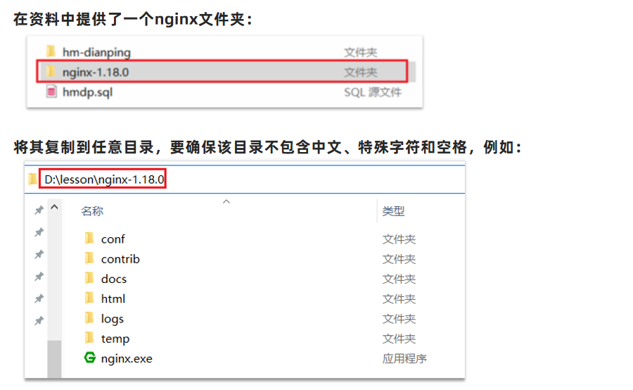
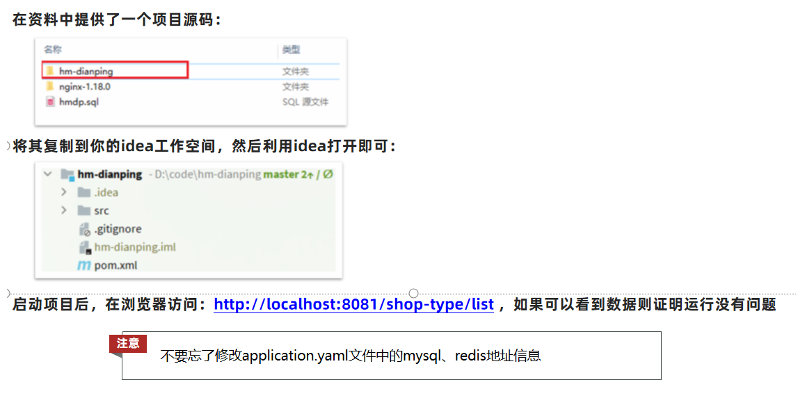
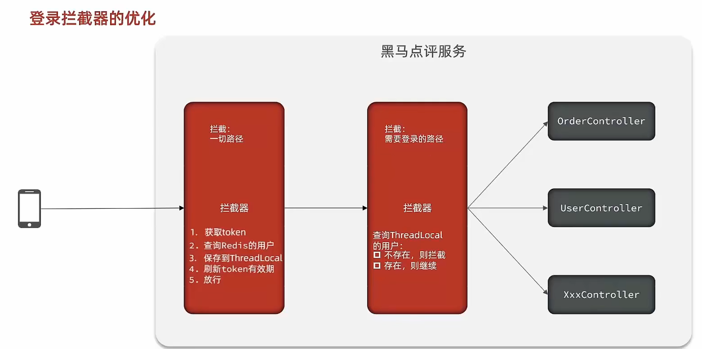
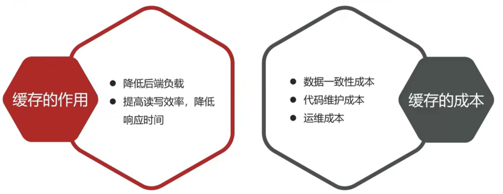
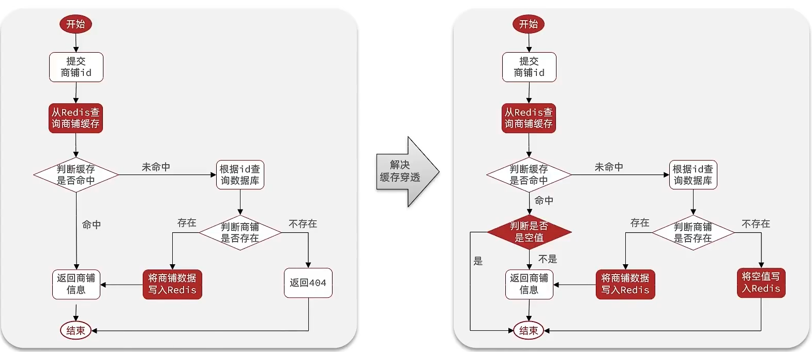
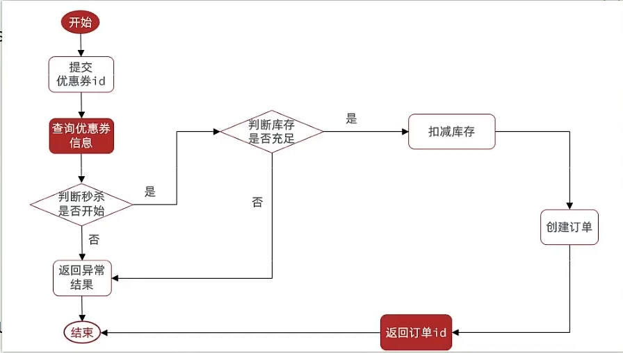
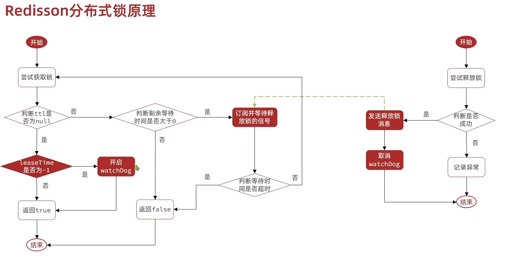
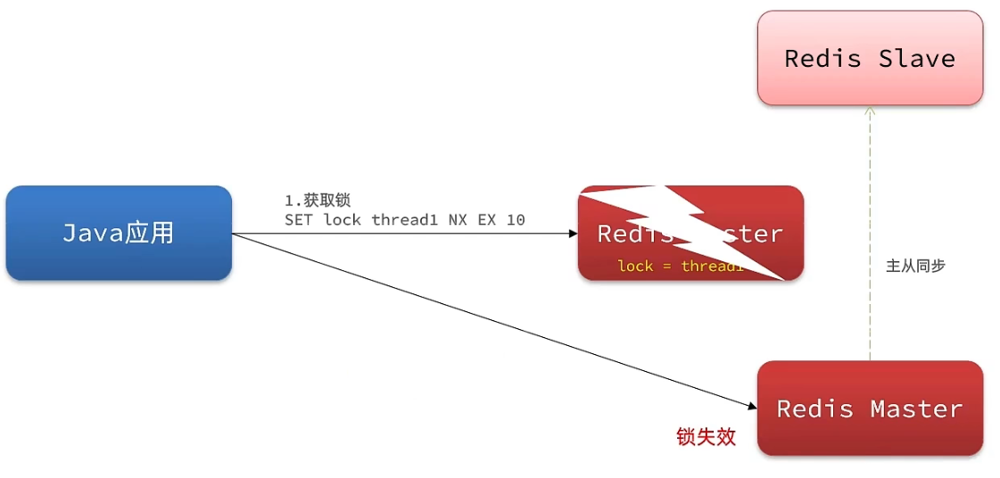
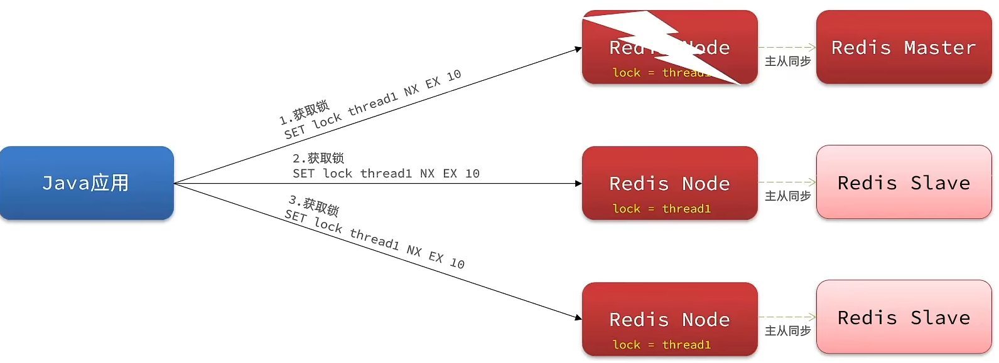

# 1.搭建基础

##1.MySQL表


## 2.整体架构

**手机或者app端发起请求，请求我们的nginx服务器，nginx基于七层模型走的事HTTP协议，可以实现基于Lua直接绕开tomcat访问redis，也可以作为静态资源服务器**

**在高并发场景下，会选择使用mysql集群，同时为了进一步降低Mysql的压力，同时增加访问的性能，我们也会加入Redis，同时使用Redis集群使得Redis对外提供更好的服务。**


**tomcat的运行原理**


1. 当用户发起请求时，会访问tomcat注册的端口，任何程序想要运行，都需要有一个线程对当前端口号进行监听
2. 当监听线程知道用户想要和tomcat连接连接时，那会由监听线程创建socket连接，socket都是成对出现的，用户通过socket像互相传递数据
3. 当tomcat端的socket接受到数据后，此时监听线程会从tomcat的线程池中取出一个线程执行用户请求，在我们的服务部署到tomcat后，线程会找到用户想要访问的工程，然后用这个线程转发到工程中的controller，service，dao中，并且访问对应的DB
4. 在用户执行完请求后，再统一返回，再找到tomcat端的socket，再将数据写回到用户端的socket，完成请求和响应
5. 每个用户其实对应都是去找tomcat线程池中的一个线程来完成工作的， 使用完成后再进行回收，既然每个请求都是独立的，所以在每个用户去访问我们的工程时，我们可以使用threadlocal来做到线程隔离，每个线程操作自己的一份数据

## 3.前端工程

启动nginx，配置文件已经配好



## 4.后端项目



# 2.短信验证码登录

## 1.基于session

###1.流程图


###2.发送验证码

#### Usercontroller

```java
    /**
     * 发送手机验证码
     *
     * @param phone
     * @param session
     * @return
     */
    @PostMapping("/code")
    public Result sendCode(@RequestParam("phone") String phone, HttpSession session) {
        return userService.sendCode(phone, session);
    }
```

#### IUserService实现类

```java
    /**
     * 发送验证码
     *
     * @param phone
     * @param session
     * @return
     */
    @Override
    public Result sendCode(String phone, HttpSession session) {
        // 1.校验手机号
        if (RegexUtils.isPhoneInvalid(phone)) {
            // 2.如果不符合，返回错误信息
            return Result.fail("手机号格式错误！");
        }
        // 3.符合，生成验证码
        String code = RandomUtil.randomNumbers(6);

        // 4.保存验证码到 session
        session.setAttribute("code",code);
        // 5.发送验证码（假设发送，非借助第三方）
        log.debug("发送短信验证码成功，验证码：{}", code);
        // 返回ok
        return Result.ok();
    }
```

### 3.登录

#### Usercontroller

```java
    /**
     * 登录功能
     *
     * @param loginForm
     * @param session
     * @return
     */
    @PostMapping("/login")
    public Result login(@RequestBody LoginFormDTO loginForm, HttpSession session) {
        return userService.login(loginForm, session);
    }
```

#### IUserService实现类

```java
	/**
     * 登录
     *
     * @param loginForm
     * @param session
     * @return
     */    
	@Override
    public Result login(LoginFormDTO loginForm, HttpSession session) {
        // 1.校验手机号
        String phone = loginForm.getPhone();
        if (RegexUtils.isPhoneInvalid(phone)) {
            // 2.如果不符合，返回错误信息
            return Result.fail("手机号格式错误！");
        }
        // 3.校验验证码
        Object cacheCode = session.getAttribute("code");
        String code = loginForm.getCode();
        if(cacheCode == null || !cacheCode.toString().equals(code)){
             //3.不一致，报错
            return Result.fail("验证码错误");
        }
        //一致，根据手机号查询用户
        //【query()方法 是因为该类继承了 mybatis-plus 提供的 ServiceImpl<XxxMapper, Xxx> 类】
        User user = query().eq("phone", phone).one();

        //5.判断用户是否存在
        if(user == null){
            //不存在，则创建，保存数据库
            user =  createUserWithPhone(phone);
        }
        //7.保存用户信息到session中【隐藏私密信息】将 User 拷贝到 UserDTO返回
        session.setAttribute("user", BeanUtils.copyProperties(user,UserDTO.class));

        return Result.ok();
    }
```

### 4.登录拦截器

#### LoginInterceptor

```java
/**
 * 【重点】手动new出来的对象，注入要利用构造器，并不是spring的自动注入；
 *  实现 HandlerInterceptor
 */
public class LoginInterceptor implements HandlerInterceptor {

    /**
     * 进入controller前
     *
     * @param request
     * @param response
     * @param handler
     * @return
     * @throws Exception
     */
    @Override
    public boolean preHandle(HttpServletRequest request, HttpServletResponse response, Object handler) throws Exception {
        // 判断是否拦截，ThreadLocal有用户不用拦截【在token拦截器中写入】
        UserDTO user = UserHolder.getUser();
        if (user == null) {
            // 拦截，返回状态码
            response.setStatus(401);
            return false;
        }
        // 有用户则放行
        return true;
    }

    @Override
    public void postHandle(HttpServletRequest request, HttpServletResponse response, Object handler, ModelAndView modelAndView) throws Exception {
        HandlerInterceptor.super.postHandle(request, response, handler, modelAndView);
    }

    @Override
    public void afterCompletion(HttpServletRequest request, HttpServletResponse response, Object handler, Exception ex) throws Exception {
        HandlerInterceptor.super.afterCompletion(request, response, handler, ex);
    }

}
```

#### 配置拦截器MvcConfig

```java
/**
 * 配置mvc拦截
 */
@Configuration
public class MvcConfig implements WebMvcConfigurer {

    @Resource
    private StringRedisTemplate stringRedisTemplate;

    /**
     * 添加拦截器
     *
     * @param registry
     */
    @Override
    public void addInterceptors(InterceptorRegistry registry) {
        // 登录拦截器
        registry.addInterceptor(new LoginInterceptor())
                .excludePathPatterns( // 不需要拦截
                        "/shop/**",
                        "/voucher/**",
                        "/shop-type/**",
                        "/upload/**",
                        "/blog/hot",
                        "/user/code",
                        "/user/login")
                .order(1);
        // token 刷新拦截器
        registry.addInterceptor(new RefreshTokenInterceptor(stringRedisTemplate))
                .addPathPatterns("/**") // 拦截所有请求，默认为拦截所有请求
                .order(0); // 值越小，越先执行
    }
}
```

### 5.session共享问题

**核心思路分析：**

**每个tomcat中都有一份属于自己的session**, 假设用户第一次访问第一台tomcat，并且把自己的信息存放到第一台服务器的session中，但是第二次这个用户访问到了第二台tomcat，那么在第二台服务器上，肯定没有第一台服务器存放的session，所以此时 整个登录拦截功能就会出现问题，我们能如何解决这个问题呢？**早期的方案是session拷贝**，就是说虽然每个tomcat上都有不同的session，但是每当任意一台服务器的session修改时，都会同步给其他的Tomcat服务器的session，这样的话，就可以实现session的共享了

但是这种方案具有两个大问题

1. 每台服务器中都有完整的一份session数据，服务器压力过大。
2. session拷贝数据时，可能会出现延迟

所以咱们后来**采用的方案都是基于redis来完成，我们把session换成redis，redis数据本身就是共享的，就可以避免session共享的问题了**

## 2.基于redis

### 1.设计key

#### 设计key的结构

首先我们要思考一下利用redis来存储数据，那么到底使用哪种结构呢？由于存入的数据比较简单，我们可以考虑使用String，或者是使用哈希，如下图，如果使用String，同学们注意他的value，用多占用一点空间，如果使用哈希，则他的value中只会存储他数据本身，如果不是特别在意内存，其实使用String就可以啦。


#### 设计key的具体细节

所以我们可以使用String结构，就是一个简单的key，value键值对的方式，但是关于key的处理，session他是每个用户都有自己的session，但是redis的key是共享的，咱们就不能使用code了

在设计这个key的时候，我们之前讲过需要满足两点

1、key要具有**唯一性**

2、key要**方便携带**

如果我们采用phone：手机号这个的数据来存储当然是可以的，但是如果把这样的敏感数据存储到redis中并且从页面中带过来毕竟不太合适，所以我们在后台生成一个随机串token，然后让前端带来这个token就能完成我们的整体逻辑了

### 2.流程图


### 3.发送验证码

#### IUserService实现类

```java
    /**
     * 发送验证码
     *
     * @param phone
     * @param session
     * @return
     */
    @Override
    public Result sendCode(String phone, HttpSession session) {
        // 校验手机号
        if (RegexUtils.isPhoneInvalid(phone)) {
            return Result.fail("手机号码格式错误");
        }

        // 生成验证码
        String code = RandomUtil.randomNumbers(6);

        // 保存redis，验证码有效期
        stringRedisTemplate.opsForValue().set(LOGIN_CODE_KEY + phone, code, LOGIN_CODE_TTL_SECONDS, TimeUnit.SECONDS);

        // 假设发送验证码成功（非借助第三方）
        log.debug("发送验证码：" + code);

        return Result.ok();
    }
```

### 4.登录

#### IUserService实现类

```java
	/**
     * 登录
     *
     * @param loginForm
     * @param session
     * @return
     */
    @Override
    public Result login(LoginFormDTO loginForm, HttpSession session) {
        // 校验手机号
        String phone = loginForm.getPhone();
        if (RegexUtils.isPhoneInvalid(phone)) {
            return Result.fail("手机号码格式错误");
        }

        // 从redis获取，校验验证码
        String cacheCode = stringRedisTemplate.opsForValue().get(LOGIN_CODE_KEY + phone);
        String code = loginForm.getCode();
        if (cacheCode == null || !cacheCode.equals(code)) {
            return Result.fail("验证码错误");
        }

        // 查询用户
        User user = query().eq("phone", phone).one();
        if (user == null) {
            // 不存在，创建用户
            user = new User();
            user.setPhone(phone);
            user.setNickName(USER_NICK_NAME_PREFIX + RandomUtil.randomString(5));
            // 保存到数据库
            save(user);
        }

        // key为随机token，返回前端
        String token = UUID.randomUUID().toString(true);

        // 保存信息到redis，保存UserDTO，浪费内存少
        UserDTO userDTO = BeanUtil.copyProperties(user, UserDTO.class);
        Map<String, Object> map = BeanUtil.beanToMap(
                userDTO,
                new HashMap<>(),
                CopyOptions.create()
                        .setIgnoreNullValue(true)
                        .setFieldValueEditor((fieldName, fieldValue) -> {
                            return fieldValue.toString(); // 将其他类型 全部转为String
                        })
        );

        // 一次性存储map，并验证有效期
        String tokenKey = LOGIN_USER_KEY + token;
        stringRedisTemplate.opsForHash().putAll(tokenKey, map);
        stringRedisTemplate.expire(tokenKey, LOGIN_USER_TTL_MINUTES, TimeUnit.MINUTES);

        // 返回token
        return Result.ok(token);
    }
```

### 5.token拦截器

在第一个拦截器中拦截所有的路径，把第二个拦截器做的事情放入到第一个拦截器中，同时刷新令牌，因为第一个拦截器有了threadLocal的数据，所以此时第二个拦截器只需要判断拦截器中的user对象是否存在即可，完成整体刷新功能。



#### RefreshTokenInterceptor

```java
/**
 * 【重点】RefreshTokenInterceptor并不是Spring管理的对象，属性注入要利用构造器，并不是spring的自动注入；
 * RefreshTokenInterceptor拦截所有，只对有token的请求，进行refresh和保存在ThreadLocal中
 */
public class RefreshTokenInterceptor implements HandlerInterceptor {

    /**
     * 自己手动创建的对象，里面的实例需要自己手动注入，
     * spring创建的对象，可以使用自动注入方法。
     */
    private StringRedisTemplate stringRedisTemplate;

    /**
     * 构造器注入
     */
    public RefreshTokenInterceptor(StringRedisTemplate stringRedisTemplate) {
        this.stringRedisTemplate = stringRedisTemplate;
    }

    /**
     * 进入controller前
     *
     * @param request
     * @param response
     * @param handler
     * @return
     * @throws Exception
     */
    @Override
    public boolean preHandle(HttpServletRequest request, HttpServletResponse response, Object handler) throws Exception {

        // 获取请求头的token信息
        String token = request.getHeader("authorization");
        if (StrUtil.isBlank(token)) {
            return true;
        }

        // token不为空，获取redis中用户，并判断
        String tokenKey = RedisConstants.LOGIN_USER_KEY + token;
        Map<Object, Object> map = stringRedisTemplate.opsForHash().entries(tokenKey);
        if (map.isEmpty()) {
            return true;
        }

        // 用户存在，hash数据转为UserDTO，并保存ThreadLocal【重点】
        UserDTO userDTO = BeanUtil.fillBeanWithMap(map, new UserDTO(), false);
        UserHolder.saveUser(userDTO);

        //【重点】刷新token有效期
        stringRedisTemplate.expire(tokenKey, RedisConstants.LOGIN_USER_TTL_MINUTES, TimeUnit.MINUTES);

        // 放行
        return true;
    }

    @Override
    public void postHandle(HttpServletRequest request, HttpServletResponse response, Object handler, ModelAndView modelAndView) throws Exception {
        HandlerInterceptor.super.postHandle(request, response, handler, modelAndView);
    }

    @Override
    public void afterCompletion(HttpServletRequest request, HttpServletResponse response, Object handler, Exception ex) throws Exception {
        // 删除当前线程的user
        UserHolder.removeUser();
    }
}
```

#### 配置拦截器MvcConfig

```java
/**
 * 配置mvc拦截
 */
@Configuration
public class MvcConfig implements WebMvcConfigurer {

    @Resource
    private StringRedisTemplate stringRedisTemplate;

    /**
     * 添加拦截器
     *
     * @param registry
     */
    @Override
    public void addInterceptors(InterceptorRegistry registry) {
        // 登录拦截器，声明不包括……
        registry.addInterceptor(new LoginInterceptor())
                .excludePathPatterns(
                        "/shop/**",
                        "/voucher/**",
                        "/shop-type/**",
                        "/upload/**",
                        "/blog/hot",
                        "/user/code",
                        "/user/login")
                .order(1);
        // token 刷新拦截器；构造器传入stringRedisTemplate
        registry.addInterceptor(new RefreshTokenInterceptor(stringRedisTemplate))
                .addPathPatterns("/**") // 拦截所有请求，默认为拦截所有请求
                .order(0); // 值越小，越先执行
    }
}
```

# 3.商铺信息添加到redis

参考：[Redis哨兵-实现Redis高可用](https://redis.com.cn/topics/sentinel.html)    redis sentinel 哨兵

## 1.简介

**缓存(**Cache),就是数据交换的**缓冲区**,俗称的缓存就是**缓冲区内的数据**

缓存数据存储于代码中,而代码运行在内存中,内存的读写性能远高于磁盘,缓存可以大大降低**用户访问并发量带来的**服务器读写压力



**浏览器缓存**：主要是存在于浏览器端的缓存

**应用层缓存：**可以分为tomcat本地缓存，比如之前提到的map，或者是使用redis作为缓存

**数据库缓存：**在数据库中有一片空间是 buffer pool，增改查数据都会先加载到mysql的缓存中

**CPU缓存：**当代计算机最大的问题是 cpu性能提升了，但内存读写速度没有跟上，所以为了适应当下的情况，增加了cpu的L1，L2，L3级的缓存

## 2.流程图


## 3.添加信息到redis

### ShopController

```java
    /**
     * 根据id查询商铺信息【经过缓存redis】
     *
     * @param id 商铺id
     * @return 商铺详情数据
     */
    @GetMapping("/{id}")
    public Result queryShopById(@PathVariable("id") Long id) {
        return shopService.queryById(id);
    }
```

### IShopService实现类

Shop shop = 调用函数……

 调用函数可分为：

1. 缓存击穿
2. 缓存雪崩
3. 缓存穿透

```java
    /**
     * 根据id查询数据库 商铺信息
     *
     * @param id
     * @return
     */
    @Override
    public Result queryById(Long id) {
        Shop shop = 调用函数……

        if (shop == null) {
            return Result.fail("店铺不存在");
        }

        return Result.ok(shop);
    }
```

### 三大缓存问题

#### 1.缓存穿透

缓存穿透 ：缓存穿透是指客户端请求的数据在缓存中和数据库中都不存在，这样缓存永远不会生效，这些请求都会打到数据库。

常见的解决方案有两种：

- 缓存空对象
  - 优点：实现简单，维护方便
  - 缺点：
    - 额外的内存消耗
    - 可能造成短期的不一致
- 布隆过滤
  - 优点：内存占用较少，没有多余key
  - 缺点：
    - 实现复杂
    - 存在误判可能

（1）**缓存空对象思路分析：**当我们客户端访问不存在的数据时，先请求redis，但是此时redis中没有数据，此时会访问到数据库，但是数据库中也没有数据，这个数据穿透了缓存，直击数据库，我们都知道数据库能够承载的并发不如redis这么高，如果大量的请求同时过来访问这种不存在的数据，这些请求就都会访问到数据库，简单的解决方案就是哪怕这个数据在数据库中也不存在，我们也把这个数据存入到redis中去，这样，下次用户过来访问这个不存在的数据，那么在redis中也能找到这个数据就不会进入到缓存了

（2）**布隆过滤：**布隆过滤器其实采用的是哈希思想来解决这个问题，通过一个庞大的二进制数组，走哈希思想去判断当前这个要查询的这个数据是否存在，如果布隆过滤器判断存在，则放行，这个请求会去访问redis，哪怕此时redis中的数据过期了，但是数据库中一定存在这个数据，在数据库中查询出来这个数据后，再将其放入到redis中。假设布隆过滤器判断这个数据不存在，则直接返回

这种方式优点在于节约内存空间，存在误判，误判原因在于：布隆过滤器走的是哈希思想，只要哈希思想，就可能存在哈希冲突


流程图



缓存穿透的解决方案有哪些？

- 缓存null值
- 布隆过滤
- 增强id的复杂度，避免被猜测id规律
- 做好数据的基础格式校验
- 加强用户权限校验
- 做好热点参数的限流

##### IShopService实现类

```java
/**
 * 【缓存穿透】
 *
 * @param id
 * @return
 */
@Deprecated
private Shop queryWithPassThrough(Long id) {
    // 从redis查缓存
    String shopJson = stringRedisTemplate.opsForValue().get(RedisConstants.CACHE_SHOP_KEY + id);
    if (StrUtil.isNotBlank(shopJson)) {
        // 缓存信息存在，直接返回
        Shop shop = JSONUtil.toBean(shopJson, Shop.class);
        return shop;
    }
    //【缓存穿透】缓存信息失效；判断命中是否为空值，""空字符串
    if (shopJson != null) {
        return null; //返回一个错误信息
    }

    // 不存在，查询数据库
    Shop shop = getById(id);
    if (shop == null) {
        //【缓存穿透】空值写入redis
        stringRedisTemplate.opsForValue().set(RedisConstants.CACHE_SHOP_KEY + id, "", RedisConstants.CACHE_NULL_TTL_MINUTES, TimeUnit.MINUTES);
        return null;
    }

    // 存在，写入redis，并设置过期时间
    stringRedisTemplate.opsForValue().set(RedisConstants.CACHE_SHOP_KEY + id, JSONUtil.toJsonStr(shop), RedisConstants.CACHE_SHOP_TTL_MINUTES, TimeUnit.MINUTES);

    return shop;
}
```

#### 2.缓存雪崩

缓存雪崩是指在同一时段大量的缓存key同时失效或者Redis服务宕机，导致大量请求到达数据库，带来巨大压力。

解决方案：

- 给不同的Key的TTL添加随机值
- 利用Redis集群提高服务的可用性
- 给缓存业务添加**降级限流策略**
- 给业务添加**多级缓存**


#### 3.缓存击穿

缓存击穿问题也叫热点Key问题，就是一个被高并发访问并且缓存重建业务较复杂的key突然失效了，无数的请求访问会在瞬间给数据库带来巨大的冲击。

常见的解决方案有两种：

- 互斥锁
- 逻辑过期

逻辑分析：假设线程1在查询缓存之后，本来应该去查询数据库，然后把这个数据重新加载到缓存的，此时只要线程1走完这个逻辑，其他线程就都能从缓存中加载这些数据了，但是假设在线程1没有走完的时候，后续的线程2，线程3，线程4同时过来访问当前这个方法， 那么这些线程都不能从缓存中查询到数据，那么他们就会同一时刻来访问查询缓存，都没查到，接着同一时间去访问数据库，同时的去执行数据库代码，对数据库访问压力过大


解决方案一、使用锁来解决：

因为锁能实现互斥性。假设线程过来，只能一个人一个人的来访问数据库，从而避免对于数据库访问压力过大，但这也会影响查询的性能，因为此时会让查询的性能从并行变成了串行，我们可以采用tryLock方法 + double check来解决这样的问题。

假设现在线程1过来访问，他查询缓存没有命中，但是此时他获得到了锁的资源，那么线程1就会一个人去执行逻辑，假设现在线程2过来，线程2在执行过程中，并没有获得到锁，那么线程2就可以进行到休眠，直到线程1把锁释放后，线程2获得到锁，然后再来执行逻辑，此时就能够从缓存中拿到数据了。


解决方案二、逻辑过期方案

方案分析：我们之所以会出现这个缓存击穿问题，主要原因是在于我们对key设置了过期时间，假设我们不设置过期时间，其实就不会有缓存击穿的问题，但是不设置过期时间，这样数据不就一直占用我们内存了吗，我们可以采用逻辑过期方案。

我们把过期时间设置在 redis的value中，注意：这个过期时间并不会直接作用于redis，而是我们后续通过逻辑去处理。假设线程1去查询缓存，然后从value中判断出来当前的数据已经过期了，此时线程1去获得互斥锁，那么其他线程会进行阻塞，获得了锁的线程他会开启一个 线程去进行 以前的重构数据的逻辑，直到新开的线程完成这个逻辑后，才释放锁， 而线程1直接进行返回，假设现在线程3过来访问，由于线程线程2持有着锁，所以线程3无法获得锁，线程3也直接返回数据，只有等到新开的线程2把重建数据构建完后，其他线程才能走返回正确的数据。

这种方案巧妙在于，异步的构建缓存，缺点在于在构建完缓存之前，返回的都是脏数据。


进行对比

**互斥锁方案：**由于保证了互斥性，所以数据一致，且实现简单，因为仅仅只需要加一把锁而已，也没其他的事情需要操心，所以没有额外的内存消耗，缺点在于有锁就有死锁问题的发生，且只能串行执行性能肯定受到影响

**逻辑过期方案：** 线程读取过程中不需要等待，性能好，有一个额外的线程持有锁去进行重构数据，但是在重构数据完成前，其他的线程只能返回之前的数据，且实现起来麻烦


##### 1.互斥锁

核心思路：相较于原来从缓存中查询不到数据后直接查询数据库而言，现在的方案是 进行查询之后，如果从缓存没有查询到数据，则进行互斥锁的获取，获取互斥锁后，判断是否获得到了锁，如果没有获得到，则休眠，过一会再进行尝试，直到获取到锁为止，才能进行查询

如果获取到了锁的线程，再去进行查询，查询后将数据写入redis，再释放锁，返回数据，利用互斥锁就能保证只有一个线程去执行操作数据库的逻辑，防止缓存击穿


###### IShopService实现类

```java
/**
 * 【缓存击穿】获取锁
 *
 * @param key
 * @return
 */
@Deprecated
private boolean tryLock(String key) {
    // setnx key value
    Boolean flag = stringRedisTemplate.opsForValue().setIfAbsent(key, "1", 10, TimeUnit.SECONDS);
    // 不要直接return flag，会有自动拆箱，出现空指针异常
    return BooleanUtil.isTrue(flag);
}

/**
 * 【缓存击穿】释放锁
 *
 * @param key
 */
@Deprecated
private void unlock(String key) {
    stringRedisTemplate.delete(key);
}
```

```java
/**
 * 【缓存穿透 + 击穿】锁机制
 *
 * @param id
 * @return
 */
@Deprecated
private Shop queryWithMutex(Long id) {
    // 从redis查缓存
    String shopJson = stringRedisTemplate.opsForValue().get(RedisConstants.CACHE_SHOP_KEY + id);
    if (StrUtil.isNotBlank(shopJson)) {
        return JSONUtil.toBean(shopJson, Shop.class);
    }
    //【缓存穿透】判断命中是否为空值，""空字符串
    if (shopJson != null) {
        return null;
    }

    //【缓存击穿】获取互斥锁
    Shop shop;
    try {
        boolean lock = tryLock(RedisConstants.LOCK_SHOP_KEY + id);
        if (lock == false) {
            // 获取锁失败，先进行休眠
            Thread.sleep(50);
            // 递归？重新查询
            return queryWithMutex(id);
        }

        // 成功获取锁，再次查询redis；存在就返回，不存在就查询数据库
        shopJson = stringRedisTemplate.opsForValue().get(RedisConstants.CACHE_SHOP_KEY + id);
        if (StrUtil.isNotBlank(shopJson)) {
            return JSONUtil.toBean(shopJson, Shop.class);
        }

        // 不存在，查询数据库
        shop = getById(id);
        Thread.sleep(200); // 模拟重建延迟
        if (shop == null) {
            //【缓存穿透】空值写入redis
            stringRedisTemplate.opsForValue().set(RedisConstants.CACHE_SHOP_KEY + id, "", RedisConstants.CACHE_NULL_TTL_MINUTES, TimeUnit.MINUTES);
            return null;
        }

        // 存在，写入redis，并设置过期时间
        stringRedisTemplate.opsForValue().set(RedisConstants.CACHE_SHOP_KEY + id, JSONUtil.toJsonStr(shop), RedisConstants.CACHE_SHOP_TTL_MINUTES, TimeUnit.MINUTES);

    } catch (InterruptedException e) {
        throw new RuntimeException(e);
    } finally {
        // 释放互斥锁
        unlock(RedisConstants.LOCK_SHOP_KEY + id);
    }

    return shop;
}
```

##### 2.逻辑过期

需求：修改根据id查询商铺的业务，基于逻辑过期方式来解决缓存击穿问题**

思路分析：当用户开始查询redis时，判断是否命中，如果没有命中则直接返回空数据，不查询数据库，而一旦命中后，将value取出，判断value中的过期时间是否满足，如果没有过期，则直接返回redis中的数据，如果过期，则在开启独立线程后直接返回之前的数据，独立线程去重构数据，重构完成后释放互斥锁。


如果封装数据：因为现在redis中存储的数据的value需要带上过期时间，此时要么你去修改原来的实体类，要么你

**步骤一：**

新建一个实体类，我们采用第二个方案，这个方案，对原来代码没有侵入性。

```java
@Data
public class RedisData {
    private LocalDateTime expireTime;
    private Object data;
}
```

**步骤二：**

在**ShopServiceImpl** 新增此方法，利用**单元测试进行缓存预热**【可以利用xxl-job实现】

```java
/**
 * 封装逻辑过期时间，预热
 *
 * @param id
 * @param expireSeconds
 */
@Deprecated
public void saveShop2RedisByLogicExpire(Long id, Long expireSeconds) throws InterruptedException {
    // 查询店铺数据
    Shop shop = getById(id);
    Thread.sleep(50); // 模拟延迟

    // 封装逻辑过期时间
    RedisData redisData = new RedisData();
    redisData.setData(shop);
    redisData.setExpireTime(LocalDateTime.now().plusSeconds(expireSeconds));

    // 写入redis，不设置redis的过期时间
    stringRedisTemplate.opsForValue().set(RedisConstants.CACHE_SHOP_KEY + id, JSONUtil.toJsonStr(redisData));
}
```

**步骤三：**正式代码

###### IShopService实现类

```java
/**
 * 【缓存击穿】获取锁
 *
 * @param key
 * @return
 */
@Deprecated
private boolean tryLock(String key) {
    // setnx key value
    Boolean flag = stringRedisTemplate.opsForValue().setIfAbsent(key, "1", 10, TimeUnit.SECONDS);
    // 不要直接return flag，会有自动拆箱，出现空指针异常
    return BooleanUtil.isTrue(flag);
}

/**
 * 【缓存击穿】释放锁
 *
 * @param key
 */
@Deprecated
private void unlock(String key) {
    stringRedisTemplate.delete(key);
}
```

```java
    /**
     * 线程池
     */
    private static final ExecutorService CACHE_REBUILD_EXECUTOR = Executors.newFixedThreadPool(10); 

	/**
     * 【缓存击穿】逻辑过期时间，前提要有redis预热所有店铺（不用考虑穿透）
     *
     * @param id
     * @return
     */
    @Deprecated
    private Shop queryWithLogicExpire(Long id) {
        // 从redis查店铺缓存，是否存在
        String shopJson = stringRedisTemplate.opsForValue().get(RedisConstants.CACHE_SHOP_KEY + id);
        if (StrUtil.isBlank(shopJson)) {
            return null;
        }

        // 存在，判断是否过期
        RedisData redisData = JSONUtil.toBean(shopJson, RedisData.class);
        JSONObject jsonObject = (JSONObject) redisData.getData();
        Shop shop = JSONUtil.toBean(jsonObject, Shop.class);

        LocalDateTime expireTime = redisData.getExpireTime();
        if (expireTime.isAfter(LocalDateTime.now())) { // 如果过期时间在now之后，说明还没过期
            return shop;
        }

        // 过期，需要缓存重建，获取锁
        String lockKey = RedisConstants.LOCK_SHOP_KEY + id;
        boolean lock = tryLock(lockKey);
        if (lock == false) {
            return shop;
        }

        // 获取锁成功，再次查询redis，进行Double Check
        //【线程A和B同时判断是过期】 A重建缓存后释放锁，但是B由于网络原因，在A释放锁后才开始获取锁
        shopJson = stringRedisTemplate.opsForValue().get(RedisConstants.CACHE_SHOP_KEY + id);
        redisData = JSONUtil.toBean(shopJson, RedisData.class);
        jsonObject = (JSONObject) redisData.getData();
        shop = JSONUtil.toBean(jsonObject, Shop.class);

        expireTime = redisData.getExpireTime();
        if (expireTime.isAfter(LocalDateTime.now())) { // 如果过期时间在now之后，说明还没过期
            return shop;
        }

        // Double Check后，开启线程缓存重建
        CACHE_REBUILD_EXECUTOR.submit(() -> {
            try {
                // 缓存重建，逻辑10s过期，为了方便测试
                this.saveShop2RedisByLogicExpire(id, 10L);
            } catch (Exception e) {
                throw new RuntimeException(e);
            } finally {
                // 释放锁
                unlock(lockKey);
            }
        });

        return shop;
    }
```

## 4.更新商铺信息时

参考：[✅技术派Mysql/Redis缓存一致性（👍强烈推荐） (yuque.com)](https://www.yuque.com/itwanger/az7yww/csd39nrtxnmsnr5k) 

### 更新策略

缓存更新是redis为了节约内存而设计出来的一个东西，主要是因为内存数据宝贵，当我们向redis插入太多数据，此时就可能会导致缓存中的数据过多，所以redis会对部分数据进行更新，或者把他叫为淘汰更合适。

**内存淘汰：**redis自动进行，当redis内存达到咱们设定的max-memery的时候，会自动触发淘汰机制，淘汰掉一些不重要的数据(可以自己设置策略方式)

**超时剔除：**当我们给redis设置了过期时间ttl之后，redis会将超时的数据进行删除，方便咱们继续使用缓存

**主动更新：**我们可以手动调用方法把缓存删掉，通常用于解决缓存和数据库不一致问题


由于我们的**缓存的数据源来自于数据库**,而数据库的**数据是会发生变化的**,因此,如果当数据库中**数据发生变化,而缓存却没有同步**,此时就会有**一致性问题存在**,其后果是:

用户使用缓存中的过时数据,就会产生类似多线程数据安全问题,从而影响业务

1. Cache Aside Pattern 人工编码方式：缓存调用者在更新完数据库后再去更新缓存，也称之为双写方案
2. Read/Write Through Pattern : 由系统本身完成，数据库与缓存的问题交由系统本身去处理
3. Write Behind Caching Pattern ：调用者只操作缓存，其他线程去异步处理数据库，实现最终一致


**数据库和缓存不一致采用什么方案**

综合考虑使用方案一，但是方案一调用者如何处理呢？这里有几个问题

操作缓存和数据库时有三个问题需要考虑：

如果采用第一个方案，那么假设我们每次操作数据库后，都操作缓存，但是中间如果没有人查询，那么这个更新动作实际上只有最后一次生效，中间的更新动作意义并不大，我们可以把缓存删除，等待再次查询时，将缓存中的数据加载出来

- **删除缓存还是更新缓存？**
  - **更新缓存**：每次更新数据库都更新缓存，无效写操作较多（写多读少）
  - **删除缓存：更新数据库时让缓存失效（删除），查询时再更新缓存【优】**
- **如何保证缓存与数据库的操作的同时成功或失败？**
  - **单体系统**，将**缓存与数据库操作放在一个事务**
  - **分布式系统**，利用**TCC**等分布式事务方案

应该具体操作缓存还是操作数据库，我们应当是先操作数据库，再删除缓存，原因在于，如果你选择第一种方案，在两个线程并发来访问时，假设线程1先来，他先把缓存删了，此时线程2过来，他查询缓存数据并不存在，此时他写入缓存，当他写入缓存后，线程1再执行更新动作时，实际上写入的就是旧的数据，新的数据被旧数据覆盖了。

- **先操作缓存还是先操作数据库？**
  - 先删除缓存，再操作数据库
  - **先操作数据库，再删除缓存【优，因为缓存写入，比数据库写入快；出现概率比前一种小；实时一致性】**
  - 两者都会导致 缓存 和 数据库 数据不一致


尽量保证 redis 和 MySQL 数据一致性

### ShopController

```java
/**
 * 更新商铺信息
 *
 * @param shop 商铺数据
 * @return 无
 */
@PutMapping
public Result updateShop(@RequestBody Shop shop) {
    return shopService.updateData(shop);
}
```

### IShopService实现类

```java
    /**
     * 更新redis和数据库
     *
     * @param shop
     * @return
     */
    @Override
    @Transactional // 添加事务注解控制原子性操作，数据库回滚【重点】注意spring事务失效
    public Result updateData(Shop shop) {
        Long id = shop.getId();
        if (id == null) {
            return Result.fail("店铺id不能为空");
        }

        // 先更新数据库
        updateById(shop);
        // 再删除缓存
        stringRedisTemplate.delete(RedisConstants.CACHE_SHOP_KEY + id);

        return Result.ok();
    }
```

# 4.单机同步下的优惠券抢购

## 1.订单全局唯一ID

场景分析一：如果我们的id具有**太明显的规则**，用户或者说商业对手很容易猜测出来我们的一些敏感信息，比如商城在一天时间内，卖出了多少单，这明显不合适。

场景分析二：随着我们商城规模越来越大，mysql的单表的容量不宜超过500W，数据量过大之后，我们要进行**拆库拆表**，但拆分表了之后，他们从逻辑上讲他们是同一张表，所以他们的id是不能一样的， 于是乎我们需要保证id的唯一性。

为了增加ID的安全性，我们可以不直接使用Redis自增的数值，而是拼接一些其它信息：


ID的组成部分：符号位：1bit，永远为0

时间戳：31bit，以秒为单位，可以使用69年

序列号：32bit，秒内的计数器，支持每秒产生2^32个不同ID

### RedisIDCreator工具类

```Java
/**
 * 基于Redis的订单id生成工具类
 */
@Component
public class RedisIDCreator {

    /**
     * 2022年1月1日0时0分0秒 的 toEpochSecond（开始时间戳）
     */
    private static final long BEGIN_TIMESTAMP = 1640995200L;

    /**
     * 序列号的位数
     */
    private static final int SHIFT_LEFT_BITS = 32;

    @Autowired
    private StringRedisTemplate stringRedisTemplate;

    /**
     * 生成id
     *
     * @param keyPrefix
     * @return
     */
    public long nextId(String keyPrefix) {
        // 时间戳
        LocalDateTime now = LocalDateTime.now();
        long nowSecond = now.toEpochSecond(ZoneOffset.UTC);
        long timestamp = nowSecond - BEGIN_TIMESTAMP;

        // 序列号
        // 获取当前日期，每一天都有新的起点【重点】
        String yyyyMMdd = now.format(DateTimeFormatter.ofPattern("yyyy:MM:dd"));
        long increment = stringRedisTemplate.opsForValue().increment("icr:" + keyPrefix + ":" + yyyyMMdd);

        // 拼接，位运算
        return timestamp << SHIFT_LEFT_BITS | increment;
    }

}
```

## 2.添加优惠券

两种表：

1. tb_voucher：优惠券的基本信息，优惠金额、使用规则等
2. tb_seckill_voucher：优惠券的库存、开始抢购时间，结束抢购时间。特价优惠券才需要填写这些信息

### VoucherController

```java
    /**
     * 新增普通券
     *
     * @param voucher 优惠券信息
     * @return 优惠券id
     */
    @PostMapping
    public Result addVoucher(@RequestBody Voucher voucher) {
        voucherService.save(voucher);
        return Result.ok(voucher.getId());
    }

    /**
     * 新增秒杀券
     *
     * @param voucher 优惠券信息，包含秒杀信息
     * @return 优惠券id
     */
    @PostMapping("seckill")
    public Result addSeckillVoucher(@RequestBody Voucher voucher) {
        voucherService.addSeckillVoucher(voucher);
        return Result.ok(voucher.getId());
    }
```

### IVoucherService实现类

```java
    /**
     * 添加秒杀券
     *
     * @param voucher
     */
    @Override
    @Transactional
    public void addSeckillVoucher(Voucher voucher) {
        // 保存优惠券
        save(voucher);

        // 保存秒杀信息
        SeckillVoucher seckillVoucher = new SeckillVoucher();
        seckillVoucher.setVoucherId(voucher.getId());
        seckillVoucher.setStock(voucher.getStock());
        seckillVoucher.setBeginTime(voucher.getBeginTime());
        seckillVoucher.setEndTime(voucher.getEndTime());
        seckillVoucherService.save(seckillVoucher);

        //【异步秒杀】同时写入redis
        stringRedisTemplate.opsForValue().set(RedisConstants.SECKILL_STOCK_KEY + voucher.getId(), voucher.getStock().toString());
        
    }
```

## 3.抢购下单

### 流程图

下单时需要判断两点：

- 秒杀是否开始或结束，如果尚未开始或已经结束则无法下单
- 库存是否充足，不足则无法下单

下单核心逻辑分析：

当用户开始进行下单，我们应当去查询优惠卷信息，查询到优惠卷信息，判断是否满足秒杀条件

比如时间是否充足，如果时间充足，则进一步判断库存是否足够，如果两者都满足，则扣减库存，创建订单，然后返回订单id，如果有一个条件不满足则直接结束。



### VoucherOrderController

```java
    /**
     * 秒杀下单
     *
     * @param voucherId
     * @return
     */
    @PostMapping("/seckill/{id}")
    @RestrictRequest(interval = 10, count = 5) // 限制接口访问（限流）【重点】
    public Result seckillVoucher(@PathVariable("id") Long voucherId) {
        return voucherOrderService.seckillVoucher(voucherId);
    }
```

### 超卖问题

假设线程1过来查询库存，判断出来库存大于1，正准备去扣减库存，但是还没有来得及去扣减，此时线程2过来，线程2也去查询库存，发现这个数量一定也大于1，那么这两个线程都会去扣减库存，最终多个线程相当于一起去扣减库存，此时就会出现库存的超卖问题。


**悲观锁：**

 悲观锁可以实现对于数据的串行化执行，比如syn，和lock都是悲观锁的代表，同时，悲观锁中又可以再细分为公平锁，非公平锁，可重入锁，等等

**乐观锁：**

  乐观锁：会有一个版本号，每次操作数据会对版本号+1，再提交回数据时，会去校验是否比之前的版本大1 ，如果大1 ，则进行操作成功，这套机制的核心逻辑在于，如果在操作过程中，版本号只比原来大1 ，那么就意味着操作过程中没有人对他进行过修改，他的操作就是安全的，如果不大1，则数据被修改过，当然乐观锁还有一些变种的处理方式比如cas

  乐观锁的典型代表：就是cas，利用cas进行无锁化机制加锁，var5 是操作前读取的内存值，while中的var1+var2 是预估值，如果预估值 == 内存值，则代表中间没有被人修改过，此时就将新值去替换 内存值

#### 实现方案

使用乐观锁，优惠券的 **库存stock字段** 当作 version 版本号；**条件改成stock大于0 即可**

#### IVoucherOrderService实现类

```java
/**
 * 同步下单，创建订单，写入数据库
 *
 * @param voucherId
 * @param userId
 * @return
 */
@Override
public Result seckillVoucherSync(Long voucherId) {
    // 1.查询优惠券
    SeckillVoucher voucher = seckillVoucherService.getById(voucherId);
    // 2.判断秒杀是否开始，已经结束
    if (voucher.getBeginTime().isAfter(LocalDateTime.now())) {
        return Result.fail("秒杀尚未开始！");
    }
    if (voucher.getEndTime().isBefore(LocalDateTime.now())) {
        return Result.fail("秒杀已经结束！");
    }
    
    // 4.判断库存是否充足
    if (voucher.getStock() < 1) {
        return Result.fail("库存不足！");
    }
    
    //5，扣减库存【乐观锁】
    boolean success = seckillVoucherService.update()
            .setSql("stock= stock -1")
            .eq("voucher_id", voucherId).update().gt("stock",0); //where id = ? and stock > 0
    if (!success) {
        return Result.fail("库存不足！");
    }
    
    //6.创建订单
    VoucherOrder voucherOrder = new VoucherOrder();
    long orderId = redisIdWorker.nextId("order");
    voucherOrder.setId(orderId);
    Long userId = UserHolder.getUser().getId();
    voucherOrder.setUserId(userId);
    voucherOrder.setVoucherId(voucherId);
    //7.保存订单到数据库
    save(voucherOrder);

    return Result.ok(orderId);
}
```

#### CAS优化

针对cas中的自旋压力过大，可以使用LongAdder这个类去解决。Java8 提供的一个对AtomicLong改进后的一个类，LongAdder。大量线程并发更新一个原子性的时候，天然的问题就是自旋，会导致并发性问题。

如果获取某个值，则会对cell和base的值进行递增，最后返回一个完整的值


### 一人一单问题

#### 流程图

具体操作逻辑如下：比如时间是否充足，如果时间充足，则进一步判断库存是否足够，然后再根据优惠卷id和用户id查询是否已经下过这个订单，如果下过这个订单，则不再下单，否则进行下单


#### IVoucherOrderService实现类

```java
return this.createVoucherOrderSync(voucherId, userId); 
```

会发生事务失效，因为seckillVoucherSync方法没加事务，使用的是this对象，不是spring的代理对象

```java
    /**
     * 同步下单，抢购
     *
     * @param voucherId
     * @return
     */
    @Deprecated
    @Override
    @Deprecated
    public Result seckillVoucherSync(Long voucherId) {
        // 查询优惠券
        SeckillVoucher voucher = seckillVoucherService.getById(voucherId);

        // 判断秒杀是否开始和结束
        if (voucher.getBeginTime().isAfter(LocalDateTime.now())) {
            return Result.fail("秒杀未开始");
        }
        if (voucher.getEndTime().isBefore(LocalDateTime.now())) {
            return Result.fail("秒杀已结束");
        }

        // 判断库存是否充足
        if (voucher.getStock() < 1) {
            return Result.fail("库存不足");
        }

        Long userId = UserHolder.getUser().getId();
        
        //【锁住同一个用户】利用intern去常量池找userId，不同用户不会被锁定（单体锁）；注意锁粒度
        synchronized (userId.toString().intern()) {
            //【获取代理对象，启动事务；确保 @Transactional事务 执行后，再释放锁】AopContext
            IVoucherOrderService proxy = (IVoucherOrderService) AopContext.currentProxy();
            return proxy.createVoucherOrderSync(voucherId, userId);
        }
```

```java
    /**
     * 【实现一人一单】同步下单，创建订单，写入数据库
     *
     * @param voucherId
     * @param userId
     * @return
     */
    @Override
    @Deprecated
    @Transactional
    public Result createVoucherOrderSync(Long voucherId, Long userId) {
        // 查询数据库，当前用户有多少单
        int count = query().eq("user_id", userId).eq("voucher_id", voucherId).count();
        if (count > 0) {
            return Result.fail("不允许重复下单");
        }

        // 扣减库存
        boolean success = seckillVoucherService.update()
                .setSql("stock = stock - 1")
                .eq("voucher_id", voucherId)
                .gt("stock", 0) //【乐观锁】库存大于0
                .update();
        if (!success) {
            return Result.fail("库存不足");
        }

        // 创建订单，写入数据库
        long orderId = redisIDCreator.nextId("order");

        VoucherOrder voucherOrder = new VoucherOrder();
        voucherOrder.setId(orderId);
        voucherOrder.setUserId(userId);
        voucherOrder.setVoucherId(voucherId);

        save(voucherOrder);

        // 返回订单id
        return Result.ok(orderId);
    }
```

#### 有关锁失效原因分析 

部署了多个tomcat，每个tomcat都有一个属于自己的jvm，那么假设在服务器A的tomcat内部，有两个线程，这两个线程由于使用的是同一份代码，那么他们的锁对象是同一个，是可以实现互斥的，但是如果现在是服务器B的tomcat内部，又有两个线程，但是他们的锁对象写的虽然和服务器A一样，但是锁对象却不是同一个，所以线程3和线程4可以实现互斥，但是却无法和线程1和线程2实现互斥，这就是 集群环境下，syn锁失效的原因，在这种情况下，我们就需要使用分布式锁来解决这个问题。


# 5.分布式下的优惠券抢购

## 1.分布式锁知识

###介绍

分布式锁：满足**分布式系统**或**集群模式**下**多进程可见**并且互斥的锁

常见的分布式锁有三种

1. Mysql：mysql本身就带有锁机制，但是由于mysql性能本身一般，所以采用分布式锁的情况下，其实使用mysql作为分布式锁比较少见
2. Redis：redis作为分布式锁是非常常见的一种使用方式，现在企业级开发中基本都使用redis或者zookeeper作为分布式锁，利用setnx这个方法，如果插入key成功，则表示获得到了锁，如果有人插入成功，其他人插入失败则表示无法获得到锁，利用这套逻辑来实现分布式锁
3. Zookeeper：zookeeper也是企业级开发中较好的一个实现分布式锁的方案，由于本套视频并不讲解zookeeper的原理和分布式锁的实现，所以不过多阐述


### 基于redis

#### 方案思路

实现分布式锁时需要实现的两个基本方法：

- 获取锁：

  - 互斥：确保只能有一个线程获取锁
  - 非阻塞：尝试一次，成功返回true，失败返回false

- 释放锁：

  - 手动释放
  - 超时释放：获取锁时添加一个超时时间

  

核心思路：

我们利用redis 的setNx 方法，当有多个线程进入时，我们就利用该方法，第一个线程进入时，redis 中就有这个key 了，返回了1，如果结果是1，则表示他抢到了锁，那么他去执行业务，然后再删除锁，退出锁逻辑，没有抢到锁的哥们，等待一定时间后重试即可

 

#### 存在问题

基于setnx实现的分布式锁存在下面的问题：

1. **重入问题**：重入问题是指 **获得锁的线程可以再次进入到相同的锁的代码块中，可重入锁的意义在于防止死锁**，比如HashTable这样的代码中，他的方法都是使用synchronized修饰的，假如他在一个方法内，调用另一个方法，那么此时如果是不可重入的，不就死锁了吗？所以可重入锁他的主要意义是防止死锁，我们的synchronized和Lock锁都是可重入的。
2. **不可重试**：是指目前的分布式**只能尝试一次**，我们认为合理的情况是：当线程在获得锁失败后，他应该能再次尝试获得锁。
3. **超时释放：**我们在加锁时增加了过期时间，这样的我们可以防止死锁，但是如果卡顿的时间超长，虽然我们采用了lua表达式防止删锁的时候，误删别人的锁，但是毕竟没有锁住，有安全隐患
4. **主从一致性：** 如果**Redis提供了主从集群，当我们向集群写数据时，主机需要异步的将数据同步给从机，而万一在同步过去之前，主机宕机了，就会出现死锁问题。**

### 基于redisson

#### 可重入锁

在Lock锁中，他是借助于底层的一个voaltile的一个state变量来记录重入的状态的，比如当前没有人持有这把锁，那么state=0，假如有人持有这把锁，那么state=1，如果持有这把锁的人再次持有这把锁，那么state就会+1

如果是对于synchronized而言，他在c语言代码中会有一个count，原理和state类似，也是重入一次就加一，释放一次就-1 ，直到减少成0 时，表示当前这把锁没有被人持有。  

在redission中，我们的也支持支持可重入锁；在分布式锁中，他采用**hash结构**用来存储锁


reentrantTryLock，获取锁Lua脚本

```lua
-- 锁的key
local key = KEYS[1];
-- 线程唯一标识
local threadId = ARGV[1];
-- 锁的自动释放时间
local releaseTime = ARGV[2];
-- 判断是否存在
if (redis.call('exists', key) == 0) then
    -- 不存在，获取锁
    redis.call('hset', key, threadId, '1');
    -- 设置有效期
    redis.call('expire', key, releaseTime);
    -- 返回结果
    return 1;
end ;
-- 锁已经存在，判断threadId是否是自己
if (redis.call('hexists', key, threadId) == 1) then
    -- 不存在，获取锁，重入次数+1
    redis.call('hincrby', key, threadId, '1');
    -- 设置有效期
    redis.call('expire', key, releaseTime);
    -- 返回结果
    return 1;
end ;
-- 代码走到这里，说明获取的锁不是自己，获取锁失败
return 0;
```

reentrantUnlock，释放锁Lua脚本

```lua
-- 锁的key
local key = KEYS[1];
-- 线程唯一标识
local threadId = ARGV[1];
-- 锁的自动释放时间
local releaseTime = ARGV[2];
-- 判断当前锁是否还是被自己持有
if (redis.call('HEXISTS', key, threadId) == 0) then
    -- 如果已经不是自己，则直接放回
    return nil;
end ;
-- 是自己的锁，则重入次数-1
local count = redis.call('HINCBY', key, threadId, -1);
-- 判断是否冲入次数是否已经为0
if (count > 0) then
    -- 大于0说明不能释放锁，重置有效期然后放回
    redis.call('EXPIRE', key, releaseTime);
    return nil;
else
    -- 等于0说明可以释放锁，直接删除
    redis.call('DEL', key);
    return nil;
end ;
```

#### 锁重试和WatchDog机制

信号量-订阅发布机制

线程池-因为锁的失效时间是30s，当10s之后，此时这个timeTask 就触发了，他就去进行续约，把当前这把锁续约成30s，如果操作成功，那么此时就会递归调用自己，再重新设置一个timeTask()，于是再过10s后又再设置一个timerTask，完成不停的续约

参考：[20.分布式锁-Redisson的锁重试和WatchDog机制_哔哩哔哩_bilibili](https://www.bilibili.com/video/BV1NV411u7GE?p=44&vd_source=133a9b44f0ebb54b7863b9875a354607) 



#### 主从MultiLock

为了提高redis的可用性，我们会搭建集群或者主从，现在以主从为例

此时我们去写命令，**写在主机上， 主机会将数据同步给从机，但是假设在主机还没有来得及把数据写入到从机去的时候，此时主机宕机，哨兵会发现主机宕机，并且选举一个slave变成master，而此时新的master中实际上并没有锁信息，此时锁信息就已经丢掉了。**



为了解决这个问题，redission提出来了MutiLock锁，**使用这把锁咱们就不使用主从了，每个节点的地位都是一样的， 这把锁加锁的逻辑需要写入到每一个主丛节点上，只有所有的服务器都写入成功，此时才是加锁成功**，假设现在某个节点挂了，那么他去获得锁的时候，只要有一个节点拿不到，都不能算是加锁成功，就保证了加锁的可靠性。



那么MutiLock 加锁原理是什么呢？笔者画了一幅图来说明

当我们去设置了多个锁时，redission会将多个锁添加到一个集合中，然后用while循环去不停去尝试拿锁，但是会有一个总共的加锁时间，这个时间是用需要加锁的个数 * 1500ms ，假设有3个锁，那么时间就是4500ms，假设在这4500ms内，所有的锁都加锁成功， 那么此时才算是加锁成功，如果在4500ms有线程加锁失败，则会再次去进行重试.


## 2.抢购实现方案

### 基于redis

#### 定义ILock接口

```java
/**
 * 锁接口
 */
public interface ILock {

    /**
     * 尝试获得锁
     *
     * @param timeoutSec 锁过期时间
     * @return 获取不到返回false
     */
    boolean tryLock(long timeoutSec);

    /**
     * 释放锁
     */
    void unlock();
}
```

#### SimpleRedisLock实现ILock接口

```java
/**
 * 尝试获取锁
 *
 * @param timeoutSec 锁过期时间
 * @return
 */
@Override
public boolean tryLock(long timeoutSec) {
    // 获取线程标示【分布式下不同JVM 容易出现 标识相同 导致冲突问题】
    String threadId = Thread.currentThread().getId()
    // 获取锁
    Boolean success = stringRedisTemplate.opsForValue()
            .setIfAbsent(KEY_PREFIX + name, threadId + "", timeoutSec, TimeUnit.SECONDS);
    // 对于自动拆箱，要判断是否为null
    return Boolean.TRUE.equals(success);
}

/**
 * 释放锁
 */
public void unlock() {
    //通过del删除锁
    stringRedisTemplate.delete(KEY_PREFIX + name);
}
```

#### IVoucherOrderService实现类

修改业务代码

```java
    /**
     * 同步下单，抢购
     *
     * @param voucherId
     * @return
     */
    @Deprecated
    @Override
    @Deprecated
    public Result seckillVoucherSync(Long voucherId) {
        // 查询优惠券
        SeckillVoucher voucher = seckillVoucherService.getById(voucherId);

        // 判断秒杀是否开始和结束
        if (voucher.getBeginTime().isAfter(LocalDateTime.now())) {
            return Result.fail("秒杀未开始");
        }
        if (voucher.getEndTime().isBefore(LocalDateTime.now())) {
            return Result.fail("秒杀已结束");
        }

        // 判断库存是否充足
        if (voucher.getStock() < 1) {
            return Result.fail("库存不足");
        }

        Long userId = UserHolder.getUser().getId();
        
        //创建锁对象(新增代码)
        SimpleRedisLock lock = new SimpleRedisLock("order:" + userId, stringRedisTemplate);
        //获取锁对象
        boolean isLock = lock.tryLock(1200);
		//加锁失败
        if (!isLock) {
            return Result.fail("不允许重复下单");
        }
        try {
            //获取代理对象(事务)
            IVoucherOrderService proxy = (IVoucherOrderService) AopContext.currentProxy();
            return proxy.createVoucherOrder(voucherId);
        } finally {
            //释放锁
            lock.unlock();
        }
    }
```

#### 锁误删问题

##### 分析

逻辑说明：**持有锁的线程1在锁的内部出现了阻塞**，**导致他的锁自动释放**，这时其他线程，线程2来尝试获得锁，就拿到了这把锁，然后线程2在持有锁执行过程中，线程1反应过来，继续执行，而线程1执行过程中，走到了删除锁逻辑，此时就会把本应该属于线程2的锁进行删除，这就是误删别人锁的情况说明

解决方案：解决方案就是在**每个线程释放锁的时候，去判断一下当前这把锁是否属于自己**，如果属于自己，则不进行锁的删除。假设还是上边的情况，线程1卡顿，锁自动释放，线程2进入到锁的内部执行逻辑，此时线程1反应过来，然后删除锁，但是线程1，一看当前这把锁不是属于自己，于是不进行删除锁逻辑，当线程2走到删除锁逻辑时，如果没有卡过自动释放锁的时间点，则判断当前这把锁是属于自己的，于是删除这把锁。


##### 解决思路

需求：修改之前的分布式锁实现，满足：在获取锁时存入线程标示（可以用UUID表示）
在释放锁时先获取锁中的线程标示，判断是否与当前线程标示一致

- 如果一致则释放锁
- 如果不一致则不释放锁

核心逻辑：在存入锁时，放入自己线程的标识，在删除锁时，判断当前这把锁的标识是不是自己存入的，如果是，则进行删除，如果不是，则不进行删除。


##### 修改SimpleRedisLock

```java
    /**
     * 线程id前缀，确保不同的JVM的线程一定存在不一样的线程id
     */
    private static final String ID_PREFIX = UUID.randomUUID().toString(true) + "-";    

    /**
     * 尝试获取锁
     *
     * @param timeoutSec 锁过期时间
     * @return
     */
    @Override
    public boolean tryLock(long timeoutSec) {
        // 获取锁
        String threadId = ID_PREFIX + Thread.currentThread().getId();
        Boolean success = stringRedisTemplate.opsForValue()
                .setIfAbsent(KEY_PREFIX + name, threadId, timeoutSec, TimeUnit.SECONDS);
        // 对于自动拆箱，要判断是否为null
        return Boolean.TRUE.equals(success);
    }


    /**
     * 释放锁
     */
	@Override
    public void unlock() {
        // 获取线程标示
        String threadId = ID_PREFIX + Thread.currentThread().getId();
        // 获取锁中的标示
        String id = stringRedisTemplate.opsForValue().get(KEY_PREFIX + name);
        // 判断标示是否一致
        if(threadId.equals(id)) {
            // 释放锁
            stringRedisTemplate.delete(KEY_PREFIX + name);
        }
	}
```

#### 原子性问题

##### 分析

逻辑说明：**线程1现在持有锁之后，在执行业务逻辑过程中，他正准备删除锁，而且已经走到了条件判断的过程中**，比如他已经拿到了当前这把锁确实是属于他自己的，正准备删除锁，但是**此时他的锁到期了，那么此时线程2进来，但是线程1他会接着往后执行，当他卡顿结束后，他直接就会执行删除锁那行代码，相当于条件判断并没有起到作用**，这就是删锁时的原子性问题，之所以有这个问题，是因为线程1的拿锁，比锁，删锁，实际上并不是原子性的。


##### 释放锁Lua脚本

```lua
-- 锁的key
local key = KEYS[1]
-- 当前线程标识
local curThreadId = ARGV[1]
-- 查redis拿到 获取锁的线程 的唯一标识
local id = redis.call('get', key)
-- 比较
if(curThreadId == id) then
    -- 释放锁
    return redis.call('del', key)
end
return 0
```

##### 修改SimpleRedisLock

```java
    /**
     * 脚本的初始化，声明为static final，避免每次获取锁都加载，避免重复IO
     */
    private static final DefaultRedisScript<Long> UNLOCK_SCRIPT;

    /**
     * 静态代码块，负责初始化脚本
     */
    static {
        UNLOCK_SCRIPT = new DefaultRedisScript<>();
        UNLOCK_SCRIPT.setLocation(new ClassPathResource("unlock.lua"));
        UNLOCK_SCRIPT.setResultType(Long.class);
    }    

    /**
     * 释放锁，确保当前id只能释放自己获取的锁，避免并发时，阻塞导致释放其他线程的锁
     */
    @Override
    public void unlock() {
        // 调用Lua脚本的释放锁；
        // 使得释放锁的两个操作（1、获取线程标识；2、释放锁）成为原子操作，避免高并发异常情况
        stringRedisTemplate.execute(
                UNLOCK_SCRIPT,
                Collections.singletonList(KEY_PREFIX + name), // KEYS[]
                ID_PREFIX + Thread.currentThread().getId() // ARGV[]
        );
    }
```

### 基于redisson

#### 配置类RedissonConfig

```java
/**
 * redisson客户端类
 */
@Configuration
public class RedissonConfig {

    @Bean
    public RedissonClient redissonClient() {
        // 配置
        Config config = new Config();
        // 单体，添加redis地址（也可以使用config.useClusterServers()添加集群地址）
        config.useSingleServer().setAddress("redis://192.168.101.130:6379").setPassword("root");
        // 创建
        return Redisson.create(config);
    }
}
```

#### IVoucherOrderService实现类

修改业务代码

```java
    /**
     * 同步下单，抢购
     *
     * @param voucherId
     * @return
     */
    @Deprecated
    @Override
    @Deprecated
    public Result seckillVoucherSync(Long voucherId) {
        // 查询优惠券
        SeckillVoucher voucher = seckillVoucherService.getById(voucherId);

        // 判断秒杀是否开始和结束
        if (voucher.getBeginTime().isAfter(LocalDateTime.now())) {
            return Result.fail("秒杀未开始");
        }
        if (voucher.getEndTime().isBefore(LocalDateTime.now())) {
            return Result.fail("秒杀已结束");
        }

        // 判断库存是否充足
        if (voucher.getStock() < 1) {
            return Result.fail("库存不足");
        }

        Long userId = UserHolder.getUser().getId();
        
        //创建锁对象【新增redisson代码】
        RLock lock = redissonClient.getLock("lock:order:" + userId);
        //获取锁对象：redisson 无参锁；【获取失败直接返回】且【锁不会超时】
        boolean isLock = lock.tryLock();
		//加锁失败
        if (!isLock) {
            return Result.fail("不允许重复下单");
        }
        try {
            //获取代理对象(事务)
            IVoucherOrderService proxy = (IVoucherOrderService) AopContext.currentProxy();
            return proxy.createVoucherOrder(voucherId);
        } finally {
            //释放锁
            lock.unlock();
        }
    }
```

# 6.异步下的优惠券抢购

## 1.方案思路

优化方案：我们**将耗时比较短的逻辑判断放入到redis中，比如是否库存足够，比如是否一人一单，这样的操作，只要这种逻辑可以完成，就意味着我们是一定可以下单完成的**，我们只需要进行快速的逻辑判断，根本就不用等下单逻辑走完，我们直接**给用户返回成功， 再在后台开一个线程，后台线程慢慢的去执行queue里边的消息**，这样程序不就超级快了吗？而且也不用担心线程池消耗殆尽的问题，因为这里我们的程序中并没有手动使用任何线程池，当然这里边有两个难点

第一个难点：我们**怎么在redis中去快速校验一人一单，还有库存判断（Set数据类型）**

第二个难点：由于我们**校验和tomct下单是两个线程，那么我们如何知道到底哪个单他最后是否成功，或者是下单完成，**为了完成这件事我们在redis操作完之后，我们**会将一些信息返回给前端，同时也会把这些信息丢到异步queue中去**，后续操作中，可以通过这个id来查询我们tomcat中的下单逻辑是否完成了


我们现在来看看整体思路：当用户下单之后，判断库存是否充足只需要导redis中去根据key找对应的value是否大于0即可，如果不充足，则直接结束，如果充足，继续在redis中判断用户是否可以下单，如果set集合中没有这条数据，说明他可以下单，如果set集合中没有这条记录，则将userId和优惠卷存入到redis中，并且返回0，整个过程需要保证是原子性的，我们可以使用lua来操作

当以上判断逻辑走完之后，我们可以判断当前redis中返回的结果是否是0 ，如果是0，则表示可以下单，则将之前说的信息存入到到queue中去，然后返回，然后再来个线程异步的下单，前端可以通过返回的订单id来判断是否下单成功。


## 2.IVoucherService实现类

将 优惠券 加入 数据库 的同时，加入 redis

```java
/**
 * 添加秒杀券
 *
 * @param voucher
 */
@Override
@Transactional
public void addSeckillVoucher(Voucher voucher) {
    // 保存优惠券
    save(voucher);

    // 保存秒杀信息
    SeckillVoucher seckillVoucher = new SeckillVoucher();
    seckillVoucher.setVoucherId(voucher.getId());
    seckillVoucher.setStock(voucher.getStock());
    seckillVoucher.setBeginTime(voucher.getBeginTime());
    seckillVoucher.setEndTime(voucher.getEndTime());
    seckillVoucherService.save(seckillVoucher);

    //【异步秒杀】同时写入redis
    stringRedisTemplate.opsForValue().set(RedisConstants.SECKILL_STOCK_KEY + voucher.getId(), voucher.getStock().toString());
}
```

## 3.基于阻塞队列

需求：

- 新增秒杀优惠券的同时，将优惠券信息保存到Redis中

- 基于Lua脚本，判断秒杀库存、一人一单，决定用户是否抢购成功

- 如果抢购成功，将优惠券id和用户id封装后存入阻塞队列

- 开启线程任务，不断从阻塞队列中获取信息，实现异步下单功能

  

### Lua脚本

seckill.lua脚本

```lua
-- id参数
local voucherId = ARGV[1]
local userId = ARGV[2]
-- 数据key
local stockKey = "seckill:stock:" .. voucherId
local orderKey = "seckill:order:" .. voucherId
-- 判断库存是否充足
if (tonumber(redis.call('get', stockKey)) <= 0) then
    return 1 -- 库存不足
end
-- 判断用户一人一单（set集合，userId为value值）
if (redis.call('sismember', orderKey, userId) == 1) then
    return 2 -- 重复下单
end
-- 预扣库存，下单
redis.call('incrby', stockKey, -1)
redis.call('sadd', orderKey, userId)
return 0 -- 可以抢购
```

### IVoucherOrderService实现类

```java
    /**
     * Lua脚本，静态代码块加载
     */
    private static final DefaultRedisScript<Long> SECKILL_SCRIPT;

    static {
        SECKILL_SCRIPT = new DefaultRedisScript<>();
        SECKILL_SCRIPT.setLocation(new ClassPathResource("seckill.lua"));
        SECKILL_SCRIPT.setResultType(Long.class);
    }    

    /**
     * 阻塞队列
     */
    private BlockingQueue<VoucherOrder> orderBlockingQueue = new ArrayBlockingQueue<>(1024 * 1024);


    /**
     * 代理对象，声明为一个成员变量，在异步线程中也可以获取到
     */
    private IVoucherOrderService proxy;
```

```java
    /**
     * 【异步下单】在该类执行完构造器后执行，启动时加载；读取阻塞队列
     */
    @Deprecated
    @PostConstruct
    public void initAsync() {
        // 也可以使用lambda表达式
        SECKILL_ORDER_EXECUTOR.submit(() -> {
            while (true) {
                try {
                    // 从阻塞队列获取订单
                    VoucherOrder order = orderBlockingQueue.take();
                    Long userId = order.getUserId();

                    RLock lock = redissonClient.getLock("lock:order:" + userId);
                    // redisson无参锁；获取失败直接返回且锁不会超时【这里单线程有必要加锁吗？而且redis也判断了】
                    boolean isLock = lock.tryLock();
                    if (!isLock) {
                        log.error("不允许重复购买");
                        return;
                    }

                    // 获取锁成功
                    try {
                        proxy.createVoucherOrderAsync(order); // 事务，代理对象
                    } finally {
                        // 释放
                        lock.unlock();
                    }

                } catch (InterruptedException e) {
                    log.error("处理订单异常", e);
                }
            }
        });
    }


    /**
     * 异步下单，阻塞队列，修改数据库
     *
     * @param voucherId
     * @return
     */
    @Override
    @Deprecated
    public Result seckillVoucherAsync(Long voucherId) {
        // 获取用户id
        UserDTO user = UserHolder.getUser();
        Long userId = user.getId();

        // 执行Lua脚本
        Long result = stringRedisTemplate.execute(
                SECKILL_SCRIPT,
                Collections.emptyList(),
                voucherId.toString(),
                userId.toString()
        );

        // 结果为0，才有下单资格
        int res = result.intValue();
        if (res != 0) {
            return Result.fail(res == 1 ? "库存不足" : "不允许重复购买");
        }

        // 获取orderId，创建订单
        long orderId = redisIDCreator.nextId("order");

        VoucherOrder voucherOrder = new VoucherOrder();
        voucherOrder.setId(orderId);
        voucherOrder.setUserId(userId);
        voucherOrder.setVoucherId(voucherId);

        // 事务的代理对象
        proxy = (IVoucherOrderService) AopContext.currentProxy();

        //【异步】放入阻塞队列
        orderBlockingQueue.add(voucherOrder);

        // 返回订单id
        return Result.ok(orderId);
    }

    /**
     * 异步下单，阻塞队列，创建订单写入数据库
     *
     * @param voucherOrder
     */
    @Deprecated
    @Transactional
    @Override
    public void createVoucherOrderAsync(VoucherOrder voucherOrder) {
        // 实现一人一单（redis判断过了，MySQL还要判断？）
        Long userId = voucherOrder.getUserId();
        int count = query().eq("user_id", userId).eq("voucher_id", voucherOrder.getVoucherId()).count();
        if (count > 0) {
            log.error("不能重复购买");
            return;
        }

        // 扣减库存（redis判断过了，MySQL还要判断？）
        boolean success = seckillVoucherService.update()
                .setSql("stock = stock - 1")
                .eq("voucher_id", voucherOrder.getVoucherId())
                .gt("stock", 0) //【乐观锁】库存大于0
                .update();
        if (!success) {
            log.error("不能重复购买");
            return;
        }

        // 创建订单，写入数据库
        save(voucherOrder);
    }
```

### 存在问题

1. 阻塞队列满时，再有订单到来，导致溢出（内存限制问题）
2. 基于内存保存信息，服务宕机，导致数据丢失（数据安全问题）

## 4.基于redis的Stream消息队列

需求：

- 创建一个Stream类型的消息队列，名为stream.orders
- 修改之前的秒杀下单Lua脚本，在认定有抢购资格后，直接向stream.orders中添加消息，内容包含voucherId、userId、orderId
- 项目启动时，开启一个线程任务，尝试获取stream.orders中的消息，完成下单

### 创建队列

在redis-cli中执行

```
xgroup create stream.orders g1 0 mkstream
```

### Lua脚本

seckillStream.lua脚本，脚本内判断后可以下单时，要发送 消息 给消息队列

```lua
-- id参数
local voucherId = ARGV[1]
local userId = ARGV[2]
local orderId = ARGV[3]
-- 数据key
local stockKey = "seckill:stock:" .. voucherId
local orderKey = "seckill:order:" .. voucherId
-- 判断库存是否充足
if (tonumber(redis.call('get', stockKey)) <= 0) then
    return 1 -- 库存不足
end
-- 判断用户一人一单
if (redis.call('sismember', orderKey, userId) == 1) then
    return 2 -- 重复下单
end
-- 预扣库存，下单
redis.call('incrby', stockKey, -1)
redis.call('sadd', orderKey, userId)
-- 发送消息给Stream的消息队列
redis.call('xadd', 'stream.orders', '*', 'userId', userId, 'voucherId', voucherId, 'id', orderId)
return 0 -- 可以抢购
```

###IVoucherOrderService实现类

```java
    /**
     * Lua脚本，静态代码块加载
     */
    private static final DefaultRedisScript<Long> SECKILL_SCRIPT;

    static {
        SECKILL_SCRIPT = new DefaultRedisScript<>();
        SECKILL_SCRIPT.setLocation(new ClassPathResource("seckillStream.lua"));
        SECKILL_SCRIPT.setResultType(Long.class);
    }

    /**
     * 代理对象，声明为一个成员变量，在异步线程中也可以获取到
     */
    private IVoucherOrderService proxy;
```

```java
    /**
     * 基于redis的Stream，消息队列
     */
    @PostConstruct
    @Deprecated
    public void initStream() {
        SECKILL_ORDER_EXECUTOR.submit(() -> {
            String queueName = "stream.orders";
            while (true) {
                try {
                    // 从消息队列获取订单，这里每次只读 1 个消息
                    List<MapRecord<String, Object, Object>> list = stringRedisTemplate.opsForStream().read(
                            Consumer.from("g1", "c1"),
                            StreamReadOptions.empty().count(1).block(Duration.ofSeconds(2)), //  读1个，阻塞2秒
                            StreamOffset.create(queueName, ReadOffset.lastConsumed())
                    );

                    // 判断消息获取是否成功
                    if (list == null || list.isEmpty()) {
                        continue; // 不成功，continue，再次循环读取
                    }

                    // 解析消息
                    MapRecord<String, Object, Object> record = list.get(0);
                    Map<Object, Object> map = record.getValue();
                    VoucherOrder voucherOrder = BeanUtil.fillBeanWithMap(map, new VoucherOrder(), false);

                    // 下单到数据库
                    createVoucherOrderStream(voucherOrder);

                    // ack确认
                    stringRedisTemplate.opsForStream().acknowledge(queueName, "g1", record.getId());

                } catch (Exception e) {
                    log.error("处理订单异常", e);
                    // 有异常，进入pending list
                    while (true) {
                        try {
                            // 从pending list获取订单，这里每次只读 1 个消息
                            List<MapRecord<String, Object, Object>> list = stringRedisTemplate.opsForStream().read(
                                    Consumer.from("g1", "c1"),
                                    StreamReadOptions.empty().count(1),
                                    StreamOffset.create(queueName, ReadOffset.from("0"))
                            );

                            // 没有异常消息，结束
                            if (list == null || list.isEmpty()) {
                                break;
                            }

                            // 解析消息
                            MapRecord<String, Object, Object> record = list.get(0);
                            Map<Object, Object> map = record.getValue();
                            VoucherOrder voucherOrder = BeanUtil.fillBeanWithMap(map, new VoucherOrder(), false);

                            // 下单到数据库
                            createVoucherOrderStream(voucherOrder);

                            // ack确认
                            stringRedisTemplate.opsForStream().acknowledge(queueName, "g1", record.getId());

                        } catch (Exception e2) {
                            log.error("处理pending-list异常", e2);
                        }
                    }
                }
            }
        });
    }


    /**
     * 基于redis的Stream，消息队列
     *
     * @param voucherId
     * @return
     */
    @Override
    @Deprecated
    public Result seckillVoucherStream(Long voucherId) {
        // 获取用户id，订单id
        UserDTO user = UserHolder.getUser();

        Long userId = user.getId();
        long orderId = redisIDCreator.nextId("order");

        // 执行Lua脚本
        Long result = stringRedisTemplate.execute(
                SECKILL_SCRIPT,
                Collections.emptyList(),
                voucherId.toString(),
                userId.toString(),
                String.valueOf(orderId)
        );

        // 结果为0，才有下单资格
        int res = result.intValue();
        if (res != 0) {
            return Result.fail(res == 1 ? "库存不足" : "不允许重复购买");
        }

        // 保存事务的代理对象
        proxy = (IVoucherOrderService) AopContext.currentProxy();

        // 返回订单id
        return Result.ok(orderId);
    }

    /**
     * 基于Stream消息队列，下单写入数据库
     *
     * @param voucherOrder
     */
    @Deprecated
    @Transactional
    public void createVoucherOrderStream(VoucherOrder voucherOrder) {
        Long userId = voucherOrder.getUserId();
        Long voucherId = voucherOrder.getVoucherId();
        // 查询数据库，是否一人一单【redis判断过了，MySQL还要判断？】
        int count = query().eq("user_id", userId).eq("voucher_id", voucherId).count();
        if (count > 0) {
            log.error("不能重复购买");
            return;
        }

        // 扣减库存【redis判断过了，MySQL还要判断？】
        boolean success = seckillVoucherService.update()
                .setSql("stock = stock - 1")
                .eq("voucher_id", voucherOrder.getVoucherId())
                .gt("stock", 0) //【乐观锁】库存大于0
                .update();
        if (!success) {
            log.error("不能重复购买");
            return;
        }

        // 创建订单，写入数据库
        save(voucherOrder);
    }

```

##5.基于RabbitMQ

RabbitMQ界面；账号：admin；密码：admin

[【RabbitMQ高级篇】消息可靠性问题（1）-腾讯云开发者社区-腾讯云 (tencent.com)](https://cloud.tencent.com/developer/article/2260035) 

### MQConfig配置类

```java
/**
 * 消息队列配置类：
 * <p>
 * 实际上，RabbitMQ 支持两种模式：
 *     <ol>
 *         <li>工作队列模式：即只有 Provider、Consumer 和 Queue，此时绑定的是默认的 Exchange </li>
 *         <li>
 *             Pub/Sub模式：即有 Provider、Consumer、Queue 和 Exchange，其中又分为：
 *             <ul>
 *                 <li>Fanout模式：将消息队列与交换机进行绑定（RoutingKey设为默认），Provider 将消息发送到 Exchange，然后 Exchange 会将消息发送到所有绑定的消息队列中。</li>
 *                 <li>Direct模式：将消息队列与交换机进行绑定并指定 RoutingKey，Provider 将消息发送到 Exchange，然后 Exchange 会将消息发送到所有指定 RoutingKey 的消息队列中。</li>
 *                 <li>Topic模式：将消息队列与交换机进行绑定并指定 RoutingKey（可以使用通配符），Provider 将消息发送到 Exchange，然后 Exchange 会将消息发送到所有符合 RoutingKey 规则的消息队列中。</li>
 *             </ul>
 *         </li>
 *     </ol>
 *     本质上都一样，主要角色都有 Provider、Consumer、Queue、Exchange、RoutingKey。
 * </p>
 *
 * @author mirrors
 * @version 1.0
 * @date 2024/1/9 9:40
 */
@Configuration
public class MQConfig {

    /**
     * RabbitTemplate的多例化
     * <ol>spring中bean的scope属性，有如下5种类型：
     *     <li>singleton 表示在spring容器中的单例，通过spring容器获得该bean时总是返回唯一的实例</li>
     *     <li>prototype表示每次获得bean都会生成一个新的对象</li>
     *     <li>request表示在一次http请求内有效（只适用于web应用）</li>
     *     <li>session表示在一个用户会话内有效（只适用于web应用）</li>
     *     <li>globalSession表示在全局会话内有效（只适用于web应用）</li></li>
     * </ol>
     * 开启confirm和return要进行多例化？
     *
     * @param connectionFactory
     * @return
     */
    @Bean
    //@Scope("prototype")
    public RabbitTemplate rabbitTemplate(ConnectionFactory connectionFactory) {
        RabbitTemplate template = new RabbitTemplate(connectionFactory);
        template.setMandatory(true);
        template.setMessageConverter(messageConverter());
        return template;
    }

    /**
     * 消息转换器
     *
     * @return
     */
    @Bean
    public MessageConverter messageConverter() {
        // 配置自动创建消息id，用于识别不同消息，也可以在业务中基于ID判断是否是重复消息
        // jackson2JsonMessageConverter.setCreateMessageIds(true);

        return new Jackson2JsonMessageConverter();
    }

    //----------------------------------抢购业务相关-----------------------------------------------------

    /**
     * 创建持久化的队列
     *
     * @return
     */
    @Bean
    public Queue seckillQueue() {
        return QueueBuilder.durable(MQConstants.SECKILL_QUEUE).build();
    }

    /**
     * 交换机
     *
     * @return
     */
    @Bean
    public Exchange seckillExchange() {
        return ExchangeBuilder.directExchange(MQConstants.SECKILL_EXCHANGE).durable(true).build();
    }

    /**
     * 绑定通道
     *
     * @param seckillQueue
     * @param seckillExchange
     * @return
     */
    @Bean
    public Binding bindingSeckill(Queue seckillQueue, Exchange seckillExchange) {
        return BindingBuilder
                .bind(seckillQueue)
                .to(seckillExchange)
                .with(MQConstants.SECKILL_ROUTING_KEY).noargs();
    }
}
```

### MqSender发送方

```java
/**
 * RabbitMQ 消息发送器
 *
 * @author mirrors
 * @version 1.0
 * @date 2024/1/9 21:17
 */
@Slf4j
@Component
public class MqSender {

    @Autowired
    RabbitTemplate rabbitTemplate;

    /**
     * 发送秒杀订单信息，需保证可靠传递性，失败重传；消息发送到队列失败，消息回退
     *
     * @param voucherOrder 秒杀订单信息
     * @param reliable     是否保证可靠传输模式
     */
    public void sendSeckillMessage(VoucherOrder voucherOrder, boolean reliable) {
        log.info("发送消息：" + voucherOrder);
        // 1.若要保证可靠传递
        if (reliable) {
            //（1）定义确认回调，当 publisher 将消息发送到 exchange 失败，则重新发送一次
            rabbitTemplate.setConfirmCallback(((correlationData, ack, cause) -> {
                // 如果发送失败就重新发送
                if (!ack) {
                    log.error("消息发送失败，错误原因：{}，再次发送。", cause);
                    rabbitTemplate.convertAndSend(MQConstants.SECKILL_EXCHANGE, MQConstants.SECKILL_ROUTING_KEY, voucherOrder);
                }
            }));
            // 设置交换机处理消息的模式，交换器无法根据自身类型和路由键找到一个符合条件的队列时的处理方式。true：RabbitMQ会调用Basic.Return命令将消息返回给生产者
            rabbitTemplate.setMandatory(true);
            //（2）设置退回函数，当 exchange 将消息发送到 队列 失败时，自动将消息退回给 publisher
            rabbitTemplate.setReturnsCallback((returnedMessage -> {
                // 如果消息未从 路由exchange 成功发送到队列，会走这个回调
                log.error("交换机发送消息到队列失败，错误原因：{}，执行将消息退回到 publisher 操作。", returnedMessage.getReplyText());
            }));
        }
        // 2.发送消息，默认消息持久化
        rabbitTemplate.convertAndSend(MQConstants.SECKILL_EXCHANGE, MQConstants.SECKILL_ROUTING_KEY, voucherOrder);
    }
}
```

### MqReceiver接收方

```java
/**
 * RabbitMQ 消息接收器类
 * <p>
 * 注解 @RabbitListener 标注在类上面表示当有收到消息的时候，就交给 @RabbitHandler 的方法处理，根据接受的参数类型进入具体的方法中；
 * 参考<a href="https://blog.csdn.net/sliver1836/article/details/119734239">@RabbitListener与@RabbitHandler/a>
 * </p>
 *
 * @author mirrors
 * @version 1.0
 * @date 2024/1/9 21:35
 */
@Slf4j
@Component
public class MqReceiver {

    @Autowired
    private IVoucherOrderService voucherOrderService;

    @Autowired
    private MqSender mqSender;

    /**
     * 线程池大小为16，同时处理16个
     */
    private final ExecutorService threadPool = Executors.newFixedThreadPool(16);

    /**
     * 接收到消息 <a href="https://blog.csdn.net/liqinglonguo/article/details/134029011">channel.basicAck</a>
     * <p>
     * 注解 @Payload吗，队列中的json字符串变成对象的注解
     * </P>
     *
     * @param voucherOrder
     * @param channel
     * @param message
     */
    @RabbitListener(queues = MQConstants.SECKILL_QUEUE, ackMode = "MANUAL") // queues 指定监听的队列名称；手动 ack
    public void receiveSeckillOrder(@Payload VoucherOrder voucherOrder, Channel channel, Message message) {

        log.info("接收到的订单消息：" + voucherOrder);
        // 线程池执行
        threadPool.submit(() -> {
            try {
                // 生成订单，库存……【保证事务】
                voucherOrderService.createVoucherOrderRabbitMQ(voucherOrder);

            } catch (Exception e1) {
                // 先本地catch异常，再抛出
                log.warn("订单处理异常，重新尝试。");
                try {
                    voucherOrderService.createVoucherOrderRabbitMQ(voucherOrder);
                } catch (Exception e2) {
                    log.error("订单处理失败：", e2);
                    throw new RuntimeException();
                    // TODO 第二次处理失败，则更改 Redis 中的数据（也可以将消息放入 异常订单数据库 或 队列 中特殊处理）-如回滚库存等操作
                }
            }
            // 手动确认消费完成
            try {
                channel.basicAck(message.getMessageProperties().getDeliveryTag(), true);

            } catch (IOException e) {
                throw new RuntimeException(e);
            }
        });
    }

}
```

###IVoucherOrderService实现类

```java
// -----------------------------------------------rabbitMq 消息队列-----------------------------------------------


/**
 * 使用RabbitMQ作为消息队列【本方法不涉及 数据库操作！】
 *
 * @param voucherId
 * @return
 */
@Override
public Result seckillVoucherRabbitMQ(Long voucherId) {
    Long userId = UserHolder.getUser().getId();
    long orderId = redisIDCreator.nextId("order");

    // 执行lua脚本
    int result = stringRedisTemplate.execute(
            SECKILL_SCRIPT,
            Collections.emptyList(),
            voucherId.toString(),
            userId.toString(),
            String.valueOf(orderId)
    ).intValue();

    // 判断结果是否为0
    if (result != 0) {
        return Result.fail(result == 1 ? "库存不足" : "不允许重复购买");
    }

    // 为0，有购买资格，创建订单
    VoucherOrder voucherOrder = new VoucherOrder();
    voucherOrder.setId(orderId);
    voucherOrder.setUserId(userId);
    voucherOrder.setVoucherId(voucherId);

    // 发送到消息队列【同时削峰】
    mqSender.sendSeckillMessage(voucherOrder, false);

    // 返回订单id
    return Result.ok(orderId);
}

/**
 * 基于RabbitMQ的创建订单【本方法设计 数据库；由消息接收方执行】
 *
 * @param voucherOrder
 */
@Transactional
@Override
public void createVoucherOrderRabbitMQ(VoucherOrder voucherOrder) {

    //（1）---------不加锁-------------

    Long userId = voucherOrder.getUserId();
    Long voucherId = voucherOrder.getVoucherId();
    // 查询数据库，是否一人一单（redis判断过了，MySQL还要判断？）
    int count = query().eq("user_id", userId).eq("voucher_id", voucherId).count();
    if (count > 0) {
        log.error("不能重复购买");
        return;
    }

    // 扣减库存（redis判断过了，MySQL还要判断？）
    boolean success = seckillVoucherService.update()
            .setSql("stock = stock - 1")
            .eq("voucher_id", voucherOrder.getVoucherId())
            .gt("stock", 0) //【乐观锁】库存大于0
            .update();
    if (!success) {
        log.error("不能重复购买");
        return;
    }

    // 创建订单，写入数据库
    save(voucherOrder);
    // 同时发送延时消息给MQ，死信交换机
    mqSender.sendDelayOrderMessage(
            MultiDelayMessage.builder()
                    .data(voucherOrder.getId())
                    .delayMillis(CollUtil.newArrayList(10000L, 10000L, 10000L))
                    .build()
    );


    //（2）-----------加锁-------------

    //Long userId = voucherOrder.getUserId();
    //Long voucherId = voucherOrder.getVoucherId();
    //// 创建锁
    //RLock lock = redissonClient.getLock("order:" + userId);
    //boolean isLock = lock.tryLock();
    //if (!isLock) {
    //    // 获取锁失败，直接返回失败
    //    log.error("不允许重复下单！");
    //    return;
    //}
    //// 获取锁成功
    //try {
    //    // 查询订单
    //    int count = query().eq("user_id", userId).eq("voucher_id", voucherId).count();
    //    if (count > 0) {
    //        log.error("该用户已经购买过一次！");
    //        return;
    //    }
    //    // 扣减 库存
    //    boolean success = seckillVoucherService.update()
    //            .setSql("stock = stock - 1")
    //            .eq("voucher_id", voucherId)
    //            .gt("stock", 0) // CAS优化，只要库存大于0就可以秒杀成功
    //            .update();
    //
    //    if (!success) {
    //        log.error("库存不足！");
    //        return;
    //    }
    //
    //    // 保存订单
    //    save(voucherOrder);
    //    // 同时发送延时消息给MQ，死信交换机
    //
    //} finally {
    //    // 释放锁
    //    lock.unlock();
    //}
}
```


