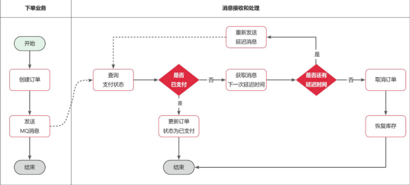
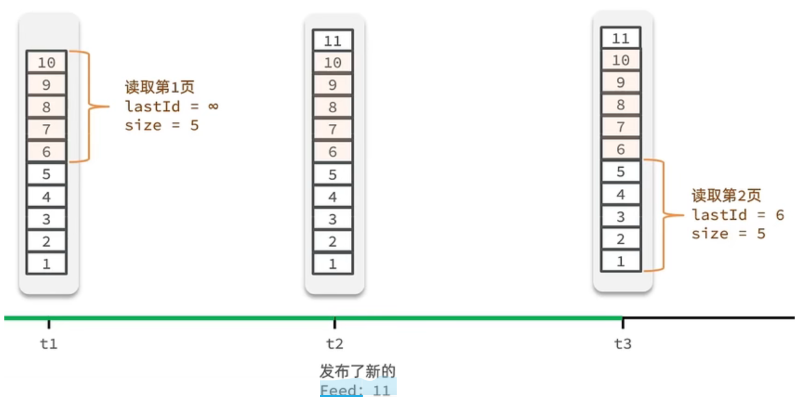
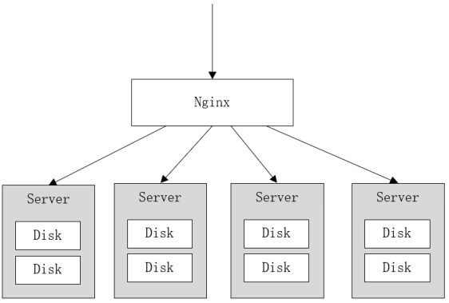

# 7.抢购接口的防刷限流

参考：[10张图带你彻底搞懂限流、熔断、服务降级-腾讯云开发者社区-腾讯云 (tencent.com)](https://cloud.tencent.com/developer/article/1815254)

​       [看完终于搞懂了限流，限流的优缺点、应用场景 - 知乎 (zhihu.com)](https://zhuanlan.zhihu.com/p/393178103)

​       [(秒杀项目) 4.9 削峰限流与防刷（核心）_4.9.148.刷-CSDN博客](https://blog.csdn.net/weixin_43919497/article/details/119876246)

​       [5种限流算法，7种限流方式，挡住突发流量？ - 掘金 (juejin.cn)](https://juejin.cn/post/7075137592265539614)

​       [MQ实战-削峰填谷 - 简书 (jianshu.com)](https://www.jianshu.com/p/5ce83b227eb3)

​       [RabbitMQ的五种工作模式和两种消费模式_rabbitmq消费模式-CSDN博客](https://blog.csdn.net/NewBeeMu/article/details/121878183)

​       [基于推和拉两种方式消费RabbitMQ消息-阿里云开发者社区 (aliyun.com)](https://developer.aliyun.com/article/900006)

​       [rabbitmq面试必懂之解耦，异步，削峰_rabbitmq解耦-CSDN博客](https://blog.csdn.net/xiejunxing/article/details/113480819)

​       [八、SpringBoot+RabbitMQ削峰-阿里云开发者社区 (aliyun.com)](https://developer.aliyun.com/article/1411344)


## 1.削峰限流

参考：[【Thread】线程池的 7 种创建方式及自定义线程池-CSDN博客](https://blog.csdn.net/sco5282/article/details/120963463) 

- 削峰应对瞬间流量多大，主要是因为**同一时间大量访问**

- 方案

  - **验证码**：平滑流量、在进行秒杀的时候防止秒杀的流量过高
  - **Redis保存库存数量**：库存当作令牌，拿到令牌执行下一步
  - **限流器**：如果库存太大，有几十万个，需要进行限流，限制每段时间用户访问个数
  - **队列**：经过限流器再进入队列，排队

- 令牌桶实现

  ```java
  // 桶的容量
  private static long capacity = 100;
  // 令牌生成速率，每秒5个
  private static long rate = 5;
  // 上次放置令牌的时间
  private static long lastTime = System.currentTimeMillis();
  // 桶中令牌余量
  private static AtomicLong token = new AtomicLong();
  
  public synchronized boolean getToken() {
      // 【惰性】更新余量
      long now = System.currentTimeMillis();
      long add = (now - lastTime) / 1000 * rate; // 距离上次隔了多少秒，再乘上每秒rate个令牌
      token.set(Math.min(capacity, token.get() + add)); // 超出容量重置
      // 更新时间
      lastTime = now;
      // 桶中还有令牌
      if(token.get() > 0) {
          token.decrementAndGet();
          return true;
      }
      return false;
  }
  ```

- 漏桶实现

  ```java
  // 桶的容量
  private static long capacity = 100;
  // 流出速率，每秒5个
  private static long rate = 5;
  // 上次请求到达桶的时间
  private static long lastTime = System.currentTimeMillis();
  // 桶中请求余量
  private static AtomicLong request = new AtomicLong();
  
  public synchronized boolean getToken() {
      long now = System.currentTimeMillis();
      // 桶中请求为0，直接流出
      if(request.get() == 0) {
          lastTime = now;
          request.set(1L);
          return true;
      }
      // 计算当前时间到上次时间，桶中请求可以流出数量
      request.set(request.get() - (now - lastTime) / 1000 * rate);
      request.set(Math.max(0, request.get()));
      // 设置新时间
      lastTime = now;
      // 当前水小于容量，可以进行
      if(request.get() < capacity) {
          request.incrementAndGet();
          return true;
      }
      return false;
  }
  ```

- 滑动窗口实现

- ……

## 3.防刷

### 自定义注解

#### RepeatSubmit防重提交

```Java
/**
 * 自定义 防重提交 注解
 *
 * @author mirrors
 * @version 1.0
 * @date 2024/1/9 22:01
 */
@Documented
@Retention(RetentionPolicy.RUNTIME)
@Target(ElementType.METHOD)
public @interface RepeatSubmit {

    /**
     * 防重提交，支持 方法参数 和 令牌；
     * 枚举类型，共2种
     */
    enum Type {PARAM, TOKEN}

    /**
     * 默认防重提交策略，方法参数
     *
     * @return
     */
    Type limitType() default Type.PARAM;

    /**
     * 加锁过期时间，默认5秒
     *
     * @return 过期时间
     */
    long lockTime() default 5;
}
```

#### RestrictRequest防刷

```java
/**
 * 接口防刷注解（控制 相同ip和用户 再规定时间内的 最大访问次数）
 * <p>
 * 参考<a href="https://juejin.cn/post/7265565809823760441">接口防刷</a>
 * </p>
 *
 * @author mirrors
 * @version 1.0
 * @date 2024/1/9 22:07
 */
@Target(ElementType.METHOD)
@Retention(RetentionPolicy.RUNTIME)
@Documented
public @interface RestrictRequest {

    /**
     * 限制时间间隔，默认5秒
     *
     * @return
     */
    long interval() default 5;

    /**
     * 最大访问次数，默认5000次
     *
     * @return
     */
    int count() default 5000;

    /**
     * 提示信息
     *
     * @return
     */
    String message() default "";
}
```

### RestrictRequestAop切面

```java
/**
 * 接口防刷 切面实现类
 *
 * @author mirrors
 * @version 1.0
 * @date 2024/1/9 22:18
 */
@Slf4j
@Component
@Aspect // 声明当前类是一个切面
public class RestrictRequestAop {

    @Autowired
    private StringRedisTemplate stringRedisTemplate;

    @Autowired
    private RedissonClient redissonClient;

    /**
     * 定义 防重提交 切入点
     */
    @Pointcut("@annotation(com.mirrors.prevent.RepeatSubmit)")
    public void repeatSubmitPointcut() {

    }

    /**
     * 定义 防刷 切入点
     */
    @Pointcut("@annotation(com.mirrors.prevent.RestrictRequest)")
    public void restrictRequestPointcut() {
    }

    /**
     * 目标方法执行前（防刷切入点）；
     * 限制 同一个ip和user 在规定时间内的最大访问次数【防刷】
     *
     * @param joinPoint
     * @throws NoSuchMethodException
     */
    @Before("restrictRequestPointcut()")
    public void joinPoint(JoinPoint joinPoint) throws NoSuchMethodException {
        // 使用redisson声明 ip锁 和 user锁
        RLock ipLock = null, userLock = null;
        boolean isIp = false, isUser = false;
        try {
            // 根据 方法签名 获得 被注解标注的具体实现方法
            MethodSignature signature = (MethodSignature) joinPoint.getSignature();
            Method method = joinPoint.getTarget().getClass().getMethod(signature.getName(), signature.getParameterTypes());

            // 获取 RestrictRequest 注解，获取注解信息
            RestrictRequest restrictRequest = method.getAnnotation(RestrictRequest.class);
            long interval = restrictRequest.interval();
            int count = restrictRequest.count();
            String message = restrictRequest.message();

            // 获得访问 被注解标注的接口 的http请求
            ServletRequestAttributes requestAttributes = (ServletRequestAttributes) RequestContextHolder.getRequestAttributes();
            assert requestAttributes != null;

            HttpServletRequest request = requestAttributes.getRequest();
            HttpServletResponse response = requestAttributes.getResponse();

            assert response != null;
            response.setContentType("application/json;charset=UTF-8");

            // TODO 以下操作可以使用 lua脚本 进行实现，从而保证 操作的原子性 以及降低 网络开销
            // 得到 限制ip的key 和 限制user的key
            String ipKey = RedisConstants.ACCESS_LIMIT_IP_KEY + IPUtil.getIpAddr(request) + "-" + request.getRequestURI();
            String userKey = RedisConstants.ACCESS_LIMIT_USER_KEY + UserHolder.getUser().getId() + "-" + request.getRequestURI();

            // 获取 ip锁
            ipLock = redissonClient.getLock("lock:" + ipKey);
            isIp = ipLock.tryLock();
            if (!isIp) {
                throw new BusinessException("相同IP不能在同一时刻下单！");
            }

            // 获取 user锁
            userLock = redissonClient.getLock("lock" + userKey);
            isUser = userLock.tryLock();
            if (!isUser) {
                throw new BusinessException("相同用户不能在同一时刻下单！");
            }

            // 取得在限定时间内的访问次数
            String ipValue = stringRedisTemplate.opsForValue().get(ipKey);
            int ipCount = (ipValue == null ? 0 : Integer.parseInt(ipValue));

            String userValue = stringRedisTemplate.opsForValue().get(userKey);
            int userCount = (userValue == null ? 0 : Integer.parseInt(userValue));

            // 如果 还没有达到最大访问次数，则将redis中的次数加1
            if (ipCount < count && userCount < count) {
                // ip
                if (ipCount == 0) {
                    stringRedisTemplate.opsForValue().set(ipKey, Integer.toString(1), interval, TimeUnit.SECONDS);
                } else {
                    stringRedisTemplate.opsForValue().increment(ipKey, 1);
                }
                // user
                if (userCount == 0) {
                    stringRedisTemplate.opsForValue().set(userKey, Integer.toString(1), interval, TimeUnit.SECONDS);
                } else {
                    stringRedisTemplate.opsForValue().increment(userKey, 1);
                }
            } else {
                message = "".equals(message) ? "相同IP或用户在" + interval + "秒内达到了最大访问次数：" + count : message;
                throw new BusinessException(message);
            }
        } finally {
            // 释放已经拿到的锁
            if (isIp) {
                ipLock.unlock();
            }
            if (isUser) {
                userLock.unlock();
            }
        }
    }

    /**
     * 防重提交 回绕通知；
     * <p>
     * 参考 <a href="https://www.cnblogs.com/muxi0407/p/11818999.html">MethodSignature</a>
     * </p>
     *
     * @param proceedingJoinPoint
     * @return
     */
    @Around("repeatSubmitPointcut()")
    public Object around(ProceedingJoinPoint proceedingJoinPoint) throws Throwable {
        // 获取当前 http request 对象
        ServletRequestAttributes requestAttributes = (ServletRequestAttributes) Objects.requireNonNull(RequestContextHolder.getRequestAttributes());
        HttpServletRequest request = requestAttributes.getRequest();

        // 获取当前登录用户id
        Long userId = UserHolder.getUser().getId();

        // 根据 方法签名 得到 具体实现方法具体实现方法
        MethodSignature signature = (MethodSignature) proceedingJoinPoint.getSignature();
        Method method = proceedingJoinPoint.getTarget().getClass().getMethod(signature.getName(), signature.getParameterTypes());

        // 得到 @RepeatSubmit 注解
        RepeatSubmit repeatSubmit = method.getAnnotation(RepeatSubmit.class);

        // 防重 类型判断
        boolean result;
        String type = repeatSubmit.limitType().name();
        if (type.equalsIgnoreCase(RepeatSubmit.Type.PARAM.name())) {
            // 方法一：参数形式防重提交
            long lockTime = repeatSubmit.lockTime();
            String ipAddr = IPUtil.getIpAddr(request);

            // 拿到 接口方法？
            MethodSignature methodSignature = (MethodSignature) proceedingJoinPoint.getSignature();
            method = methodSignature.getMethod();

            // 锁的key
            String className = method.getDeclaringClass().getName();
            String key = "order-server:repeat_submit:" + Arrays.toString(DigestUtils.md5Digest(String.format("%s-%s-%s-%s", ipAddr, className, method, userId).getBytes()));

            // redisson加锁
            RLock lock = redissonClient.getLock(key);
            // 尝试加锁，最多等待0秒，上锁5{lockTime}秒后自动解锁
            result = lock.tryLock(0, lockTime, TimeUnit.SECONDS);

        } else {
            // 方法二：令牌形式防重提交
            String requestToken = request.getHeader("request-token");
            if (!StringUtils.hasText(requestToken)) {
                throw new BusinessException("token is blank.");
            }

            // 建立key
            String key = String.format(RedisConstants.REPEAT_SUBMIT_ORDER_TOKEN_KEY, userId, requestToken);

            // 直接删除，删除成功表示完成
            result = Boolean.TRUE.equals(stringRedisTemplate.delete(key));
        }

        if (!result) {
            log.error("请求重复提交");
            log.info("环绕通知中");
        }

        // 开始执行方法
        return proceedingJoinPoint.proceed();

    }


}
```

# 8.MQ延迟队列处理超时订单

##1.死信交换机和延迟消息

在电商的支付业务中，对于一些库存有限的商品，为了更好的用户体验，通常都会在用户下单时立刻扣减商品库存。例如电影院购票、高铁购票，下单后就会锁定座位资源，其他人无法重复购买。

- 但是这样就存在一个问题，**假如用户下单后一直不付款，就会一直占有库存资源，导致其他客户无法正常交易**，最终导致商户利益受损！
- 因此，电商中通常的做法就是：**对于超过一定时间未支付的订单，应该立刻取消订单并释放占用的库存**。
- 例如，订单支付超时时间为30分钟，则我们应该在用户下单后的第30分钟检查订单支付状态，如果发现未支付，应该立刻取消订单，释放库存。

但问题来了：如何才能准确的实现在下单后第30分钟去检查支付状态呢？

像**这种在一段时间以后才执行的任务**，我们称之为**【延迟任务】**，而要实现延迟任务，最简单的方案就是利用MQ的延迟消息了。

在RabbitMQ中实现延迟消息也有两种方案：

- **死信交换机 + TTL**
- **延迟消息插件**

### 死信交换机

什么是死信？

当一个队列中的消息满足下列情况之一时，可以成为死信（dead letter）：

- **消费者使用`basic.reject`或 `basic.nack`声明消费失败，并且消息的`requeue`参数设置为false**
- 消息是一个**过期消息，超时无人消费**
- 要投递的**队列消息满了，无法投递**

如果一个**队列中的消息已经成为死信**，并且这个**队列通过`dead-letter-exchange`属性指定了一个交换机**，那么队列中的**死信就会投递到这个交换机**中，而这个交换机就称为**死信交换机**（Dead Letter
Exchange）。而此时加入有队列与死信交换机绑定，则最终死信就会被投递到这个队列中。

死信交换机有什么作用呢？

1. 收集那些**因处理失败而被拒绝的消息**（与`RepublishMessageRecoverer`作用类似）
2. 收集那些**因队列满了而被拒绝的消息**（与`RepublishMessageRecoverer`作用类似）
3. 收集**因TTL（有效期）到期的消息**

### 延迟消息

**前面两种作用场景可以看做是把死信交换机当做一种【消息处理的最终兜底方案】，与消费者重试时讲的`RepublishMessageRecoverer`作用类似。**

而最后一种场景，大家设想一下这样的场景：
如图，有一组绑定的交换机（`ttl.fanout`）和队列（`ttl.queue`）。**但是【`ttl.queue`没有消费者】监听，而是【设定了死信交换机】`hmall.direct`，而队列`direct.queue1`
则与死信交换机绑定，RoutingKey是blue：**


假如我们现在发送一条消息到`ttl.fanout`，RoutingKey为blue，并设置消息的**【有效期**为5000毫秒】：


**注意**：尽管这里的`ttl.fanout`不需要RoutingKey，但是**当消息变为死信并投递到死信交换机时，会沿用之前的RoutingKey，这样`hmall.direct`才能正确路由消息。**

消息肯定会被投递到`ttl.queue`之后，由于没有消费者，因此消息无人消费。**5秒之后，消息的有效期到期，成为死信：**


**死信被再次投递到死信交换机`hmall.direct`，并沿用之前的RoutingKey，也就是`blue`：**


由于`direct.queue1`与`hmall.direct`绑定的key是blue，因此**最终消息被成功路由到`direct.queue1`，如果此时有消费者与`direct.queue1`绑定，
也就能成功消费消息了。但此时已经是5秒钟以后了：**


也就是说，publisher发送了一条消息，但最终consumer在5秒后才收到消息。我们成功实现了**延迟消息**。

### 拆分TTL

假如订单超时支付时间为30分钟，理论上说我们应该在下单时发送一条延迟消息，延迟时间为30分钟。这样就可以在接收到消息时检验订单支付状态，关闭未支付订单。

但是大多数情况下用户支付都会在1分钟内完成，我们发送的消息却要在MQ中停留30分钟，额外消耗了MQ的资源。因此，我们最好**多检测几次订单支付状态，而不是在最后第30分钟才检测【将30分钟拆分】**

例如：我们**（在用户下单后的 第10秒、第20秒、第30秒、第45秒、第60秒、第1分30秒、第2分、...、第30分）分别设置延迟消息，如果提前发现订单已经支付，则后续的检测取消即可；**这样就可以有效避免对MQ资源的浪费了。

## 2.项目实现



### MultiDelayMessage消息实体类

```java
/**
 * 延时消息，处理超时订单
 *
 * @author mirrors
 * @version 1.0
 * @date 2024/1/23 22:03
 */
@Data
@AllArgsConstructor
@NoArgsConstructor
@Builder
public class MultiDelayMessage<T> {

    /**
     * 消息体
     */
    private T data;

    /**
     * 记录延迟时间的集合
     */
    private List<Long> delayMillis;

    /**
     * 获取并移除下一个延迟时间
     *
     * @return
     */
    public Long removeNextDelay() {
        return delayMillis.remove(0);
    }

    /**
     * 是否还有下一个延迟时间
     *
     * @return
     */
    public boolean hasNextDelay() {
        return !delayMillis.isEmpty();
    }

}
```

### MQConfig配置类

```java
......

@Configuration
public class MQConfig {

	......

    //----------------------------------超时订单业务相关-----------------------------------------------------

    /**
     * 没有消费者的队列
     *
     * @return
     */
    @Bean
    public Queue delayOrderQueue() {
        Map<String, Object> args = new HashMap<>();
        args.put("x-dead-letter-exchange", MQConstants.DELAY_ORDER_DL_EXCHANGE);
        args.put("x-dead-letter-routing-key", MQConstants.DELAY_ORDER_ROUTING_KEY);
        args.put("x-message-ttl", 5000); // 本项目让队列固定过时
        return QueueBuilder.durable(MQConstants.DELAY_ORDER_QUEUE)
                .withArguments(args)
                .build();
    }

    /**
     * 死信队列
     *
     * @return
     */
    @Bean
    public Queue delayOrderDLQueue() {
        return QueueBuilder.durable(MQConstants.DELAY_ORDER_DL_QUEUE).build();
    }

    /**
     * 交换机
     *
     * @return
     */
    @Bean
    public Exchange delayOrderExchange() {
        return ExchangeBuilder.directExchange(MQConstants.DELAY_ORDER_EXCHANGE).durable(true).build();
    }

    /**
     * 死信交换机
     *
     * @return
     */
    @Bean
    public Exchange delayOrderDLExchange() {
        return ExchangeBuilder.directExchange(MQConstants.DELAY_ORDER_DL_EXCHANGE).durable(true).build();
    }

    /**
     * 绑定：delayOrderExchange() -> delayOrderQueue() -> delayOrderDLExchange() -> delayOrderDLQueue()
     *
     * @return
     */
    @Bean
    public Binding bindingDelayOrder1() {
        return BindingBuilder
                .bind(delayOrderQueue())
                .to(delayOrderExchange())
                .with(MQConstants.DELAY_ORDER_ROUTING_KEY).noargs();
    }

    /**
     * 绑定：delayOrderExchange() -> delayOrderQueue() -> delayOrderDLExchange() -> delayOrderDLQueue()
     *
     * @return
     */
    @Bean
    public Binding bindingDelayOrder2() {
        return BindingBuilder
                .bind(delayOrderDLQueue())
                .to(delayOrderDLExchange())
                .with(MQConstants.DELAY_ORDER_ROUTING_KEY).noargs();
    }
}
```

### MqSender发送方

```java
/**
 * RabbitMQ 消息发送器
 *
 * @author mirrors
 * @version 1.0
 * @date 2024/1/9 21:17
 */
@Slf4j
@Component
public class MqSender {

    @Autowired
    RabbitTemplate rabbitTemplate;

    /**
     * 发送延时消息给MQ，死信交换机
     *
     * @param delayMessage
     * @param <T>
     */
    public <T> void sendDelayOrderMessage(MultiDelayMessage<T> delayMessage) {
        log.info("发送延迟消息：" + delayMessage);
        Long delay = delayMessage.removeNextDelay();
        rabbitTemplate.convertAndSend(MQConstants.DELAY_ORDER_EXCHANGE, MQConstants.DELAY_ORDER_ROUTING_KEY, delayMessage, message -> {
            message.getMessageProperties().setDelay(delay.intValue());
            return message;
        });
    }
}
```

### MqReceiver接收方

```java
/**
 * RabbitMQ 消息接收器类
 * <p>
 * 注解 @RabbitListener 标注在类上面表示当有收到消息的时候，就交给 @RabbitHandler 的方法处理，根据接受的参数类型进入具体的方法中；
 * 参考<a href="https://blog.csdn.net/sliver1836/article/details/119734239">@RabbitListener与@RabbitHandler/a>
 * </p>
 *
 * @author mirrors
 * @version 1.0
 * @date 2024/1/9 21:35
 */
@Slf4j
@Component
public class MqReceiver {

    @Autowired
    private IVoucherOrderService voucherOrderService;

    @Autowired
    private MqSender mqSender;

    /**
     * 接收到延迟消息，监听死信队列
     *
     * @param delayMessage
     * @param channel
     * @param message
     */
    @RabbitListener(queues = MQConstants.DELAY_ORDER_DL_QUEUE, ackMode = "MANUAL") // queues 指定监听的队列名称；手动 ack
    public void receiveDelayOrder(@Payload MultiDelayMessage<Long> delayMessage, Channel channel, Message message) {
        log.info("接收到的延迟消息：" + delayMessage);
        try {
            // 查询订单状态
            Long orderId = delayMessage.getData();
            VoucherOrder voucherOrder = voucherOrderService.getById(orderId);
            if (voucherOrder == null || voucherOrder.getStatus() != 1) {
                // TODO 实现支付服务，查询是否真的已支付
                return;
            }
            // 判断是否有延迟时间
            if (delayMessage.hasNextDelay()) {
                // 有，重发延迟
                mqSender.sendDelayOrderMessage(delayMessage);

            } else {
                // 没有，取消订单（可以删除）；保证事务一致性
                voucherOrderService.lambdaUpdate()
                        .set(VoucherOrder::getStatus, 4)
                        .eq(VoucherOrder::getId, orderId)
                        .update();
            }
            // TODO 恢复 MySQL库存 和 redis库存；保证事务一致性

            // 手动确认消费完成
            channel.basicAck(message.getMessageProperties().getDeliveryTag(), true);

        } catch (IOException e) {
            throw new RuntimeException(e);
        }
    }
}
```

### IVoucherOrderService实现类

```java
/**
 * 基于RabbitMQ的创建订单【本方法设计 数据库；由消息接收方执行】
 *
 * @param voucherOrder
 */
@Transactional
@Override
public void createVoucherOrderRabbitMQ(VoucherOrder voucherOrder){
        ......

        // 创建订单，写入数据库
        save(voucherOrder);
        // 同时发送延时消息给MQ，死信交换机
        mqSender.sendDelayOrderMessage(
        MultiDelayMessage.builder()
        .data(voucherOrder.getId())
        .delayMillis(CollUtil.newArrayList(10000L,10000L,10000L))
        .build()
        );

        ......
        }
```

# 9.Feed流推送

## 1.共同关注

### 关注与取关

#### FollowController

```java
    /**
 * 关注和取关
 *
 * @param followUserId 被关注的id
 * @param isFollow     true或false
 * @return
 */
@PutMapping("/{id}/{isFollow}")
public Result follow(@PathVariable("id") Long followUserId,@PathVariable("isFollow") Boolean isFollow){
        return followService.follow(followUserId,isFollow);
        }
```

#### IFollowService实现类

关注或取关都要与redis进行操作，set集合去重

```java
    @Override
public Result follow(Long followUserId,Boolean isFollow){
        Long userId=UserHolder.getUser().getId();

        // 判断关注还是取关
        if(isFollow){
        // 关注，新增数据
        Follow follow=new Follow();
        follow.setUserId(userId);
        follow.setFollowUserId(followUserId);
        // 保存数据库
        boolean isSuccess=save(follow);
        // 放入redis【存储用户关注了哪个人，用于后续求共同关注】
        if(isSuccess){
        stringRedisTemplate.opsForSet().add("follows:"+userId,followUserId.toString());
        }

        }else{
        // 取关，删除
        boolean isSuccess=remove(new QueryWrapper<Follow>().eq("user_id",userId).eq("follow_user_id",followUserId));
        // 从redis移除
        if(isSuccess){
        stringRedisTemplate.opsForSet().remove("follows:"+userId,followUserId.toString());
        }
        }
        return Result.ok();
        }
```

### 查询共同关注

#### FollowController

```java
/**
 * 求 传入id用户 和 当前登录用户 的共同关注列表
 *
 * @param id
 * @return
 */
@GetMapping("/common/{id}")
public Result followCommon(@PathVariable("id") Long id){
        return followService.followCommon(id);
        }
```

#### IFollowService实现类

```java
@Override
public Result followCommon(Long id){
        // 获取当前用户
        Long userId=UserHolder.getUser().getId();
        String key1="follows:"+userId;
        String key2="follows:"+id;
        //【求交集】
        Set<String> intersect=stringRedisTemplate.opsForSet().intersect(key1,key2);
        if(intersect==null||intersect.isEmpty()){
        return Result.ok(Collections.emptyList());
        }
        // 解析id集合，查询用户
        List<Long> ids=intersect.stream().map(Long::valueOf).collect(Collectors.toList());
        List<UserDTO> userDTOList=userService.listByIds(ids)
        .stream()
        .map(user->BeanUtil.copyProperties(user,UserDTO.class))
        .collect(Collectors.toList());
        return Result.ok(userDTOList);
        }
```

## 2.Feed流介绍

参考：[如何设计一个超级牛逼的 Feed 流系统 - 知乎 (zhihu.com)](https://zhuanlan.zhihu.com/p/259562762)

​       [Feed 流系统杂谈 - 掘金 (juejin.cn)](https://juejin.cn/post/7102236106665492487)

​       [如何打造千万级Feed流系统-阿里云开发者社区 (aliyun.com)](https://developer.aliyun.com/article/224132)

当我们关注了用户后，这个用户发了动态，那么我们应该把这些数据推送给用户，这个需求，其实我们又把他叫做Feed流，关注推送也叫做Feed流，直译为投喂。为用户持续的提供“沉浸式”的体验，通过无限下拉刷新获取新的信息。

对于传统的模式的内容解锁：我们是需要用户去通过搜索引擎或者是其他的方式去解锁想要看的内容


对于新型的Feed流的的效果：不需要我们用户再去推送信息，而是**系统分析用户到底想要什么，然后直接把内容推送给用户，从而使用户能够更加的节约时间，不用主动去寻找。**


Feed流实现主要可以分为：

Timeline：不做内容筛选，简单的按照内容发布时间排序，常用于好友或关注。例如朋友圈

- 优点：信息全面，不会有缺失。并且实现也相对简单
- 缺点：信息噪音较多，用户不一定感兴趣，内容获取效率低

智能排序：利用智能算法屏蔽掉违规的、用户不感兴趣的内容。推送用户感兴趣信息来吸引用户

- 优点：投喂用户感兴趣信息，用户粘度很高，容易沉迷
- 缺点：如果算法不精准，可能起到反作用

## 3.Timeline模式

只需要拿到我们关注用户的信息，然后按照时间排序即可，因此采用Timeline的模式。该模式的实现方案有三种：

- 拉模式
- 推模式
- 推拉结合

### **拉模式**

1. 也叫读扩散**（很少使用）**
2. 该模式的核心含义就是：当张三和李四和王五发了消息后，都会保存在自己的邮箱中，假设赵六要读取信息，那么他会从读取他自己的收件箱，此时系统会从他关注的人群中，把他关注人的信息全部都进行拉取，然后在进行排序
3. 优缺点
    1. 优点：比较节约空间，因为赵六在读信息时，并没有重复读取，而且读取完之后可以把他的收件箱进行清楚。
    2. 缺点：比较延迟，当用户读取数据时才去关注的人里边去读取数据，假设用户关注了大量的用户，那么此时就会拉取海量的内容，对服务器压力巨大。


### 推模式

1. 也叫写扩散（**适合用户量少，没有大up**）
2. 推模式是没有写邮箱的，当张三写了一个内容，此时会主动的把张三写的内容发送到他的粉丝收件箱中去，假设此时李四再来读取，就不用再去临时拉取了
3. 优缺点
    1. 优点：时效快，不用临时拉取
    2. 缺点：内存压力大，假设一个大V写信息，很多人关注他， 就会写很多分数据到粉丝那边去


### 推拉结合模式

1. 也叫做读写混合，兼具推和拉两种模式的优点（**适合大up**）
2. 推拉模式是一个折中的方案，站在发件人这一段：
    1. 如果是个**小up**，那么我们采用**写扩散**的方式，直接把数据写入到他的粉丝中去，因为普通的人他的粉丝关注量比较小，所以这样做没有压力
    2. 如果是**大up**，那么他是直接**将数据先写入到一份到发件箱（普通粉丝）**里边去，然后再**直接写一份到活跃粉丝收件箱**里边去，
3. 现在站在收件人这端来看：
    1. 如果是**活跃粉丝**，那么大V和普通的人发的都会直接写入到自己收件箱里边来
    2. 而如果是**普通粉丝**，由于他们上线不是很频繁，所以等他们上线时，再从发件箱里边去拉信息。


## 4.推模式实现

需求：

- 修改 **新增推文** 业务，在**保存blog到数据库的同时**，**推送到粉丝的收件箱**
- 收件箱满足可以**根据时间戳排序**，必须用Redis的数据结构实现（**Zset**）
- 查询收件箱数据时，可以实现**分页查询**

### 分页问题

Feed流中的数据会不断更新（有新的推文），所以数据的角标也在变化，因此不能采用传统的分页模式。

假设在t1 时刻，我们去读取第一页，此时page = 1 ，size = 5 ，那么我们拿到的就是10~6 这几条记录，假设**现在t2时候又发布了一条记录**，此时t3 时刻，我们来读取第二页，读取第二页传入的参数是page=2
，size=5 ，那么此时读取到的第二页实际上是从6 开始，然后是6~2 ，那么我们就读取到了重复的数据，所以feed流的分页，不能采用原始方案来做。


我们需要**记录每次操作的最后一条，然后从这个位置开始去读取数据**

举个例子：我们从t1时刻开始，拿第一页数据，拿到了10~6，然后**记录下当前最后一次拿取的记录，就是6**
，t2时刻发布了新的记录，此时这个11放到最顶上，但是不会影响我们之前记录的6，此时t3时刻来拿第二页，第二页这个时候拿数据，还是从6后一点的5去拿，就拿到了5-1的记录。我们这个地方可以**
采用sortedSet来做，可以进行范围查询，并且还可以记录当前获取数据时间戳最小值，就可以实现滚动分页了**



### 新增推文

#### BlogController

```java
/**
 * 保存博客，Feed流图推送
 *
 * @param blog
 * @return
 */
@PostMapping
public Result saveBlog(@RequestBody Blog blog){
        return blogService.saveBlog(blog);
        }
```

#### IBlogService实现类

```java
@Override
public Result saveBlog(Blog blog){
        // 获取登录用户
        UserDTO user=UserHolder.getUser();
        blog.setUserId(user.getId());
        // 保存推文到MySQL数据库
        boolean isSuccess=save(blog);
        if(!isSuccess){
        return Result.ok("发布动态失败");
        }
        // 查询MySQL中所有粉丝，推送笔记id
        List<Follow> follows=followService.query().eq("follow_user_id",user.getId()).list();
        for(Follow follow:follows){
        // 获取粉丝id，推送
        Long userId=follow.getUserId();
        // 推送到redis的SortedSet【score为 当前时间戳】
        String key="feed:"+userId;
        stringRedisTemplate.opsForZSet().add(key,blog.getId().toString(),System.currentTimeMillis());
        }

        // 返回id
        return Result.ok(blog.getId());
        }
```

### 查询分页

#### BlogController

```java
    /**
 * Feed流推模式下，信息的滚动分页
 *
 * @param max
 * @param offset 注意第一次查询offset为0，设置默认值（defaultValue = "0"），避免空指针
 * @return
 */
@GetMapping("/of/follow")
public Result queryBlogFollow(@RequestParam("lastId") Long max,@RequestParam(value = "offset", defaultValue = "0") Integer offset){
        return blogService.queryBlogOfFollow(max,offset);
        }
```

#### IBlogService实现类

命令：**zrevrangebyscore**  key max min \[**withscores**]  [**limit**  offset  count]

1. **offset：上次查询结果最小值 有多少个，offset就为多少 | 初始为0（去除最小值有多个的情况）**
2. **count：查询 多少条 信息**
3. **max：上次查询的最小值（当前时间戳）**
4. min：一般为0

```java
    @Override
public Result queryBlogOfFollow(Long max,Integer offset){
        // 获取当前用户
        Long userId=UserHolder.getUser().getId();

        // 查询收件箱【滚动分页查询】
        String key="feed:"+userId;
        Set<ZSetOperations.TypedTuple<String>>tuples=stringRedisTemplate
        .opsForZSet().reverseRangeByScoreWithScores(key,0,max,offset,2); // 4个关键参数

        if(tuples==null||tuples.isEmpty()){
        return Result.ok();
        }

        // 解析数据
        List<Long> ids=new ArrayList<>(tuples.size()); // 指定大小，避免扩容影响性能
        long minTime=0;
        int minCount=1; // 最小元素个数，也就是offset

        for(ZSetOperations.TypedTuple<String> tuple:tuples){
        // blogId
        String blogId=tuple.getValue();
        ids.add(Long.valueOf(blogId));
        // minTime时间戳，最后一个元素最小（已排序）
        long time=tuple.getScore().longValue();
        if(time==minTime){
        // offset最小元素的个数
        minCount++;
        }else{
        minTime=time;
        minCount=0;
        }
        }

        // 根据id查询blog
        String idStr=StrUtil.join(",",ids);
        List<Blog> blogList=query().in("id",ids).last("ORDER BY FIELD(id,"+idStr+")").list();
        // 查询blog点赞信息
        blogList.forEach(blog->{
        Long id=blog.getUserId();
        User user=userService.getById(id);
        blog.setName(user.getNickName());
        blog.setIcon(user.getIcon());
        // 查询blog是否点赞
        isBlogLiked(blog);
        });

        // 返回
        ScrollResult scrollResult=new ScrollResult();
        scrollResult.setList(blogList);
        scrollResult.setOffset(minCount);
        scrollResult.setMinTime(minTime);

        return Result.ok(scrollResult);
        }
```

# 10.跨域CORS

## 1.介绍

参考：[什么是跨域？跨域解决方法-CSDN博客](https://blog.csdn.net/qq_38128179/article/details/84956552)

1. **CORS **全称是 cross origin resource share；表示跨域资源共享。
2. 基于浏览器的同源策略，去判断是否跨域请求，**同源策略是浏览器的一种安全机制**，从一个地址请求另一个地址，如果协议、主机、端口三者全部一致则不属于跨域，否则有一个不一致就是跨域请求
3. 浏览器判断是跨域请求会在**请求头上添加origin**，表示这个请求来源哪里。

## 2.解决方案

### JSONP

通过 script标签的src属性 进行跨域请求，如果服务端要响应内容则首先 读取请求参数callback的值，callback是一个回调函数的名称，服务端读取callback的值后将响应内容通过调用callback函数的方式告诉请求方

### 添加响应头

服务端在响应头添加 Access-Control-Allow-Origin：*

### 通过nginx代理跨域

由于服务端之间没有跨域，浏览器通过 nginx 去访问跨域地址


# 11.异常处理与参数校验

参考：https://www.cnblogs.com/l-y-h/p/12797809.html

## 1.异常处理

### 前后端统一的异常传输类

```java
/**
 * 返回前端的异常信息类
 *
 * @author mirrors
 * @version 1.0
 * @date 2024/1/15 20:36
 */
@Data
@AllArgsConstructor
@NoArgsConstructor
public class ExceptionMsgResponse {

    /**
     * 异常信息
     */
    private String message;

}
```

### 两个异常类

#### CommonException

```java
/**
 * 通用异常
 *
 * @author mirrors
 * @version 1.0
 * @date 2024/1/15 20:17
 */
public enum CommonException {

    UNKNOWN_ERROR("执行过程异常，请重试"),
    PARAMS_ERROR("非法参数"),
    OBJECT_NULL("对象为空"),
    QUERY_NULL("查询结果为空"),
    REQUEST_NULL("请求参数为空");

    private final String message;

    public String getMessage() {
        return message;
    }

    CommonException(String message) {
        this.message = message;
    }
}
```

#### BusinessException

```java
/**
 * 自定义异常（统一）
 *
 * @author mirrors
 * @version 1.0
 * @date 2024/1/9 15:56
 */
public class BusinessException extends RuntimeException {

    /**
     * 错误信息
     */
    private String message;

    public BusinessException() {
        super();
    }

    public BusinessException(String message) {
        super(message);
        this.message = message;
    }

    @Override
    public String getMessage() {
        return message;
    }

    /**
     * 抛出一般异常
     *
     * @param message
     */
    public static void throwException(String message) {
        throw new BusinessException(message);
    }

    /**
     * 抛出通用异常
     *
     * @param commonException
     */
    public static void throwException(CommonException commonException) {
        throw new BusinessException(commonException.getMessage());
    }

    /**
     * 不写入堆栈信息，提高性能
     *
     * @return
     */
    @Override
    public Throwable fillInStackTrace() {
        return this;
    }
}
```

### 统一异常处理器

参考：[spring的@ControllerAdvice注解 - yanggb - 博客园 (cnblogs.com)](https://www.cnblogs.com/yanggb/p/10859907.html)

​       [Spring MVC : 注解@ControllerAdvice的工作原理_controlleradvice原理-CSDN博客](https://blog.csdn.net/andy_zhang2007/article/details/100041219)

​       [@ControllerAdvice 注解使用及原理探究 - 京东云技术团队 - 博客园 (cnblogs.com)](https://www.cnblogs.com/jingdongkeji/p/17605738.html)

1. @ControllerAdvice：对 Controller 的切面环绕
2. @ResponseBody：将 java对象 转为 json格式 的数据。

```java
/**
 * 全局异常处理器；将系统抛出的异常进行拦截
 *
 * @author mirrors
 * @version 1.0
 * @date 2024/1/15 20:25
 */
@Slf4j
@RestControllerAdvice // 包括 @ControllerAdvice 和 @ResponseBody
public class BusinessExceptionHandler {

    /**
     * 捕获用户自定义异常
     *
     * @param exception
     * @return
     */
    @ExceptionHandler(BusinessException.class) // 捕获对应的异常
    @ResponseStatus(HttpStatus.INTERNAL_SERVER_ERROR) // 返回状态
    public ExceptionMsgResponse customException(BusinessException exception) {
        log.error("【自定义异常】{}", exception.getMessage(), exception);
        return new ExceptionMsgResponse(exception.getMessage());
    }

    /**
     * 捕获系统异常
     *
     * @param exception
     * @return
     */
    @ExceptionHandler(Exception.class)
    @ResponseStatus(HttpStatus.INTERNAL_SERVER_ERROR)
    public ExceptionMsgResponse exception(Exception exception) {
        log.error("【系统异常】{}", exception.getMessage(), exception);
        if (exception.getMessage().equals("不允许访问")) {
            return new ExceptionMsgResponse("没有操作此功能的权限");
        }
        return new ExceptionMsgResponse(CommonException.UNKNOWN_ERROR.getMessage());
    }

}
```

## 2.参数合法性校验

参考：[SpringMVC之JSR303和拦截器-阿里云开发者社区 (aliyun.com)](https://developer.aliyun.com/article/1359591)

​      [【全网最全】JSR303参数校验与全局异常处理（从理论到实践别用if判断参数了） - 知乎 (zhihu.com)](https://zhuanlan.zhihu.com/p/475250372)

​      [Spring Boot 使用 JSR303（@Validated） 实现参数校验_掌握spring掌握jsr303验证的心得-CSDN博客](https://blog.csdn.net/qq_41712834/article/details/106886410)

### DTO类添加注解

```java

@Data
@Builder
public class LoginFormDTO {
    // 参数合法性校验注解之一
    @NotEmpty(message = "登录手机号不能为空1")
    private String phone;
    private String code;
    private String password;
}
```

### UserController改变接口

```java
/**
 * 登录功能；@Validated注解 标注 参数校验
 *
 * @param loginForm
 * @param session
 * @return
 */
@PostMapping("/login")
public Result login(@RequestBody @Validated LoginFormDTO loginForm,HttpSession session){
        return userService.login(loginForm,session);
        }
```

### 统一异常处理BusinessExceptionHandler

```java
/**
 * 全局异常处理器
 *
 * @author mirrors
 * @version 1.0
 * @date 2024/1/15 20:25
 */
@Slf4j
@RestControllerAdvice // 包括 @ControllerAdvice 和 @ResponseBody
public class BusinessExceptionHandler {

	……

    /**
     * 处理 @Validate 异常信息
     *
     * @param exception 异常信息
     * @return 返回异常响应结果
     */
    @ExceptionHandler(MethodArgumentNotValidException.class) // 抛出……
    @ResponseStatus(HttpStatus.INTERNAL_SERVER_ERROR)
    public ExceptionMsgResponse methodArgumentValidException(MethodArgumentNotValidException exception) {
        // 实体类校验信息返回结果绑定
        BindingResult bindingResult = exception.getBindingResult();
        // 校验的错误信息
        List<FieldError> fieldErrors = bindingResult.getFieldErrors();
        // 记录
        StringBuffer errors = new StringBuffer();
        fieldErrors.forEach((error) -> {
            errors.append(error.getDefaultMessage()).append(",");
        });

        log.error("【参数校验异常】{}", errors, exception);
        return new ExceptionMsgResponse(errors.toString());
    }
}
```

### 分组校验

1. 有时候在同一个属性上设置一个校验规则不能满足要求，比如：订单编号由系统生成，在 添加订单 时要求订单编号为空，在 更新订单 时要求订单编写不能为空
2. 分组校验，**同一个属性定义多个校验规则属于不同的分组，比如**
    1. 添加订单 定义 @NULL 规则属于insert分组
    2. 更新订单 定义 @NotEmpty 规则属于update分组
    3. insert和update是分组的名称，是可以修改的。

#### 定义校验分组类

```java
/**
 * 用于 分组参数校验
 *
 * @author mirrors
 * @version 1.0
 * @date 2024/1/15 21:40
 */
public class ValidationGroups {
    /**
     * 新增分组（用于添加校验）
     */
    public interface Insert {
    }

    /**
     * 更新分组（用于更新校验）
     */
    public interface Update {
    }

    /**
     * 删除分组（用于删除校验）
     */
    public interface Delete {
    }
}
```

#### DTO类改变注解

```java

@Data
@Builder
public class LoginFormDTO {

    @NotEmpty(message = "登录手机号不能为空1", groups = {ValidationGroups.Insert.class})
    @NotEmpty(message = "登录手机号不能为空2", groups = {ValidationGroups.Update.class}) // 分组
    private String phone;

    // 一旦有一个属性进行分组，其他属性也要分组？
    private String code;

    // 一旦有一个属性进行分组，其他属性也要分组？
    private String password;
}
```

#### UserController接口注解添加分组

```java
/**
 * 登录功能；@Validated(ValidationGroups.Insert.class)
 *
 * @param loginForm
 * @param session
 * @return
 */
@PostMapping("/login")
public Result login(@RequestBody @Validated(ValidationGroups.Insert.class) LoginFormDTO loginForm,HttpSession session){
        return userService.login(loginForm,session);
        }
```

# 12.分布式存储

## 1.介绍

参考：[架构师必知必会系列：分布式文件系统与存储 - 掘金 (juejin.cn)](https://juejin.cn/post/7309157781561835530)

​       [分布式文件系统调研（详细版） - 知乎 (zhihu.com)](https://zhuanlan.zhihu.com/p/493647334)

分布式文件系统（Distributed File System，DFS）是指**文件系统管理的物理存储资源不一定直接连接在本地节点上**
，而是通过计算机网络与节点（可简单的理解为一台计算机）相连；或是若干不同的逻辑磁盘分区或卷标组合在一起而形成的完整的有层次的文件系统。DFS为**分布在网络上任意位置的资源提供一个逻辑上的树形文件系统结构**
，从而使用户访问分布在网络上的共享文件更加简便

好处：

1. 一台计算机的文件系统处理能力扩充到多台计算机同时处理
2. 一台计算机挂了还有另外副本计算机提供数据
3. 每台计算机可以放在不同的地域，这样用户就可以就近访问，提高访问速度

## 2.MinIO

### 原理与简介

参考：[Linux安装MinIO（图文解说详细版）-CSDN博客](https://blog.csdn.net/csdnerM/article/details/121336618)

​      [Linux（CentOS）安装MinIo，详细教程，附防火墙端口开放操作 - 山有扶苏QWQ - 博客园 (cnblogs.com)](https://www.cnblogs.com/blogof-fusu/p/16327384.html#:~:text=Linux%E5%AE%89%E8%A3%85MinIo%EF%BC%88%E5%B7%B2%E9%85%8D%E7%BD%AE%E5%BC%80%E6%9C%BA%E9%87%8D%E5%90%AF%EF%BC%89%201%201%EF%BC%8C%E5%87%86%E5%A4%87%E5%AE%89%E8%A3%85%E7%9B%AE%E5%BD%95%E5%92%8C%E6%96%87%E4%BB%B6%202%202%EF%BC%8C%E5%AE%89%E8%A3%85%203%203%EF%BC%8C%E5%90%8E%E5%8F%B0%E5%90%AF%E5%8A%A8,4%204%EF%BC%8C%E5%BC%80%E6%94%BE%E5%AF%B9%E5%BA%94%E9%98%B2%E7%81%AB%E5%A2%99%E7%AB%AF%E5%8F%A3%205%205.%E5%B0%9D%E8%AF%95%E7%99%BB%E5%BD%95MinIo%206%206.%E6%96%B0%E5%BB%BA%E7%AE%A1%E7%90%86%E5%91%98%E7%94%A8%E6%88%B7%E5%B9%B6%E8%B5%8B%E6%9D%83%207%207.%E8%AE%BE%E7%BD%AEMinio%E6%9C%8D%E5%8A%A1%E5%99%A8%E5%AE%95%E6%9C%BA%E5%90%8E%E8%87%AA%E5%8A%A8%E9%87%8D%E5%90%AF)

​      [Linux MinIO 安装与配置(清晰明了)_linux安装minio-CSDN博客](https://blog.csdn.net/qq_44697754/article/details/133303180)

​          [minio 高可用 （原理+秒懂+史上最全）_minio原理-CSDN博客](https://blog.csdn.net/crazymakercircle/article/details/120855464)

​          [Minio架构分析 - 掘金 (juejin.cn)](https://juejin.cn/post/6918353666038562824)

1. **MinIO 是一个非常轻量的服务**,可以很简单的和其他应用的结合使用，它兼容亚马逊 S3 云存储服务接口，非常适合于存储大容量非结构化的数据，例如图片、视频、日志文件、备份数据和容器/虚拟机镜像等。
2. 特点：轻量，使用简单，功能强大，支持各种平台，单个文件最大5TB，兼容 Amazon S3接口，提供了 Java、Python、GO等多版本SDK支持。
3. **MinIO集群采用去中心化共享架构，每个结点是对等关系，通过Nginx可对MinIO进行负载均衡访问；**而不用考虑其真实物理位置。
4. 它将分布在不同服务器上的多块硬盘组成一个对象存储服务。由于硬盘分布在不同的节点上，分布式Minio**避免了单点故障**。如下图：



Minio使用**纠删码**技术来保护数据，它是一种恢复丢失和损坏数据的数学算法，它将数据**分块冗余**
的分散存储在各各节点的磁盘上，所有的可用磁盘组成一个集合，上图由8块硬盘组成一个集合，当上传一个文件时会通过纠删码算法计算对文件进行分块存储，除了**将文件本身分成4个数据块，还会生成4个校验块**，**
数据块和校验块会分散的存储在这8块硬盘上。**使用纠删码的好处是**即便丢失一半数量（N/2）的硬盘，仍然可以恢复数据**。

### 项目配置

#### application.yaml

```yaml
spring:
  servlet:
    multipart:
      max-file-size: 5MB # 单个传输最大为5MB
# MinIO配置
minio:
  endpoint: http://192.168.101.130:9800
  access-key: minioadmin
  secret-key: minioadmin
  bucket:
    media-files: mediafilesbucket
    video-files: videofilesbucket
```

#### MinioConfig配置类

```java
/**
 * MinIO配置类，自定义yaml文件配置
 *
 * @author mirrors
 * @version 1.0
 * @date 2024/1/16 10:46
 */
@Configuration
public class MinioConfig {

    @Value("${minio.endpoint}")
    private String endpoint;

    @Value("${minio.access-key}")
    private String accessKey;

    @Value("${minio.secret-key}")
    private String secretKey;

    @Bean
    public MinioClient minioClient() {
        return MinioClient.builder()
                .endpoint(endpoint) // 注意区分 管理界面端口 还是 服务端口
                .credentials(accessKey, secretKey)
                .build();
    }

}
```

### MinioUtil工具类

```java
/**
 * MinIO相关工具类
 *
 * @author mirrors
 * @version 1.0
 * @date 2024/1/16 15:29
 */
@Slf4j
public class MinioUtil {

    /**
     * 通过文件路径上传文件到MinIO
     *
     * @param minioClient
     * @param filepath
     * @param bucket
     * @param objectName
     */
    public static void addFile2MinioByPath(MinioClient minioClient, String filepath, String bucket, String objectName) {
        // 扩展名
        String extension = null;
        if (filepath.contains(".")) {
            extension = filepath.substring(filepath.lastIndexOf("."));
        }
        // 获取扩展名对应的媒体类型
        String contentType = getMimeTypeByExtension(extension);
        try {
            minioClient.uploadObject(UploadObjectArgs.builder()
                    .bucket(bucket)
                    .object(objectName)
                    .filename(filepath)
                    .contentType(contentType)
                    .build());
        } catch (Exception e) {
            e.printStackTrace();
            BusinessException.throwException("上传文件到文件系统出错");
        }
    }

    /**
     * 合并分块时，检查所有分块是否上传完毕并返回所有的分块文件
     *
     * @param minioClient
     * @param fileMd5
     * @param chunkTotal
     * @param bucket
     * @return
     */
    public static File[] mergeCheckChunks(MinioClient minioClient, String fileMd5, int chunkTotal, String bucket) {
        // 得到分块目录路径
        String chunksFolderPath = getChunksFolderPath(fileMd5);
        File[] files = new File[chunkTotal];
        // 检测分块文件是否上传完毕
        for (int i = 0; i < chunkTotal; i++) {
            String chunkPath = chunksFolderPath + i;
            // 从MinIO拿到分块文件
            File chunkFile;
            try {
                chunkFile = File.createTempFile("chunk" + i, null);
            } catch (Exception e) {
                throw new BusinessException("下载分块时创建临时文件出错");
            }
            files[i] = downloadFileFromMinio(minioClient, chunkFile, bucket, chunkPath);
        }
        return files;
    }

    /**
     * 从MinIO拿到分块文件；下载到chunkFile
     *
     * @param minioClient
     * @param chunkFile
     * @param bucket
     * @param chunkPath
     * @return
     */
    public static File downloadFileFromMinio(MinioClient minioClient, File chunkFile, String bucket, String chunkPath) {
        GetObjectArgs args = GetObjectArgs.builder()
                .bucket(bucket)
                .object(chunkPath)
                .build();
        // 拿到文件输入流
        try (InputStream inputStream = minioClient.getObject(args)) {
            // 输出流下载
            try (OutputStream outputStream = Files.newOutputStream(chunkFile.toPath())) {
                IOUtils.copy(inputStream, outputStream);
            } catch (Exception e) {
                BusinessException.throwException("下载文件" + chunkPath + "出错");
            }

        } catch (Exception e) {
            e.printStackTrace();
            BusinessException.throwException("文件不存在 " + chunkPath);
        }
        return chunkFile;
    }

    /**
     * 根据文件md5值得到分块文件的目录
     *
     * @param fileMd5 文件md5值
     * @return 分块路径
     */
    public static String getChunksFolderPath(String fileMd5) {
        return fileMd5.charAt(0) + "/" + fileMd5.charAt(1) + "/" + fileMd5 + "/" + "chunk" + "/";
    }

    /**
     * 根据文件md5值获取文件绝对路径
     *
     * @param fileMd5 文件md5值
     * @param fileExt 文件扩展名
     * @return 文件绝对路径
     */
    public static String getFilePathByMd5(String fileMd5, String fileExt) {
        return fileMd5.charAt(0) + "/" + fileMd5.charAt(1) + "/" + fileMd5 + "/" + fileMd5 + fileExt;
    }

    /**
     * 根据扩展名得到对应的媒体类型
     *
     * @param extension 文件扩展名
     * @return 对应的媒体类型
     */
    public static String getMimeTypeByExtension(String extension) {
        String contentType = MediaType.APPLICATION_OCTET_STREAM_VALUE;
        if (StringUtils.hasText(extension)) {
            ContentInfo extensionMatch = ContentInfoUtil.findExtensionMatch(extension);
            if (extensionMatch != null) {
                contentType = extensionMatch.getMimeType();
            }
        }
        return contentType;
    }

    /**
     * 上传文件到MinIO
     *
     * @param fileBytes
     * @param bucket
     * @param objectName
     * @return
     */
    public static void addFile2Minio(MinioClient minioClient, byte[] fileBytes, String bucket, String objectName) {
        try {
            // 获取 contentType
            String contentType = MediaType.APPLICATION_OCTET_STREAM_VALUE; // 未知的二进制流
            if (objectName.contains(".")) {
                // 如果文件名有扩展名，取 objectName 中的扩展名
                String extension = objectName.substring(objectName.lastIndexOf("."));
                ContentInfo extensionMatch = ContentInfoUtil.findExtensionMatch(extension);
                if (extensionMatch != null) {
                    contentType = extensionMatch.getMimeType();
                }
            }
            // 创建 输入流
            ByteArrayInputStream inputStream = new ByteArrayInputStream(fileBytes);
            // 参数信息
            PutObjectArgs args = PutObjectArgs.builder()
                    .bucket(bucket)
                    .object(objectName) // 子目录
                    .stream(inputStream, inputStream.available(), -1) // -1 表示文件分片按 5M(不小于5M,不大于5T)，分片数量最大 10000
                    .contentType(contentType)
                    .build();
            // 上传
            minioClient.putObject(args);
        } catch (Exception e) {
            log.error("上传文件出错", e);
        }
    }

    /**
     * 根据日期拼接目录（）
     *
     * @param date
     * @param year
     * @param month
     * @param day
     * @return
     */
    public static String getImageFolderPathByData(Date date, boolean year, boolean month, boolean day) {
        SimpleDateFormat simpleDateFormat = new SimpleDateFormat("yyyy-MM-dd");
        // 获取当前日期字符串
        String dateString = simpleDateFormat.format(date);
        // 取出年、月、日
        String[] dateStringArray = dateString.split("-");
        // 拼接
        StringBuilder folderString = new StringBuilder();
        if (year) {
            folderString.append(dateStringArray[0]).append("/");
        }
        if (month) {
            folderString.append(dateStringArray[1]).append("/");
        }
        if (day) {
            folderString.append(dateStringArray[2]).append("/");
        }
        return folderString.toString();
    }
}
```

## 3.上传图片小文件

### 流程

1. 前端进入上传图片界面
2. 上传图片，请求接口
3. 服务将图片文件存储在MinIO
4. 记录文件信息到数据库

### UploadController

```java
//---------------------------------------上传图片到MinIO----------------------------------------------------

/**
 * 上传图片到分布式存储
 *
 * @param file
 * @param userId
 * @param path
 * @param objectName
 * @return
 */
@PostMapping(value = "/image", consumes = MediaType.MULTIPART_FORM_DATA_VALUE) // consumes指定类型
public Result uploadImage2Minio(@RequestParam("file") MultipartFile file,
@RequestParam(value = "userId", required = false) Long userId,
@RequestParam(value = "path", required = false) String path,
@RequestParam(value = "objectName", required = false) String objectName){
        String contentType=file.getContentType();
        // 设置参数
        UploadFileParam uploadFileParam=new UploadFileParam();
        uploadFileParam.setFileSize(file.getSize());
        uploadFileParam.setContentType(contentType);
        uploadFileParam.setFilename(file.getOriginalFilename());
        uploadFileParam.setUserId(userId);
        if(contentType.contains("image")){
        uploadFileParam.setFileType("image");
        }else{
        uploadFileParam.setFileType("video");
        }
        // 调用Service服务
        try{
        return uploadService.uploadImage2Minio(uploadFileParam,file.getBytes(),path,objectName);
        }catch(Exception e){
        log.error("文件上传过程中出错");
        e.printStackTrace();
        }
        return Result.fail("文件上传过程中出错");
        }
```

### IUploadService实现类

```java
//---------------------------------------上传图片到MinIO----------------------------------------------------

/**
 * 上传文件到Minio
 *
 * @param uploadFileParam
 * @param fileBytes
 * @param path
 * @param objectName
 * @return
 */
@Override
public Result uploadImage2Minio(UploadFileParam uploadFileParam,byte[]fileBytes,String path,String objectName){
        // 如果为空，就使用默认路径；不为空，则路径最后要加上"/"
        if(!StringUtils.hasText(path)){
        path=MinioUtil.getImageFolderPathByData(new Date(),true,true,true);
        }else if(!path.contains("/")){
        path+="/";
        }
        // 获取文件MD5值
        String md5Hex=DigestUtil.md5Hex(fileBytes);
        // 得到文件名
        String filename=uploadFileParam.getFilename();
        // 构造 objectName
        if(!StringUtils.hasText(objectName)){
        objectName=md5Hex+filename.substring(filename.lastIndexOf("."));
        }
        objectName=path+objectName;
        // 上传
        try{
        // 保存到MinIO
        MinioUtil.addFile2Minio(minioClient,fileBytes,mediaFilesBucket,objectName);
        // 保存文件信息到数据库【事务优化:注意Spring事务和MySQL事务】
        IUploadService uploadService=(IUploadService)AopContext.currentProxy();
        uploadService.addFile2Db(md5Hex,uploadFileParam,mediaFilesBucket,objectName);

        return Result.ok("上传文件成功");
        }catch(Exception e){
        log.error("文件上传失败",e);
        }
        return Result.fail("上传文件失败");
        }

/**
 * 将文件信息存入数据库中
 *
 * @param md5Hex          fileId
 * @param uploadFileParam
 * @param bucket
 * @param objectName      对象名
 */
@Override
@Transactional
public UploadFile addFile2Db(String md5Hex,UploadFileParam uploadFileParam,String bucket,String objectName){
        // 扩展名
        String extension=null;
        if(objectName.contains(".")){
        extension=objectName.substring(objectName.lastIndexOf("."));
        }
        // 获取扩展名对应的媒体类型
        String contentType=MinioUtil.getMimeTypeByExtension(extension);
        // 从数据库查询文件
        int count=query().eq("id",md5Hex).count();
        // 没查到就写入数据库
        if(count<=0){
        UploadFile uploadFile=new UploadFile();
        // 拷贝基本信息
        uploadFile.setId(md5Hex);
        uploadFile.setFileId(md5Hex);
        uploadFile.setUserId(uploadFileParam.getUserId());
        uploadFile.setFilePath(objectName);
        // 图片、mp4视频可以直接设置url
        if(contentType.contains("image")||contentType.contains("mp4")){
        uploadFile.setUrl("/"+bucket+"/"+objectName);
        }
        uploadFile.setBucket(bucket);
        // 插入数据库
        boolean save=save(uploadFile);
        if(!save){
        BusinessException.throwException("文件信息保存失败");
        }
        // TODO 若要对视频进行转码，添加到 数据库的待处理任务表

        return uploadFile;
        }
        return null;
        }
```

## 4.上传视频大文件

### 断点续传

通常视频文件都比较大，所以对于媒资系统上传文件的需求要满足大文件的上传要求。**http协议本身对上传文件大小没有限制**，但是客户的网络环境质量、电脑硬件环境等参差不齐，**
如果一个大文件快上传完了网断了没有上传完成，需要客户重新上传，用户体验非常差，所以对于大文件上传的要求最基本的是断点续传**。

什么是断点续传：断点续传指的是在下载或上传时，**
将下载或上传任务（一个文件或一个压缩包）人为的划分为几个部分，每一个部分采用一个线程进行上传或下载，如果碰到网络故障，可以从已经上传或下载的部分开始继续上传下载未完成的部分，而没有必要从头开始上传下载**
，断点续传可以提高节省操作时间，提高用户体验性。


1. **前端对文件进行分块**。
2. 前端上传分块文件前**请求 检查文件是否存在，如果已经存在则不再上传**。
3. 如果**分块文件不存在则前端开始上传**
4. 前端**请求 上传分块**
5. 将分块**上传至MinIO**
6. 前端将分块上传完毕**请求 合并分块**
7. **判断分块上传完成则请求MinIO合并文件**
8. 合并完成**校验合并后的文件是否完整，如果完整则上传完成，否则删除文件**

### UploadController

```java
//---------------------------------------上传大文件视频到MinIO-----------------------------------------------

/**
 * （1）检测文件是否完整
 *
 * @param fileMd5
 * @return
 */
@PostMapping("/checkfile")
public Result checkFile(@RequestParam("fileMd5") String fileMd5){
        return uploadService.checkFile(fileMd5);
        }

/**
 * （2）检测分块
 *
 * @param fileMd5
 * @param chunk
 * @return
 */
@PostMapping("/checkchunks")
public Result checkChunks(@RequestParam("fileMd5") String fileMd5,
@RequestParam("chunk") int chunk){
        return uploadService.checkChunks(fileMd5,chunk);
        }

/**
 * （3）上传分块
 *
 * @param file
 * @param fileMd5
 * @param chunk
 * @return
 * @throws Exception
 */
@PostMapping("/uploadchunks")
public Result uploadChunks(@RequestParam("file") MultipartFile file,
@RequestParam("fileMd5") String fileMd5,
@RequestParam("chunk") int chunk)throws Exception{
        return uploadService.uploadChunks(fileMd5,chunk,file.getBytes());
        }

/**
 * （4）合并分块
 *
 * @param fileMd5
 * @param fileName
 * @param chunkTotal
 * @return
 */
@PostMapping("/mergechunks")
public Result mergeChunks(@RequestParam("fileMd5") String fileMd5,
@RequestParam("fileName") String fileName,
@RequestParam("chunkTotal") int chunkTotal){
        UploadFileParam uploadFileParam=new UploadFileParam();
        uploadFileParam.setFileType("video");
        uploadFileParam.setFilename(fileName);
        return uploadService.mergeChunks(fileMd5,chunkTotal,uploadFileParam);
        }
```

### IUploadService实现类

```java
/**
 * （4）合并分块
 *
 * @param fileMd5
 * @param chunkTotal
 * @param uploadFileParam
 * @return
 */
@Override
public Result mergeChunks(String fileMd5,int chunkTotal,UploadFileParam uploadFileParam){
        // 拿到所有分块
        File[]chunkFiles=MinioUtil.mergeCheckChunks(minioClient,fileMd5,chunkTotal,videoFilesBucket);
        // 文件扩展名
        String filename=uploadFileParam.getFilename();
        String extension=filename.substring(filename.lastIndexOf("."));
        // 创建临时合并文件
        File mergeFile;
        try{
        mergeFile=File.createTempFile(fileMd5,extension);
        }catch(Exception e){
        throw new BusinessException("合并文件过程中创建临时文件出错");
        }
        // 合并流程
        try{
        //（1）开始合并
        byte[]buffer=new byte[1024];
        try(RandomAccessFile rw=new RandomAccessFile(mergeFile,"rw")){
        // 遍历分块
        for(File chunkFile:chunkFiles){
        FileInputStream inputStream=new FileInputStream(chunkFile);
        int len;
        while((len=inputStream.read(buffer))!=-1){
        // 写入临时文件
        rw.write(buffer,0,len);
        }
        inputStream.close();
        }
        }catch(Exception e){
        e.printStackTrace();
        throw new BusinessException("合并文件过程中出错");
        }
        log.debug("合并文件完成{}",mergeFile.getAbsolutePath());
        uploadFileParam.setFileSize(mergeFile.length());
        //（2）校验文件内容，通过 md5 对比
        try(FileInputStream inputStream=new FileInputStream(mergeFile)){
        String md5Hex=DigestUtil.md5Hex(inputStream);
        if(!fileMd5.equalsIgnoreCase(md5Hex)){
        throw new BusinessException("合并文件校验失败");
        }
        log.debug("合并文件校验通过 {}",mergeFile.getAbsolutePath());
        }catch(Exception e){
        e.printStackTrace();
        throw new BusinessException("合并文件校验异常");
        }
        //（3）合并临时文件重新上传到MinIO
        String mergeFilePath=MinioUtil.getFilePathByMd5(fileMd5,extension);
        try{
        MinioUtil.addFile2MinioByPath(minioClient,mergeFile.getAbsolutePath(),videoFilesBucket,mergeFilePath);
        log.debug("合并文件上传 MinIO 完成：{}",mergeFile.getAbsolutePath());
        }catch(Exception e){
        throw new BusinessException("合并文件时上传文件出错");
        }
        //（4）上传到数据库
        IUploadService uploadService=(IUploadService)AopContext.currentProxy();
        UploadFile uploadFile=uploadService.addFile2Db(fileMd5,uploadFileParam,videoFilesBucket,mergeFilePath);
        if(uploadFile==null){
        throw new BusinessException("文件入库出错");
        }
        return Result.ok();
        }finally{
        // 删除临时文件
        for(File chunkFile:chunkFiles){
        chunkFile.delete();
        }
        mergeFile.delete();
        log.debug("临时文件清理完毕");
        }
        }

/**
 * （3）上传分块
 *
 * @param fileMd5
 * @param chunk
 * @param bytes
 * @return
 */
@Override
public Result uploadChunks(String fileMd5,int chunk,byte[]bytes){
        // 得到分块文件的目录路径
        String chunksFolderPath=MinioUtil.getChunksFolderPath(fileMd5);
        // 得到分块文件的路径
        String chunksPath=chunksFolderPath+chunk;
        // 存储到Minio
        try{
        MinioUtil.addFile2Minio(minioClient,bytes,mediaFilesBucket,chunksPath);
        log.info("上传分块成功：{}",chunksPath);
        return Result.ok("上传分块成功");
        }catch(Exception e){
        log.error("上传分块文件：{}，失败。",chunksPath,e);
        }
        return Result.fail("上传分块失败");
        }

/**
 * （2）检测分块
 *
 * @param fileMd5
 * @param chunkIdx
 * @return
 */
@Override
public Result checkChunks(String fileMd5,int chunkIdx){
        // 分块文件所在目录
        String chunksFolderPath=MinioUtil.getChunksFolderPath(fileMd5);
        // 分块文件的路径
        String chunksPath=chunksFolderPath+chunkIdx;
        // 查询文件系统是否存在
        GetObjectArgs args=GetObjectArgs.builder()
        .bucket(videoFilesBucket)
        .object(chunksPath)
        .build();
        try{
        InputStream inputStream=minioClient.getObject(args);
        if(inputStream==null){
        // 文件不存在
        return Result.ok("文件不存在，可以上传");
        }
        }catch(Exception e){
        // 文件不存在
        return Result.ok("文件不存在，可以上传");
        }
        // 文件已存在
        return Result.ok("文件已经存在，不需要重复上传");
        }

/**
 * （1）检测文件是否完整
 *
 * @param fileMd5
 * @return
 */
@Override
public Result checkFile(String fileMd5){
        // 在文件表中存在，并且在文件系统中存在，此文件才存在
        List<UploadFile> files=query().eq("id",fileMd5).list();
        if(files==null||files.size()==0){
        return Result.ok("文件不存在，可以上传");
        }
        // 查询文件系统中是否存在
        UploadFile uploadFile=files.get(0);
        GetObjectArgs args=GetObjectArgs.builder()
        .bucket(uploadFile.getBucket())
        .object(uploadFile.getFilePath())
        .build();
        try{
        InputStream inputStream=minioClient.getObject(args);
        if(inputStream==null){
        // 文件不存在
        return Result.ok("文件不存在，可以上传");
        }
        }catch(Exception e){
        // 文件不存在
        return Result.ok("文件不存在，可以上传");
        }
        // 文件已存在
        return Result.ok("文件已经存在，不需要重复上传");
        }
```

# 13.定时任务调度

**【本项目部署到本地Windows】**

## 1.分布式任务调度

参考：[扫盲篇-什么是分布式任务调度 - 知乎 (zhihu.com)](https://zhuanlan.zhihu.com/p/136843131)

​       [阿里二面：请讲明白什么是分布式任务调度？_wx60fa94429a80e的技术博客_51CTO博客](https://blog.51cto.com/u_15311952/3186095)

​       [实现一个任务调度系统，看这篇就够了 - 掘金 (juejin.cn)](https://juejin.cn/post/7056704703559630856#heading-5)

如何去高效处理一批任务：

1. 多线程：多线程是充分利用单机的资源。
2. 分布式加多线程：充分利用多台计算机，每台计算机使用多线程处理。

分布式调度要实现的目标：

1. 并行任务调度：并行任务调度实现靠多线程，如果有大量任务需要调度，此时光靠多线程就会有瓶颈了，因为一台计算机CPU的处理能力是有限的
2. 如果将**任务调度程序分布式部署，每个结点还可以部署为集群**，这样就可以让多台计算机共同去完成任务调度，我们可以将**任务分割为若干个分片**，由**不同的实例并行执行**，来提高任务调度的处理效率
3. 高可用：若某一个实例宕机，不影响其他实例来执行任务
4. 弹性扩容：当集群中增加实例就可以提高并执行任务的处理效率
5. 任务管理与监测：对系统中存在的所有定时任务进行统一的管理及监测。让开发人员及运维人员能够时刻了解任务执行情况，从而做出快速的应急处理响应
6. 避免任务重复执行：当任务调度以集群方式部署，同一个任务调度可能会执行多次，比如在上面提到的电商系统中到点发优惠券的例子，就会发放多次优惠券，对公司造成很多损失，所以我们需要控制相同的任务在多个运行实例上只执行一次。

## 2.XXL-JOB

**调度中心：**

1. **负责管理调度信息，按照调度配置发出调度请求，自身不承担业务代码；**
2. 主要职责为执行器管理、任务管理、监控运维、日志管理等

**任务执行器：**

1. **负责接收调度请求并执行任务逻辑；**
2. 只要职责是注册服务、任务执行服务（接收到任务后会放入线程池中的任务队列）、执行结果上报、日志服务等

**任务：**负责执行具体的业务处理


**执行流程：**

1. 任务执行器根据配置的调度中心的地址，**自动注册到调度中心**
2. 达到任务触发条件，**调度中心下发任务**
3. 执行器**基于线程池执行任务**，并把执行结果放入内存队列中、把执行日志写入日志文件中
4. 执行器消费内存队列中的执行结果，**主动上报给调度中心**
5. 当用户在调度中心查看任务日志，**调度中心请求任务执行器**，任务执行器读取任务日志文件并返回日志详情

### 原理与配置

参考：[XXL-JOB分布式任务调度平台(真·保姆级教程) - 知乎 (zhihu.com)](https://zhuanlan.zhihu.com/p/514114395)

​       [xxl-job搭建、部署、SpringBoot集成xxl-job - lcl-mm - 博客园 (cnblogs.com)](https://www.cnblogs.com/liconglong/p/11753147.html)

​       [一文带你搞懂xxl-job（分布式任务调度平台） - 知乎 (zhihu.com)](https://zhuanlan.zhihu.com/p/625060354)

​       [XXL-Job学习笔记_xxl.job.executor.logpath-CSDN博客](https://blog.csdn.net/m0_37647376/article/details/126820981)

​       [XXL-JOB定时任务调度平台原理-腾讯云开发者社区-腾讯云 (tencent.com)](https://cloud.tencent.com/developer/article/1873194)

​       [XXL-job原理 - 掘金 (juejin.cn)](https://juejin.cn/post/6999234357818834974)

### application.properties

```yaml
# 配置xxl-job
xxl-job:
  admin:
    addresses: http://127.0.0.1:9876/xxl-job-admin
  executor:
    app-name: job-handler
    address: # 为空使用内嵌服务地址
    ip: # 执行器IP默认为空表示自动获取IP
    port: 9999
    log-path: C:/JavaProjects/2-点评项目/project/xxl-job-master/logs
    log-retention-days: 30
  accessToken: default_token
```

### XxlJobConfig配置类

```java
/**
 * 针对多网卡、容器内部署等情况，可借助 "spring-cloud-commons" 提供的 "InetUtils" 组件灵活定制注册IP；
 * <p>
 * 1、引入依赖：
 * <dependency>
 * <groupId>org.springframework.cloud</groupId>
 * <artifactId>spring-cloud-commons</artifactId>
 * <version>${version}</version>
 * </dependency>
 * <p>
 * 2、配置文件，或者容器启动变量
 * spring.cloud.inetutils.preferred-networks: 'xxx.xxx.xxx.'
 * <p>
 * 3、获取IP
 * String ip_ = inetUtils.findFirstNonLoopbackHostInfo().getIpAddress();
 *
 * @author mirrors
 * @version 1.0
 * @date 2024/1/17 17:16
 */
@Slf4j
@Configuration
public class XxlJobConfig {

    @Value("${xxl-job.admin.addresses}")
    private String adminAddresses;

    @Value("${xxl-job.accessToken}")
    private String accessToken;

    @Value("${xxl-job.executor.app-name}")
    private String appName;

    @Value("${xxl-job.executor.address}")
    private String address;

    @Value("${xxl-job.executor.ip}")
    private String ip;

    @Value("${xxl-job.executor.port}")
    private int port;

    @Value("${xxl-job.executor.log-path}")
    private String logPath;

    @Value("${xxl-job.executor.log-retention-days}")
    private int logRetentionDays;

    @Bean
    public XxlJobSpringExecutor xxlJobExecutor() {
        log.info(">>>>>>>>>>> xxl-job config init.");

        XxlJobSpringExecutor xxlJobSpringExecutor = new XxlJobSpringExecutor();
        xxlJobSpringExecutor.setAdminAddresses(adminAddresses);
        xxlJobSpringExecutor.setAppname(appName);
        xxlJobSpringExecutor.setAddress(address);
        xxlJobSpringExecutor.setIp(ip);
        xxlJobSpringExecutor.setPort(port);
        xxlJobSpringExecutor.setAccessToken(accessToken);
        xxlJobSpringExecutor.setLogPath(logPath);
        xxlJobSpringExecutor.setLogRetentionDays(logRetentionDays);

        return xxlJobSpringExecutor;
    }
}
```

## 3.分片广播

分片广播：广播触发对应集群中所有机器执行一次任务，同时系统自动传递分片参数；可根据分片参数开发分片任务。

参考：[分布式任务处理：XXL-JOB分布式任务调度框架（三）-阿里云开发者社区 (aliyun.com)](https://developer.aliyun.com/article/1266475)

### 分片方案


每个执行器收到广播任务有两个参数：分片总数、分片序号。每个执行从数据表取任务时可以让任务id 模上 分片总数（取余），如果等于分片序号则执行此任务。上边两个执行器实例那么分片总数为2，序号为0、1，从任务1开始，如下：

- 1 % 2 = 1 执行器2执行
- 2 % 2 = 0 执行器1执行
- 3 % 2 = 1 执行器2执行
- 以此类推.

### 任务不重复执行

通过作业分片方案保证了执行器之间查询到不重复的任务，如果一个执行器在处理一个视频还没有完成，此时调度中心又一次请求调度，为了不重复处理同一个该怎么办

- 调度过期策略：调度中心错过调度时间的补偿处理策略，包括：忽略、立即补偿触发一次等；
    - 忽略：调度过期后，忽略过期的任务，从当前时间开始重新计算下次触发时间；
    - 立即执行一次：调度过期后，立即执行一次，并从当前时间开始重新计算下次触发时间；
- 阻塞处理策略：调度过于密集执行器来不及处理时的处理策略；
    - 单机串行（默认）：调度请求进入单机执行器后，调度请求进入FIFO队列并以串行方式运行
    - 丢弃后续调度：调度请求进入单机执行器后，发现执行器存在运行的调度任务，本次请求将会被丢弃并标记为失败
    - 覆盖之前调度：调度请求进入单机执行器后，发现执行器存在运行的调度任务，将会终止运行中的调度任务并清空队列，然后运行本地调度任务

只做这些配置可以保证任务不会重复执行吗？做不到，还需要保证任务处理的幂等性。**什么是任务的幂等性？**任务的幂等性是指：**对于数据的操作不论多少次，操作的结果始终是一致的。**

1. **什么是幂等性：**它描述了一次和多次请求某一个资源对于资源本身应该具有同样的结果。
2. 幂等性是为了解决重复提交问题，比如：恶意刷单，重复支付等。

解决幂等性常用的方案：

1. 数据库约束，比如：**唯一索引，主键**。
2. 乐观锁，常用于数据库，更新数据时根据**乐观锁状态去更新。**
3. 唯一序列号，操作**传递一个唯一序列号，操作时判断与该序列号相等则执行。**

## 4.项目实现

###缓存预热

缓存预热：[Redis系列 | 缓存穿透、击穿、雪崩、预热、更新、降级-腾讯云开发者社区-腾讯云 (tencent.com)](https://cloud.tencent.com/developer/article/1666384)

​          [(2 封私信 / 80 条消息) 关于 Redis 缓存预热你有哪些思考？ - 知乎 (zhihu.com)](https://www.zhihu.com/question/484000892)

CacheXxlJob

```java
/**
 * 任务调度
 *
 * @author mirrors
 * @version 1.0
 * @date 2024/1/17 17:33
 */
@Slf4j
@Component
public class CacheXxlJob {

    @Autowired
    IShopService shopService;

    @Autowired
    RedisUtil redisUtil;

    /**
     * 缓存预热
     * <p>
     * 路由策略：第一个
     *
     * @throws InterruptedException
     */
    //@XxlJob("preheat")
    @Deprecated
    public void preheatOne() throws InterruptedException {
        for (long i = 1L; i <= 14; i++) {
            Shop shop = shopService.getById(i);
            redisUtil.setWithLogicExpire(RedisConstants.CACHE_SHOP_KEY + shop.getId(), shop, 10L, TimeUnit.SECONDS);
        }
    }

    /**
     * 缓存预热；需要本项目部署两个节点以上 (-Dserver.port=8082 -Dxxl-job.executor.port=9998)
     * <p>
     * 路由策略：分片广播
     *
     * @throws InterruptedException
     */
    @XxlJob("preheat")
    //@Deprecated
    public void preheatFragment() throws InterruptedException {
        log.info("缓存预热；路由策略：分片广播");
        // TODO 分片广播进行缓存预热
    }
}
```

### 分布式事务

详情可以看  **15.分布式事务**

#14.Elasticsearch

参考：[Linux安装Elasticsearch(手把手入门教程及下载资源)_xu'ni'jelasticsearch下载和安装-CSDN博客](https://blog.csdn.net/qq_45502336/article/details/122023493)

​       [Linux环境下安装Elasticsearch，史上最详细的教程来啦~_linux elasticsearch-CSDN博客](https://blog.csdn.net/smilehappiness/article/details/118466378)

​       [CentOS7下安装elastic search错误记录_seccomp unavailable: 'i386' architecture unsupport-CSDN博客](https://blog.csdn.net/liu1160848595/article/details/102859967)

​       [Linux下Kibana的安装、配置及开机自启动-阿里云开发者社区 (aliyun.com)](https://developer.aliyun.com/article/789870)

​       [Elasticsearch写入流程 - 知乎 (zhihu.com)](https://zhuanlan.zhihu.com/p/497735811)

视频学习：[【黑马java】ElasticSearch教程入门到精通_哔哩哔哩_bilibili](https://www.bilibili.com/video/BV1Gh411j7d6/?spm_id_from=333.337.search-card.all.click&vd_source=133a9b44f0ebb54b7863b9875a354607)

## 1.添加索引库

```json
PUT /blog
{
  "mappings": {
    "properties": {
      "id": {
        "type": "keyword"
      },
      "shopId": {
        "type": "keyword"
      },
      "userId": {
        "type": "keyword"
      },
      "title": {
        "type": "text",
        "analyzer": "ik_max_word"
      },
      "images": {
        "type": "keyword"
      },
      "content": {
        "type": "text",
        "analyzer": "ik_smart"
      },
      "liked": {
        "type": "keyword"
      },
      "comments": {
        "type": "keyword"
      },
      "createTime": {
        "type": "keyword"
      },
      "updateTime": {
        "type": "keyword"
      }
    }
  }
}
```

## 2.ElasticsearchConfig配置类

```Java
/**
 * 配置Elasticsearch
 *
 * @author mirrors
 * @version 1.0
 * @date 2024/1/20 9:46
 */
@Configuration
public class ElasticsearchConfig {

    @Value("${es.address}") // 配置文件中
    private String address;

    @Bean
    public RestHighLevelClient restHighLevelClient() {
        return new RestHighLevelClient(
                RestClient.builder(HttpHost.create(address))
        );
    }

}
```

## 3.EsSearchController

```java
/**
 * Elasticsearch相关搜索
 *
 * @author mirrors
 * @version 1.0
 * @date 2024/1/20 10:52
 */
@RestController
@RequestMapping("/es")
public class EsSearchController {

    @Autowired
    private ISearchService searchService;

    @GetMapping("/blog/{text}/{page}/{size}")
    public Result list(@PathVariable("text") String text, @PathVariable("page") Integer page, @PathVariable("size") Integer size) {
        return searchService.searchBlogByEs(text, page.intValue(), size.intValue());
    }

}
```

## 4.Service服务层

### ISearchService接口

```java
/**
 * @author mirrors
 * @version 1.0
 * @date 2024/1/20 15:16
 */
public interface ISearchService {

    /**
     * 从Elasticsearch中查询blog
     *
     * @param text
     * @param page
     * @param size
     * @return
     */
    Result searchBlogByEs(String text, int page, int size);
}
```

### ISearchService实现类

```java
/**
 * @author mirrors
 * @version 1.0
 * @date 2024/1/20 15:18
 */
@Service
public class SearchServiceImpl implements ISearchService {

    @Resource
    private RestHighLevelClient restHighLevelClient;

    /**
     * 从Elasticsearch中查询blog
     *
     * @param text
     * @param page
     * @param size
     * @return
     */
    @Override
    public Result searchBlogByEs(String text, int page, int size) {
        // 从Elasticsearch中查询blog
        try {
            // 准备查询参数
            SearchRequest request = new SearchRequest("blog");
            request.source().query(QueryBuilders.multiMatchQuery(text, "title", "content"));
            // 发送请求
            SearchResponse response = restHighLevelClient.search(request, RequestOptions.DEFAULT);
            // 结果解析
            SearchHits searchHits = response.getHits();
            long total = searchHits.getTotalHits().value;
            System.out.println("共有" + total + "条数据");
            // 文档数组
            SearchHit[] hits = searchHits.getHits();
            List<Blog> list = new ArrayList<>();
            for (SearchHit hit : hits) {
                String json = hit.getSourceAsString();
                Blog blog = JSON.parseObject(json, Blog.class);

                System.out.println("Blog = " + json);
                list.add(blog);
            }
            // TODO 从es中查询到blog返回结果
            return Result.ok(list);

        } catch (Exception e) {
            e.printStackTrace();
        }
        return Result.fail("查找blog出错");
    }
}
```

# 15.分布式事务

参考：[分布式事务有这一篇就够了！ - 知乎 (zhihu.com)](https://zhuanlan.zhihu.com/p/263555694)

​       [彻底搞清楚什么是分布式事务 - 知乎 (zhihu.com)](https://zhuanlan.zhihu.com/p/98393002#:~:text=%E5%88%86%E5%B8%83%E5%BC%8F%E7%B3%BB%E7%BB%9F%E4%BC%9A%E6%8A%8A%E4%B8%80%E4%B8%AA%E5%BA%94%E7%94%A8%E7%B3%BB%E7%BB%9F%E6%8B%86%E5%88%86%E4%B8%BA%E5%8F%AF%E7%8B%AC%E7%AB%8B%E9%83%A8%E7%BD%B2%E7%9A%84%E5%A4%9A%E4%B8%AA%E6%9C%8D%E5%8A%A1%EF%BC%8C%E5%9B%A0%E6%AD%A4%E9%9C%80%E8%A6%81%E6%9C%8D%E5%8A%A1%E4%B8%8E%E6%9C%8D%E5%8A%A1%E4%B9%8B%E9%97%B4%E8%BF%9C%E7%A8%8B%E5%8D%8F%E4%BD%9C%E6%89%8D%E8%83%BD%E5%AE%8C%E6%88%90%E4%BA%8B%E5%8A%A1%E6%93%8D%E4%BD%9C%EF%BC%8C%E8%BF%99%E7%A7%8D%E5%88%86%E5%B8%83%E5%BC%8F%E7%B3%BB%E7%BB%9F%E7%8E%AF%E5%A2%83%E4%B8%8B%E7%94%B1%E4%B8%8D%E5%90%8C%E7%9A%84%E6%9C%8D%E5%8A%A1%E4%B9%8B%E9%97%B4%E9%80%9A%E8%BF%87%E7%BD%91%E7%BB%9C%E8%BF%9C%E7%A8%8B%E5%8D%8F%E4%BD%9C%E5%AE%8C%E6%88%90%E4%BA%8B%E5%8A%A1%E7%A7%B0%E4%B9%8B%E4%B8%BA,%E5%88%86%E5%B8%83%E5%BC%8F%E4%BA%8B%E5%8A%A1%20%EF%BC%8C%E4%BE%8B%E5%A6%82%E7%94%A8%E6%88%B7%E6%B3%A8%E5%86%8C%E9%80%81%E7%A7%AF%E5%88%86%E4%BA%8B%E5%8A%A1%E3%80%81%E5%88%9B%E5%BB%BA%E8%AE%A2%E5%8D%95%E5%87%8F%E5%BA%93%E5%AD%98%E4%BA%8B%E5%8A%A1%EF%BC%8C%E9%93%B6%E8%A1%8C%E8%BD%AC%E8%B4%A6%E4%BA%8B%E5%8A%A1%E7%AD%89%E9%83%BD%E6%98%AF%E5%88%86%E5%B8%83%E5%BC%8F%E4%BA%8B%E5%8A%A1%E3%80%82)

​       [七种常见分布式事务详解（2PC、3PC、TCC、Saga、本地事务表、MQ事务消息、最大努力通知）-CSDN博客](https://blog.csdn.net/a745233700/article/details/122402303)

​       [Linux安装Kibana详细教程-CSDN博客](https://blog.csdn.net/qq_29917503/article/details/126768884)

##1.介绍

一次发布blog操作**需要向数据库、elasticsearch写两份数据**，这里存在分布式事务问题。

**首先理解什么是本地事务？**

1. 平常我们在程序中**通过spring去控制事务是利用数据库本身的事务特性来实现的**，因此叫数据库事务，由于应用主要靠关系数据库来控制事务，此数据库只属于该应用，所以基于本应用自己的关系型数据库的事务又被称为本地事务。
2. **本地事务具有ACID四大特性**，数据库事务在实现时会将一次事务涉及的所有操作全部纳入到一个不可分割的执行单元，该执行单元中的所有操作 要么都成功，要么都失败，只要其中任一操作执行失败，都将导致整个事务的回滚。

**什么是分布式事务？**

**微服务架构**：


**单服务多数据库**：


**多服务单数据库**：


## 2.CAP理论

CAP是 Consistency、Availability、Partition tolerance三个词语的缩写，分别表示**一致性**、**可用性**、**分区容忍性**

1. **一致性是指用户不管访问哪一个结点拿到的数据都是最新的**，比如查询小明的信息，不能出现在数据没有改变的情况下两次查询结果不一样。
2. **可用性是指任何时候查询用户信息都可以查询到结果，但不保证查询到最新的数据**。
3. 分区容忍性也叫**分区容错性，当系统采用分布式架构时由于网络通信异常导致请求中断、消息丢失，但系统依然对外提供服务。**

进行分布式事务控制，**要么保证CP、要么保证AP**：比如我们添加一个用户小明的信息，该信息先添加到结点1中，再同步到结点2中，如下图


1. **满足C一致性，必须等待信息同步完成系统才可用**（否则会出现请求到结点2时查询不到数据，违反了一致性），在信息同步过程中系统是不可用的，所以满足C的同时无法满足A
2. **满足A可用性，要时刻保证系统可用就不用等待信息同步完成，此时系统的一致性无法满足。**I

## 3.分布式事务控制方案

**CP的场景：**满足C舍弃A，**强调一致性。**

1. 跨行转账：一次转账请求要等待双方银行系统都完成整个事务才算完成，只要其中一个失败另一方执行回滚操作。
2. 开户操作：在业务系统开户同时要在运营商开户，任何一方开户失败该用户都不可使用，所以要满足CP。

**AP的场景**：满足A舍弃C，**强调可用性。**

1. 订单退款，今日退款成功，明日账户到账，只要用户可以接受在一定时间内到账即可。
2. 支付短信通信，支付成功发短信，短信发送可以有延迟，甚至没有发送成功。

在实际应用中符合**AP的场景较多，其实虽然AP舍弃C一致性，实际上最终数据还是达到了一致，也就满足了最终一致性，所以业界定义了BASE理论。**

BASE 是 Basically Available(**基本可用**)、Soft state(**软状态**)和 Eventually consistent (**最终一致性**)三个短语的缩写。

1. 基本可用：当系统无法满足全部可用时保证核心服务可用即可，比如一个外卖系统，每到中午12点左右系统并发量很高，此时要**保证下单流程涉及的服务可用，其它服务暂时不可用。**
2. 软状态：是指可以存在中间状态，比如：打印自己的社保统计情况，该操作不会立即出现结果，而是提示你打印中，请在XXX时间后查收。虽然**出现了中间状态，但最终状态是正确的。**
3. 最终一致性：退款操作后没有及时到账，经过一定的时间后账户到账，**舍弃强一致性，满足最终一致性。**

**实现CP就是要实现强一致性:**

1. 使用**Seata框架基于AT**模式 实现
2. 使用**Seata框架基于TCC**模式 实现

**实现AP则要保证最终数据一致性:**

1. 使用**消息队列通知的方式去实现，通知失败自动重试，达到最大失败次数需要人工处理**
2. 使用**任务调度的方案，启动任务调度将 信息 由 数据库 同步到elasticsearch、MinIO、redis中【本项目采用】**

## 4.项目实现（Es和MySQL一致性）

- 具体看这个，项目实现的不是分布式事务，是一致性！
- [分布式事务（四）本地消息表和消息事务（RocketMQ详细实现） - 掘金 (juejin.cn)](https://juejin.cn/post/7030787692984008741#heading-1) 

### 流程

1. 在 数据库 中添加一个消息表，**消息表**和**blog表**在同一个数据库。
2. 点击 发布blog **通过本地事务向blog发布表写入blog信息，同时向消息表写blog的消息**。通过数据库进行控制，**只要blog表插入成功消息表也插入成功**，消息表的数据就记录了某门课程发布的任务。
3. 启动 **任务调度系统** 定时调度 去定时扫描消息表的记录。
4. 当扫描到 **消息类型为"blog"** 的消息时即开始完成向redis、elasticsearch、MinIO同步数据的操作【**本项目只同步es**】
5. 同步数据的任务完成后**删除消息表记录**。

### 发布blog

#### BlogController

```java
/**
 * 保存博客：
 * <p>
 * （1）Feed流图推送
 * <p>
 * （2）存入信息表，分布式事务，同步到Elasticsearch
 *
 * @param blog
 * @return
 */
@PostMapping
public Result saveBlog(@RequestBody Blog blog){
        return blogService.saveBlog(blog);
        }
```

#### IBlogService实现类

```java
/**
 * 将blog保存到 消息表 和 blog表
 *
 * @param blog
 * @return
 */
@Override
@Transactional //【本地事务】
public Result saveBlog(Blog blog){
        // 获取登录用户
        UserDTO user=UserHolder.getUser();
        blog.setUserId(user.getId());
        // 【本地事务】保存探店博文到数据库
        boolean isSuccess=save(blog);
        if(!isSuccess){
        return Result.ok("发布动态失败");
        }
        // 【本地事务】写入本地消息表，以后由任务调度写入Elasticsearch
        TimeTaskMessage message=timeTaskMessageService.addMessage("blog",String.valueOf(blog.getId()),null,null);
        if(message==null){
        throw new BusinessException("添加消息记录失败");
        }

        // 查询所有粉丝，推送笔记id
        List<Follow> follows=followService.query().eq("follow_user_id",user.getId()).list();
        for(Follow follow:follows){
        // 获取粉丝id，推送
        Long userId=follow.getUserId();
        // 推送到redis的SortedSet，score为时间戳
        String key="feed:"+userId;
        stringRedisTemplate.opsForZSet().add(key,blog.getId().toString(),System.currentTimeMillis());
        }

        // 返回id
        return Result.ok(blog.getId());
        }
```

### 配置XXL-JOB

```yaml
# 配置xxl-job
xxl-job:
  admin:
    addresses: http://127.0.0.1:9876/xxl-job-admin
  executor:
    app-name: job-handler
    address: # 为空使用内嵌服务地址
    ip: # 执行器IP默认为空表示自动获取IP
    port: 9999
    log-path: C:/JavaProjects/2-点评项目/project/xxl-job-master/logs
    log-retention-days: 30
  accessToken: default_token
```

### 消息服务

#### TimeTaskMessage消息实体类

```Java
/**
 * 消息实体类
 *
 * @author mirrors
 * @version 1.0
 * @date 2024/1/18 10:20
 */
@Data
@ToString
@NoArgsConstructor
@AllArgsConstructor
@TableName("tb_message")
public class TimeTaskMessage implements Serializable {

    /**
     * 消息id
     */
    @TableId(value = "id", type = IdType.AUTO)
    private Long id;

    /**
     * 消息类型代码: course_publish ,  media_test,
     */
    private String messageType;

    /**
     * 关联业务信息
     */
    private String businessKey1;

    /**
     * 关联业务信息
     */
    private String businessKey2;

    /**
     * 关联业务信息
     */
    private String businessKey3;

    /**
     * 执行次数
     */
    private Integer executeNum;

    /**
     * 处理状态，0:初始，1:成功
     */
    private String state;

    /**
     * 回复失败时间
     */
    private LocalDateTime returnFailureDate;

    /**
     * 回复成功时间
     */
    private LocalDateTime returnSuccessDate;

    /**
     * 回复失败内容
     */
    private String returnFailureMsg;

    /**
     * 最近执行时间
     */
    private LocalDateTime executeDate;

    /**
     * 阶段1处理状态, 0:初始，1:成功
     */
    private String stageState1;

    /**
     * 阶段2处理状态, 0:初始，1:成功
     */
    private String stageState2;

    /**
     * 阶段3处理状态, 0:初始，1:成功
     */
    private String stageState3;

    /**
     * 阶段4处理状态, 0:初始，1:成功
     */
    private String stageState4;
}
```

#### ITimeTaskMessageService实现类

```java
/**
 * 任务调度实现类
 *
 * @author mirrors
 * @version 1.0
 * @date 2024/1/18 15:02
 */
@Slf4j
@Component
public class TimeTaskMessageServiceImpl extends ServiceImpl<TimeTaskMessageMapper, TimeTaskMessage> implements ITimeTaskMessageService {

    /**
     * 扫描消息表记录（分片广播）
     *
     * @param shardIndex
     * @param shardTotal
     * @param messageType
     * @param count
     * @return
     */
    @Override
    public List<TimeTaskMessage> getMessageList(int shardIndex, int shardTotal, String messageType, int count) {
        return baseMapper.selectListByShardIndex(shardTotal, shardIndex, messageType, count);
    }

    /**
     * 添加消息到数据库
     *
     * @param messageType
     * @param businessKey1
     * @param businessKey2
     * @param businessKey3
     * @return
     */
    @Override
    public TimeTaskMessage addMessage(String messageType, String businessKey1, String businessKey2, String businessKey3) {
        TimeTaskMessage timeTaskMessage = new TimeTaskMessage();
        timeTaskMessage.setMessageType(messageType);
        timeTaskMessage.setBusinessKey1(businessKey1);
        timeTaskMessage.setBusinessKey2(businessKey2);
        timeTaskMessage.setBusinessKey3(businessKey3);
        // 保存到数据库
        int insert = baseMapper.insert(timeTaskMessage);
        if (insert > 0) {
            return timeTaskMessage;
        } else {
            return null;
        }
    }

    /**
     * 完成任务
     *
     * @param id
     * @return
     */
    @Override
    public int completed(long id) {
        TimeTaskMessage timeTaskMessage = new TimeTaskMessage();
        // 完成任务，设置状态
        timeTaskMessage.setState("1");
        // 更新到数据库
        int update = baseMapper.update(timeTaskMessage, new LambdaQueryWrapper<TimeTaskMessage>().eq(TimeTaskMessage::getId, id));
        if (update > 0) {
            TimeTaskMessage message = baseMapper.selectById(id);
            // TODO 完成任务后，将消息添加到历史消息表

            // 删除
            baseMapper.deleteById(id);
            return 1;
        }
        return 0;
    }

    /**
     * 完成 阶段一 任务
     *
     * @param id
     * @return
     */
    @Override
    public int completedStageOne(long id) {
        TimeTaskMessage timeTaskMessage = new TimeTaskMessage();
        timeTaskMessage.setStageState1("1");
        return baseMapper.update(timeTaskMessage, new LambdaQueryWrapper<TimeTaskMessage>().eq(TimeTaskMessage::getId, id));
    }

    /**
     * 完成 阶段二 任务
     *
     * @param id
     * @return
     */
    @Override
    public int completedStageTwo(long id) {
        TimeTaskMessage timeTaskMessage = new TimeTaskMessage();
        timeTaskMessage.setStageState2("1");
        return baseMapper.update(timeTaskMessage, new LambdaQueryWrapper<TimeTaskMessage>().eq(TimeTaskMessage::getId, id));
    }

    /**
     * 完成 阶段三 任务
     *
     * @param id
     * @return
     */
    @Override
    public int completedStageThree(long id) {
        TimeTaskMessage timeTaskMessage = new TimeTaskMessage();
        timeTaskMessage.setStageState3("1");
        return baseMapper.update(timeTaskMessage, new LambdaQueryWrapper<TimeTaskMessage>().eq(TimeTaskMessage::getId, id));
    }

    /**
     * 完成 阶段四 任务
     *
     * @param id
     * @return
     */
    @Override
    public int completedStageFour(long id) {
        TimeTaskMessage timeTaskMessage = new TimeTaskMessage();
        timeTaskMessage.setStageState4("1");
        return baseMapper.update(timeTaskMessage, new LambdaQueryWrapper<TimeTaskMessage>().eq(TimeTaskMessage::getId, id));
    }

    /**
     * 查询 阶段一 任务状态
     *
     * @param id
     * @return
     */
    @Override
    public int getStageOne(long id) {
        return Integer.parseInt(baseMapper.selectById(id).getStageState1());
    }

    /**
     * 查询 阶段二 任务状态
     *
     * @param id
     * @return
     */
    @Override
    public int getStageTwo(long id) {
        return Integer.parseInt(baseMapper.selectById(id).getStageState2());
    }

    /**
     * 查询 阶段三 任务状态
     *
     * @param id
     * @return
     */
    @Override
    public int getStageThree(long id) {
        return Integer.parseInt(baseMapper.selectById(id).getStageState3());
    }

    /**
     * 查询 阶段四 任务状态
     *
     * @param id
     * @return
     */
    @Override
    public int getStageFour(long id) {
        return Integer.parseInt(baseMapper.selectById(id).getStageState4());
    }
}
```

### 任务调度

#### TimeTaskMessageAbstract抽象类

```java
/**
 * 定时任务抽象类
 *
 * @author mirrors
 * @version 1.0
 * @date 2024/1/18 11:02
 */
@Slf4j
@Data
@Component
public abstract class TimeTaskMessageAbstract {

    @Autowired
    private ITimeTaskMessageService timeTaskMessageService;

    /**
     * 任务处理流程，由 实现类 完成
     *
     * @param timeTaskMessage
     * @return
     */
    public abstract boolean execute(TimeTaskMessage timeTaskMessage);

    /**
     * 扫描消息表多线程执行任务
     *
     * @param shardIndex
     * @param shardTotal
     * @param messageType
     * @param count
     * @param timeout
     */
    public void process(int shardIndex, int shardTotal, String messageType, int count, long timeout) {
        try {
            // 扫描消息表获取任务清单
            List<TimeTaskMessage> messageList = timeTaskMessageService.getMessageList(shardIndex, shardTotal, messageType, count);
            // 任务个数
            int size = messageList.size();
            log.info("取出待处理消息" + size + "条");
            if (size <= 0) {
                return;
            }
            // 创建线程池
            ExecutorService threadPool = Executors.newFixedThreadPool(size);
            // 计数器
            CountDownLatch countDownLatch = new CountDownLatch(size);
            // 遍历消息
            for (TimeTaskMessage message : messageList) {
                threadPool.execute(() -> {
                    log.info("开始任务:{}", message);
                    // 处理任务
                    try {
                        boolean execute = execute(message);
                        if (execute) {
                            log.info("任务执行成功:{})", message);
                            int completed = timeTaskMessageService.completed(message.getId());
                            if (completed > 0) {
                                log.debug("任务删除成功:{}", message);
                            } else {
                                log.debug("任务删除失败:{}", message);
                            }
                        }
                    } catch (Exception e) {
                        e.printStackTrace();
                        log.debug("任务出现异常:{},任务:{}", e.getMessage(), message);
                    }
                    // 计数
                    countDownLatch.countDown();
                    log.debug("结束任务:{}", message);
                });
            }
            // 等待所有任务线程完成，给一个充裕的超时时间，防止无限等待，到达超时时间还没有处理完成则结束任务
            countDownLatch.await(timeout, TimeUnit.SECONDS);
        } catch (Exception e) {
            e.printStackTrace();
        }
    }
}
```

#### BlogConsistencyXxlJob任务调度入口

```java
/**
 * 分布式事务，将blog保证数据库与Elasticsearch数据一致性
 *
 * @author mirrors
 * @version 1.0
 * @date 2024/1/18 10:38
 */
@Slf4j
@Component
public class BlogConsistencyXxlJob extends TimeTaskMessageAbstract {

    /**
     * 发布博客 消息类型
     */
    public static final String MESSAGE_TYPE = "blog";

    /**
     * 任务调度入口
     */
    @XxlJob("consistency")
    public void BlogConsistency() {
        // 分片参数
        int shardIndex = XxlJobHelper.getShardIndex();
        int shardTotal = XxlJobHelper.getShardTotal();
        log.info("shardIndex = {}, shardTotal = {}.", shardIndex, shardTotal);
        // 参数：分片序号，分片总数，消息类型，一次最多取到的任务数，一次任务调度执行的超时时间(秒)
        process(shardIndex, shardTotal, MESSAGE_TYPE, 5, 60);
    }

    /**
     * 完成 任务处理的流程
     *
     * @param timeTaskMessage
     * @return
     */
    @Override
    public boolean execute(TimeTaskMessage timeTaskMessage) {
        // 获取相关的业务信息
        String businessKey1 = timeTaskMessage.getBusinessKey1();
        Long blogId = Long.parseLong(businessKey1);
        // 将博客缓存到 索引库es
        saveBlogIndex(timeTaskMessage, blogId);
        return true;
    }

    /**
     * 将博客缓存到 索引库es
     *
     * @param timeTaskMessage
     * @param blogId
     */
    private void saveBlogIndex(TimeTaskMessage timeTaskMessage, Long blogId) {
        log.info("将课程索引信息存入es，blogId：{}", blogId);
        // 消息id
        Long id = timeTaskMessage.getId();
        // 拿到服务
        ITimeTaskMessageService timeTaskMessageService = getTimeTaskMessageService();
        // 保证消息幂等性（这里采用数据库增加一个字段实现判断）
        int stageOne = timeTaskMessageService.getStageOne(id);
        if (stageOne == 1) {
            log.warn("blog索引已处理，直接返回，blogId：{}", blogId);
            return;
        }
        // 保存blog索引到es
        try {
            // 从数据库查出blog
            Blog blog = blogMapper.selectById(blogId);
            String json = JSON.toJSONString(blog);
            // 发送请求给es
            IndexRequest indexRequest = new IndexRequest("blog").id(blog.getId().toString());
            indexRequest.source(json, XContentType.JSON);
            restHighLevelClient.index(indexRequest, RequestOptions.DEFAULT);

        } catch (Exception e) {
            e.printStackTrace();
        }
    }

}
```


