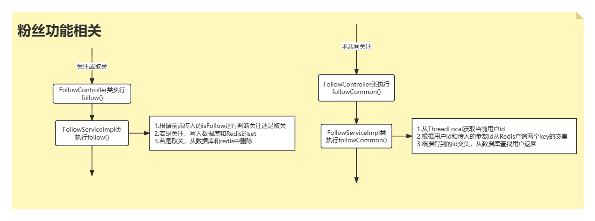
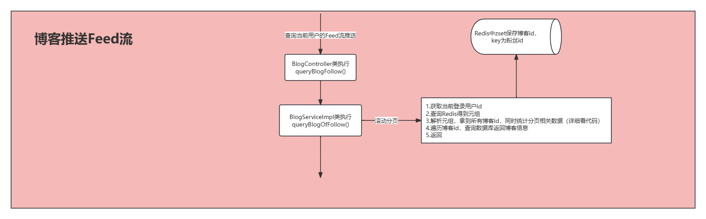

# 16.流程图

## 1.访问首页时流程

## 2.验证登录流程

## 3.粉丝功能相关流程

## 4.抢购接口相关流程

## 5.接口防刷相关

## 6.更新店铺信息流程

## 7.查询店铺信息流程

## 8.保存博客流程

## 9.博客推送流程

## 10.任务调度流程

## 11.博客搜索Es流程

## 12.抢购接口削峰限流流程

## 13.异步编排流程

# 17.项目启动

- 防火墙
  - 查看状态：systemctl status firewalld 
  - 开启：systemctl start firewalld.service 
- 前端
  - **启动Nginx**
    - 本项目在 C:\JavaProjects\nginx-1.18.0 下启动nginx.exe；注意修改nginx.config
    - 启动：start nginx.exe 
    - 重启：nginx -s reload
- 后端
  - **启动Redis**
    - /usr/local/bin 下的启动服务
    - 启动要指定配置文件：redis-server /opt/redis-7.2.0/redis.conf
  - **启动MinIO**
    - nohup /opt/minio/minio server /opt/minio/data >/opt/minio/minio.log 2>&1 &
    - 账号密码：minioadmin      minioadmin
  - **启动XXL-JOB**
    - 本地 C:\JavaProjects\2-点评项目\project\xxl-job-master
    - 使用idea打开运行（控制台运行jar）
  - **启动RabbitMQ**
    - 启动：systemctl start rabbitmq-server.service
    - 账号密码：admin     admin
  - **启动Elasticsearch**
    - 用户mirrors下：/home/mirrors/elasticsearch
    - 切换用户mirrors启动：su mirrors             ./bin/elasticsearch -d
    - 杀掉进程：ps aux | grep elastic            kill -9 [pid]
    - 修改jdk选择：https://www.cnblogs.com/zhuhuibiao/p/16446105.html
  - **启动Nacos**
    - sh bin/startup.sh -m standalone

